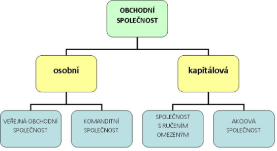

# 1. hodina 5. 9. 2025

- probereme:
  - podnikání
    - OSVČ
    - typy společností
    - živnost
    - jak podnikat
  - náklady, výnosy a výsledek hospodaření
  - podnikatelský záměr
  - daně
    - přímé, nepřímé
    - přiznání příjmu
  - kalkulace
    - jak si spočítat své výrobní náklady
    - jak zvolit prodejní cenu
  - majetek podniku a odpisy majetku
- zápisy v počítači povoleny
- opět budou prezentace
  - 1 prezentace za hodinu
  - polovina třídy první pololetí, druhá ve druhém
  - délka prezentace cca. zhruba +- ~5 minut
  - bude hodnoceno:
    - styl odrážek, nikoli textu
    - velikost písma aby bylo čitelné z každé části třídy U43
    - pozor na kontrast pozadí a písma [poznámka Niki: [dobrý zdroj WCAG compliance](https://webaim.org/resources/contrastchecker/)]
    - zdroje povinné
- budou se psát dva testy
- pí. uč. Sobotíková si užila prázdniny, více informací odmítla podat
- prezentace do předmětu budou postupně posílány do Teams

## Podnik a podnikání

- ### potřeba rozhodnout o:

  - předmět podnikání - co bude poskytovat/vyrábět
  - sídlo/provozovna - kde bude vyrábět
  - technologie - jak bude vyrábět nebo poskytovat služby
  - finance - kolik zdrojů do své činnosti vloží nebo jako je získá
  - investice - jak použije získané prostředky
  - jakou právní formu pro svou činnost zvolí

- ### základní podmínky

  - občanský zákoník
    - hlavně vztahy mezi spotřebovatelem a poskytovatelem
  - živnostenský zákon
    - specifické podmínky dle živnosti
  - obchodní zákoník
    - vymezuje obchodní společnosti
  - zákoník práce
    - v případě zaměstnanců

- ### podnikání

  - **soustavná činnost, která je provozována**:
    - **samostatně** - co bude vyrábět si podnikatel určuje sám v souladu se zákony ČR
    - **vlastním jménem** - ve styku s ostatními podnikateli, státem používá oficiální označení své firmy
    - **na vlastní účet** - znamená, že podnikatel hradí veškeré náklady, které podnikání přináší a také mu připadají veškeré výnosy z jeho podnikání, aby náklady a výnosy vyčíslil musí vést účetnictví
    - **účelem činnosti je dosažení zisku** - pokud nemá určitá činnost stanovená jako cíl zisk, nejedná se o podnikání

- ### rysy podnikání

  - základní motivem je snaha o dosažení zisku (rozdíl výnosů a nákladů), případně jinak definovaného užitku
  - zisk je dosahován uspokojováním potřeb zákazníků (spokojený zákazník jako cíl)
  - snaha o uspokojování potřeb zákazníků sebou přináší riziko (je nutné jej přijmout a umět s ním pracovat)
  - do podnikání je nutné na počátku vložit nějaký kapitál, který musí být podnikáním zhodnocen
  - cílevědomá cinnost
  - opakování, cyklický proces
  - kreativita, tvůrčí přístup

- ### podnik

  - podnikem se rozumí
    - soubor hmotných (pozemky, stroje, budovy, dopravní prostředky, materiál), jakož i osobních (zaměstnanci) a nehmotných (finance, práva, software) složek podnikání
    - k podniku náleží věci, práva a jiné majetkové hodnoty
  - je ekonomicko-právním subjektem (ekonomická samostatnost a právní subjektivita)

- podnikat mohou

  - fyzické osoby - FO - občan

    má právní osobnost, tzn. že může nabývat práva a povinnosti. Pokud získá ŽO, zůstává nadále FO a kromě toho se stává OSVČ

  - právnické osoby - PO

    organizovaný útvar vytvořené lidmi a považovány podle zákona za samostatné právní subjekty, např. s.r.o

  - stát - PO

# 1. 10.

## OSVČ - Samuel Dostál

- osoba samostatně výdělečně činná
- osoba, která je zaevidovaná na živnostenském úřadě
- podnikání může být:
  - volné: dělník
  - vázané: doktoři
- každý rok daňové přiznání
- může si vybrat jakým způsobem bude udávat výdaje

| Zaměstnanec                                                  | OSVČ                                                       |
| ------------------------------------------------------------ | ---------------------------------------------------------- |
| zaměstnavatel platí sociální a zdravotní pojištění a zároveň zaměstnanec platí také sociální pojištění | většinou má menší odvody na sociální a zdravotní pojištění |

### Rating: 2/10

- jel moc rychle
- nepřesné informace, mnoho lží, nepravd a nedostatků
- jediné plus a důvod proč místo 0 je 2/10 je, že jediným zdrojem je "táta"

## Živnostenský rejstřík - Martin Krychtálek

- veřejný registr osob a firem, které mají živnostenské oprávnění
- obsahuje jméno a příjmení nebo název firmy, IČO, sídlo firmy, předmět podnikání, název provozovny a datum zahájení podnikání
- dělí se na veřejnou a neveřejnou část
- umožňuje ověřit, kdo je oficiálně registrovaný podnikatel
- zapíšeme se založením živnosti na živnostenském úřadě či online
- student může podnikat od 18 let, mladší se souhlasem rodičů a soudu
- nejsou speciální podmínky

### Rating 10/10

- všechno co bylo třeba
- perfektně a jasně řečeno i napsáno
- bohužel čteno vše z prezentace tak je to za 2

## Obchodní společnosti

- chceme-li podnikat ve více osobách, je třeba založit korporaci
- Korporace je právnická osoba, kterou založilo několik osob (fyzických i právnických), aby společně prováděly určitou činnost napr. podnikání
- korporaci může založit i jediná osoba
- pro podnikání jsou významné obchodní korporace, mezi něž patří obchodni společnosti a družstvo
- toto podnikání upravuje zákon o obchodních korporacích
- dalším typem korporace je spolek

### Obchodní společnosti

- Obchodní společnost si můžeme představit jako právnickou osobu, která si dala za cíl podnikat
- zakládají ji jak fyzické, tak právnické osoby - společníci
- mohou být zakládány i společně se zahraničními osobami a s jejich kapitálem - investoři

### Znaky obchodních společností

- společníci všech obchodních společností mají právo na podíl na:
  - řízení
  - zisku
  - zbylém majetku v případě likvidace společnosti
- pro obchodní společnosti je podstatné, jak ručí za své závazky a kdo je řídí

### Kapitálové obch. spol.

- v kapitálových spol. společníci nejsou povinni osobně pracovat
- za závazky společnosti (dluhy) ručí majetkem, který do společnosti vložili při jejím založení - v případě, že se společnost dostane do finančních obtíží a bude nutno hradit dluhy prodejem majetku spoleečnosti, společník může přijít o svůj počáteční vklad

### Osobní obch. spol.

- v osobních společnostech všichni nebo část společníků ručí neomezeně, tedy i osobním majetkem, a osobně v nich pracují

# 8.10.

## Obchodní společnosti - Lukáš Nevěčný

- korporace = právnická osoba, kterou stvořilo několik osob
- v.o.s.
  - veřejná obchodní společnost, kde společníci ručí celý svým jaetkem
  - vhodná pro menší podniky
- s.r.o.
  - kapitálová společnost, ručení společníků do výše vkladů
  - nejběžnější forma pro malé a střední podniky
  - minimální zákl. kapitál - 1 Kč
  - firmy často volí vyšší částky - 1000 Kč
- k.s.
  - komanditisté a komplementář

nevím nešlo moc opsat, ale skvělá prezentace

## Charakteristika s.r.o. - Štěpán Otruba

- společnost s ručením omezením
- minimálně jeden zakladatel, fyzický či právnický
- zákl. kap. min. 1 Kč
- zisk dle podílu společníků
- orgány společnosti
  - valná hromada - nejvyšší orgán
  - ... šel moc rychle
- výhody
  - omezené ručení společníků
  - jasně daná právní forma
  - snadné převody podílů
  - vyšší důvěryhodnost u partnerů
- nevýhody
  - povinné účetnictví a administrace
  - složitější založení než živnost
  - dvojí zdanění zisku a výplaty

## Obchodní společnosti - pokračování

### Osobní obchodní společnosti

- obchodní společnosti řídí obvykle dva orgány:
  - nejvyšší orgán - v osobních spol. jsou to společníci, v kap. valná hromada
  - statutární orgán - jedná za společnost, zastupuje ji a uzavírá smlouvy

### Znaky obchodních společností

- Pro obchodní společnost je podstatné zejména to, jak ručí za své závazky a kdo je řídí

## Obchodní korporace - společnosti - vznik a zánik

Prezentace na Teams

# 15.10.

## Samostatná práce - Charakterizujte znaky obchodních společností 

### 1) Způsob ručení u komanditní společnosti a akciové společnosti

- **Komanditní společnost (k. s.)**
   Komplementáři ručí za závazky společnosti celým svým majetkem, tedy neomezeně.
   Komanditisté ručí pouze do výše svého nesplaceného vkladu nebo do výše komanditní sumy uvedené ve společenské smlouvě.
- **Akciová společnost (a. s.)**
   Akcionáři neručí za závazky společnosti svým osobním majetkem.
   Ručí pouze do výše svého vkladu (tedy do výše splacených akcií).
   Za závazky ručí samotná společnost svým majetkem.

------

### 2) Minimální vklad do podnikání u veřejné obchodní společnosti a společnosti s ručením omezeným

- **Veřejná obchodní společnost (v. o. s.)**
   Zákon nestanovuje žádnou minimální výši vkladu. Je na dohodě společníků, zda a jaký vklad vloží.
- **Společnost s ručením omezeným (s. r. o.)**
   Minimální vklad je 1 Kč.
   Základní kapitál společnosti tak může být již od jedné koruny.

------

### 3) Možnosti řízení u akciové společnosti a nejvyšší orgán

Akciová společnost může mít dva možné systémy řízení:

- **Dualistický systém**
  - Nejvyšším orgánem je **valná hromada** (rozhoduje o základních otázkách, např. rozdělení zisku, změna stanov, volba orgánů).
  - **Představenstvo** je statutární orgán, který vede společnost a rozhoduje o běžných záležitostech.
  - **Dozorčí rada** dohlíží na činnost představenstva a kontroluje hospodaření společnosti.
- **Monistický systém**
  - Nejvyšším orgánem je opět **valná hromada**.
  - Řídícím orgánem je **správní rada**, která spojuje funkce představenstva i dozorčí rady.

V obou systémech je tedy nejvyšším orgánem **valná hromada akcionářů**.

------

### 4) Rozdělení zisku u komanditní společnosti a akciové společnosti

- **Komanditní společnost (k. s.)**
   Pokud společenská smlouva nestanoví jinak, zisk se obvykle rozdělí tak, že polovina připadne komplementářům a druhá polovina komanditistům.
   Komplementáři se na své části zisku podílejí rovným dílem, zatímco komanditisté podle výše svých vkladů.
- **Akciová společnost (a. s.)**
   Zisk se rozděluje formou **dividend**, a to podle jmenovité hodnoty akcií (pokud stanovy neurčí jinak).
   Rozdělení zisku schvaluje valná hromada na základě účetní závěrky.
   Společnost může vyplácet zisk jen tehdy, pokud tím nesníží svůj vlastní kapitál pod zákonem stanovenou hranici.

------

### 5) Řízení a zastupování u společnosti s ručením omezeným

- **Nejvyšší orgán**: **Valná hromada**, která rozhoduje o základních otázkách (např. rozdělení zisku, změny společenské smlouvy, jmenování jednatelů).
   Pokud má společnost jen jednoho společníka, vykonává jeho působnost on sám.
- **Statutární orgán**: **Jednatel** nebo více jednatelů.
   Jednatelé zastupují společnost navenek a rozhodují o jejím běžném chodu.
   Není-li ve společenské smlouvě stanoveno jinak, jedná každý jednatel samostatně.

Jednatelé musí jednat s péčí řádného hospodáře – tedy zodpovědně, informovaně a v zájmu společnosti.
 Společníci ručí za závazky společnosti pouze do výše nesplacené části svého vkladu. 