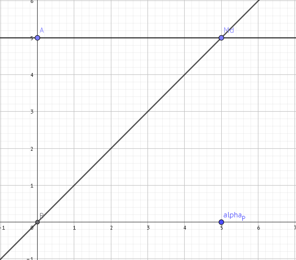

# Měření

- získávání hodnot

$x=\{x\}\cdot[x]$

přičemž

x.....měřená veličina

{x}...měřená hodnota

[x]...jednotka

## 1. Co? - Měřená veličina

## 2. S čím to porovnávám? - Jednotka

### Jednotky Si

- Máme 7 základních jednotek Si

- Všechny se odvozují od fyzikálních konstant

- K tomu je 22 odvozených jednotek Si

- např.

  $[N]=[kg\cdot m\cdot s^{-2}]$

### Srovnávací měření

- např. rovnoramenné váhy
  - porovnání s nějakým standardem

## 3. Měřicí metoda

## 4. Čím? - Měřící přístroj

### Analogové měřící přístroje

- ukazuje hodnotu spojitě
  - teoretický nekonečné množství hodnot
  - ručička ukazující hodnotu na škále
  - plynulá změna
- vizuální údaj, narozdíl od přímé hodnoty
- základní princip je elektromechanický
- základní součásti analogového přístroje:
  - vlastní měřicí systém
    - skrytý
  - ukazovací systém
    - co vidím
  - vratný moment
    - nebýt tohoto systém, ručka by šla do zarážky a zůstala tam do konce měření

Pro osu x[d] a osu y[Nm]

### Konstanta a citlivost měřícího přístroje

- buď přístroj měřící na jednom rozsahu

  - jedna stupnice, např. od 0 do 100 V
  - co ukáže ručička je měřená hodnota
  - často nestačí, rozsah může být málo

- přístroje umožňují přepínat stupnici

  - např. z rozsahu 0 do 100 V přepnout na 0 až 1000 V

- Konstanta měřícího přístroje:

  - podíl s jmenovitým rozsahem

  $\frac{\text{jmenovitý rozsah}}{\text{celkový počet dílků}}$

  - např. [naprosto nečitelné výpočty]
  - K

- citlivost

  - C=$\frac{1}{K};[d\cdot\text{jednotka}^{-1}]$ 

## 5. Za jakých podmínek?

- změna tlaku, prostředí, stabilita, vlhkost, teplota
- veličiny: 
  - tlak
  - teplota
  - relativní vlhkost vzduchu
  - stabilní napájecí napětí
  - rušení