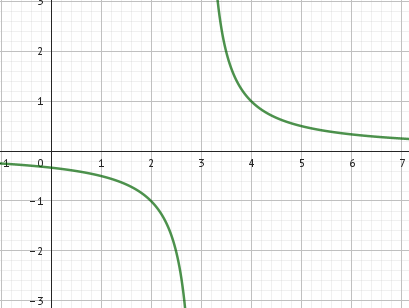

# 1. hodina - organizační

- budou se psát standardy
- nebudou přepadovky, vždy bude oznámeno
- 4 čtvrtletky
- minimum zkoušení u tabule, spíše menší písemky
- přihlásit a registrovat na logickou olympiádu
  - 15\. 10\. první test

## Co nás bude čekat?

- Zopakování
  - Funkce
  - Grafy funkcí
  - Logaritmické funkce, exponenciální funkce
  - Geometrické řady
- Analytická geometrie
  - Přímky, vzájemnou polohu přímek
  - Rovina, vzájemnou polohu rovin
  - Vektory
- Paraboly, hyperboly
- Kombinatorika
  - Variace
  - Permutace
- Pravděpodobnost a statistika
- Úvod do diferenciálního počtu -> derivace (4. ročník)

## Opakování

1. Urči, který funkční předpis odpovídá grafu.

A) y = 2x-4

B) y = -x+4

C) y = 2x+4

D) y = -2x-4

E) y = -2x+4

A[2,0]

B[0,-4]

y = ax + b
$$
A:
0=a\cdot2+b\\
B:
-4=a\cdot0+b\implies b=-4\\
0=a\cdot2+-4\\
2a=4\\
a=2\\
\text{Tudíž odpověď}\implies A
$$

---

2. Urči, který funkční předpis odpovídá grafu.

$$
A)\space y=2x-4\\
B)\space y=2x+4\\
C)\space y=2x-4;\, x\in <-1,2>\\
D)\space y=2x+4;\, x\in <0,2>\\
E)\space y=-x+4;\, x\in <-1,2>\\
\\
D(f)=<-1,2>\\
A[2,0]\\
B[-1,-6]\\
y=ax+b\\
0=a\cdot2+b\\
-6=a\cdot(-1)+b\,/\cdot(-1)\\
0=2a+b\\
6=a-b\\
6=3a\\
2=a\\
0=2\cdot2+b\\
-4=b\\
y=2x-4\implies \boxed{C}
$$

# 2. hodina

## Mocninné funkce

$y=x^n$ 

1. $n\in\N$ $n=1,2,3,4,...$

   $y=x$ pro $n=1$ 
   speciální případ - lineární rovnice
   

   když $n$ je sudé
   $n=2,4,6,8,...$
   $y=x^2,y=x^4,y=x^6,...$
   přičemž $y=x^2$ je kvadratická funkce
   grafem parabola
   
   $D(f)=\R$ a $H(f)=<0,\infty)$
   $y=-x^2$
   

př. 1) Načrtni graf funkce:

a) $f:y=x^2-1$

b) $f:y=(x+1)^2$

c) $f:y=(x-1)^2+2$

3. $n$ je liché $n=3,5,7,...$
   $y=x^3,y=x^5$
   
   graf je souměrný dle počátku - lichá funkce
   

př. 2) Načrtni graf funkce:

a) $f:y=x^3+1$

b) $f:y=(x-1)^3$

c) $f:y=(x+1)^3-2$

4. $n$ je záporné
   1) $n$ je sudé
      $n=-2,-4,-6,...$
      $y=x^{-2}$ tj. $y=\frac{1}{x^2};x\ne 0$
      
      $D(f)=\R-\{0\}$
      $H(f)=(0,\infty)$
      souměrná podle osy $y\implies$sudá
      rost. $(-\infty,0)$
      kles. $(0,\infty)$
   2) $n$ je liché
      $n=-3,-5,...$
      $y=x^{-3}$ tj. $y=\frac{1}{x^3}$
      
      grafem hyperbola
      funkce souměrná dle počátku$\implies$lichá
      $D(f)=\R-\{0\}$
      $H(f)=\R-\{0\}$
      rost. ---
      kles. $(-\infty,0)\cup(0,\infty)$

# 3. hodina

## Funkce nepřímá úměrnost

- $f: y = \frac{k}{x}$ k...koeficient nepřímé úměrnosti
- grafem je rovno-osá hyperbola
- Pro k>0: 
- Pro k<0: 

$D(f)=\R-\{0\}$

$H(f)=\R-\{0\}=(-\infty,0)\cup(0,\infty)$

1. Načrtněte graf funkce $f:y=\frac{1}{x-3};\, x\ne 3$

$D(f)=\R-\{3\}$

2. Načrtni graf funkce $y=-\frac{2}{x+4}$

$k=-2$ ... $k<0$

$D(f)=\R-\{-4\}$

3. Načrtni graf funkce $f:y=\frac{1}{x+1}-1$

$D(f)=\R-\{-1\}$

$H(f)=\R-\{-1\}$

$k>0$

4. Ozubené kolo má 210 zubů a otočí se 11 krát za minutu

   a) kolik zubů má druhé kolo soukolí, otáčí-li se 15x za minutu?

   b) kolikrát se otočí třetí kolo soukolí, které zapadá do toho prvního kola a má pouze 55 zubů?

$Z_1=210\newline
n_1=11\newline
n_2=15\newline
z_2=?\newline
\frac{z_1}{n_2}=\frac{n_2}{z_2}$ 

nebo

$\frac{z_1}{z_2}=\frac{n_2}{n_1}$

$\frac{210}{z_2}=\frac{15}{11}/\cdot z_2\cdot 11$

$210\cdot 11 = 15 \cdot z_2$

$\frac{210 \cdot 11}{15} = z_2$

$z_2=154$

b)

$z_1=210;n_1=11$

$z_3=55;n_3=?$

$\frac{210}{55}=\frac{n_3}{11}\implies n_3=42$

## Exponenciální funkce a rovnice

$f:y=a^x$

$a\in (0,1)$

$D(f)=\R$

$H(f)=(0,\infty)$

$a>1$

1. Načrtni graf funkce $f:y=3^{x+1}-1$

$y=3^{0+1}-1=2$

$0=3^{x+1}-1$

$1=3^{x+1}$

$3^0 =3^{x+1}$

2. Řešte rovnici:

$8\cdot 2^{2-x} = 16^{-3}$

$2^3 \cdot 2^{2-x} = (2^4)^{-3}$

$2^{3+2-x}=2^{4\cdot (-3)}$

$5-x=-12\implies \boxed{x=17}$

# 29. 9.

Urči $\overrightarrow{u}$ +$\overrightarrow{v}$ , $\overrightarrow{u}$ -$\overrightarrow{v}$ i graficky, je-li dáno 

$\overrightarrow{u}=(-2;3)$

$\overrightarrow{v}=(4;5)$

---

$\overrightarrow{u}+\overrightarrow{v}=(-2+4;3+5)=(2;8)$

$\overrightarrow{u}-\overrightarrow{v}=(-2-4;3-5)=(-6;-2)$

$A[3,0];B[2,-1];C[5,-3]$ najdětě P,Q,R tak, aby platilo: $\vec{AB}=\vec{CP};\vec{BC}=\vec{AQ};\vec{CA}=\vec{BR}$

$P[p_1;p_2]\, Q[q_1;q_2]\, R[r_1;r_2]$

$\vec{AB}=B-A=(2-3;-1-0)=(-1,-1)=\vec{CP}$

$\vec{CP}=P-C=(p_1-5;p_2+3)=(-1;-1)$

$P[4,-4]$

$\vec{BC}=\vec{AQ}$

$\vec{BC}=C-B=(5-2;-3+1)=(3;-2)$

$\vec{AQ}=Q-A=(q_1-3;q_2-0)=(3;-2)$

$Q=[6,-2]$

$\vec{CA}=A-C=(3-5;0+3)=(-2;3)$

$\vec{BR}=R-B=(r_1-2;r_2+1)=(-2;3)$

$R[0,2]$

