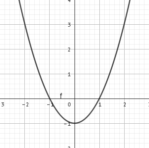

# 1. hodina - organizační

- budou se psát standardy
- nebudou přepadovky, vždy bude oznámeno
- 4 čtvrtletky
- minimum zkoušení u tabule, spíše menší písemky
- přihlásit a registrovat na logickou olympiádu
  - 15\. 10\. první test

## Co nás bude čekat?

- Zopakování
  - Funkce
  - Grafy funkcí
  - Logaritmické funkce, exponenciální funkce
  - Geometrické řady
- Analytická geometrie
  - Přímky, vzájemnou polohu přímek
  - Rovina, vzájemnou polohu rovin
  - Vektory
- Paraboly, hyperboly
- Kombinatorika
  - Variace
  - Permutace
- Pravděpodobnost a statistika
- Úvod do diferenciálního počtu -> derivace (4. ročník)

## Opakování

1. Urči, který funkční předpis odpovídá grafu.

A) y = 2x-4

B) y = -x+4

C) y = 2x+4

D) y = -2x-4

E) y = -2x+4

A[2,0]

B[0,-4]

y = ax + b
$$
A:
0=a\cdot2+b\\
B:
-4=a\cdot0+b\implies b=-4\\
0=a\cdot2+-4\\
2a=4\\
a=2\\
\text{Tudíž odpověď}\implies A
$$

---

2. Urči, který funkční předpis odpovídá grafu.

$$
A)\space y=2x-4\\
B)\space y=2x+4\\
C)\space y=2x-4;\, x\in <-1,2>\\
D)\space y=2x+4;\, x\in <0,2>\\
E)\space y=-x+4;\, x\in <-1,2>\\
\\
D(f)=<-1,2>\\
A[2,0]\\
B[-1,-6]\\
y=ax+b\\
0=a\cdot2+b\\
-6=a\cdot(-1)+b\,/\cdot(-1)\\
0=2a+b\\
6=a-b\\
6=3a\\
2=a\\
0=2\cdot2+b\\
-4=b\\
y=2x-4\implies \boxed{C}
$$

# 2. hodina

## Mocninné funkce

$y=x^n$ 

1. $n\in\N$ $n=1,2,3,4,...$

   $y=x$ pro $n=1$ 
   speciální případ - lineární rovnice
   

   když $n$ je sudé
   $n=2,4,6,8,...$
   $y=x^2,y=x^4,y=x^6,...$
   přičemž $y=x^2$ je kvadratická funkce
   grafem parabola
   
   $D(f)=\R$ a $H(f)=<0,\infty)$
   $y=-x^2$
   

př. 1) Načrtni graf funkce:

a) $f:y=x^2-1$

b) $f:y=(x+1)^2$

c) $f:y=(x-1)^2+2$

3. $n$ je liché $n=3,5,7,...$
   $y=x^3,y=x^5$
   
   graf je souměrný dle počátku - lichá funkce
   

př. 2) Načrtni graf funkce:

a) $f:y=x^3+1$

b) $f:y=(x-1)^3$

c) $f:y=(x+1)^3-2$

4. $n$ je záporné
   1) $n$ je sudé
      $n=-2,-4,-6,...$
      $y=x^{-2}$ tj. $y=\frac{1}{x^2};x\ne 0$
      
      $D(f)=\R-\{0\}$
      $H(f)=(0,\infty)$
      souměrná podle osy $y\implies$sudá
      rost. $(-\infty,0)$
      kles. $(0,\infty)$
   2) $n$ je liché
      $n=-3,-5,...$
      $y=x^{-3}$ tj. $y=\frac{1}{x^3}$
      
      grafem hyperbola
      funkce souměrná dle počátku$\implies$lichá
      $D(f)=\R-\{0\}$
      $H(f)=\R-\{0\}$
      rost. ---
      kles. $(-\infty,0)\cup(0,\infty)$
