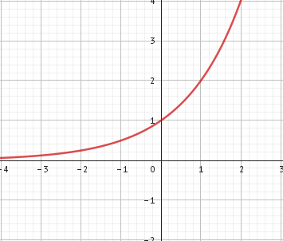

# 1. hodina - organizační

- budou se psát standardy
- nebudou přepadovky, vždy bude oznámeno
- 4 čtvrtletky
- minimum zkoušení u tabule, spíše menší písemky
- přihlásit a registrovat na logickou olympiádu
  - 15\. 10\. první test

## Co nás bude čekat?

- Zopakování
  - Funkce
  - Grafy funkcí
  - Logaritmické funkce, exponenciální funkce
  - Geometrické řady
- Analytická geometrie
  - Přímky, vzájemnou polohu přímek
  - Rovina, vzájemnou polohu rovin
  - Vektory
- Paraboly, hyperboly
- Kombinatorika
  - Variace
  - Permutace
- Pravděpodobnost a statistika
- Úvod do diferenciálního počtu -> derivace (4. ročník)

## Opakování

1. Urči, který funkční předpis odpovídá grafu.

A) y = 2x-4

B) y = -x+4

C) y = 2x+4

D) y = -2x-4

E) y = -2x+4

A[2,0]

B[0,-4]

y = ax + b
$$
A:
0=a\cdot2+b\\
B:
-4=a\cdot0+b\implies b=-4\\
0=a\cdot2+-4\\
2a=4\\
a=2\\
\text{Tudíž odpověď}\implies A
$$

---

2. Urči, který funkční předpis odpovídá grafu.

$$
A)\space y=2x-4\\
B)\space y=2x+4\\
C)\space y=2x-4;\, x\in <-1,2>\\
D)\space y=2x+4;\, x\in <0,2>\\
E)\space y=-x+4;\, x\in <-1,2>\\
\\
D(f)=<-1,2>\\
A[2,0]\\
B[-1,-6]\\
y=ax+b\\
0=a\cdot2+b\\
-6=a\cdot(-1)+b\,/\cdot(-1)\\
0=2a+b\\
6=a-b\\
6=3a\\
2=a\\
0=2\cdot2+b\\
-4=b\\
y=2x-4\implies \boxed{C}
$$

# 2. hodina

## Mocninné funkce

$y=x^n$ 

1. $n\in\N$ $n=1,2,3,4,...$

   $y=x$ pro $n=1$ 
   speciální případ - lineární rovnice
   

   když $n$ je sudé
   $n=2,4,6,8,...$
   $y=x^2,y=x^4,y=x^6,...$
   přičemž $y=x^2$ je kvadratická funkce
   grafem parabola
   
   $D(f)=\R$ a $H(f)=<0,\infty)$
   $y=-x^2$
   

př. 1) Načrtni graf funkce:

a) $f:y=x^2-1$

b) $f:y=(x+1)^2$

c) $f:y=(x-1)^2+2$

3. $n$ je liché $n=3,5,7,...$
   $y=x^3,y=x^5$
   
   graf je souměrný dle počátku - lichá funkce
   

př. 2) Načrtni graf funkce:

a) $f:y=x^3+1$

b) $f:y=(x-1)^3$

c) $f:y=(x+1)^3-2$

4. $n$ je záporné
   1) $n$ je sudé
      $n=-2,-4,-6,...$
      $y=x^{-2}$ tj. $y=\frac{1}{x^2};x\ne 0$
      
      $D(f)=\R-\{0\}$
      $H(f)=(0,\infty)$
      souměrná podle osy $y\implies$sudá
      rost. $(-\infty,0)$
      kles. $(0,\infty)$
   2) $n$ je liché
      $n=-3,-5,...$
      $y=x^{-3}$ tj. $y=\frac{1}{x^3}$
      
      grafem hyperbola
      funkce souměrná dle počátku$\implies$lichá
      $D(f)=\R-\{0\}$
      $H(f)=\R-\{0\}$
      rost. ---
      kles. $(-\infty,0)\cup(0,\infty)$

# 3. hodina

## Funkce nepřímá úměrnost

- $f: y = \frac{k}{x}$ k...koeficient nepřímé úměrnosti
- grafem je rovno-osá hyperbola
- Pro k>0: 
- Pro k<0: 

$D(f)=\R-\{0\}$

$H(f)=\R-\{0\}=(-\infty,0)\cup(0,\infty)$

1. Načrtněte graf funkce $f:y=\frac{1}{x-3};\, x\ne 3$

$D(f)=\R-\{3\}$

2. Načrtni graf funkce $y=-\frac{2}{x+4}$

$k=-2$ ... $k<0$

$D(f)=\R-\{-4\}$

3. Načrtni graf funkce $f:y=\frac{1}{x+1}-1$

$D(f)=\R-\{-1\}$

$H(f)=\R-\{-1\}$

$k>0$

4. Ozubené kolo má 210 zubů a otočí se 11 krát za minutu

   a) kolik zubů má druhé kolo soukolí, otáčí-li se 15x za minutu?

   b) kolikrát se otočí třetí kolo soukolí, které zapadá do toho prvního kola a má pouze 55 zubů?

$Z_1=210\newline
n_1=11\newline
n_2=15\newline
z_2=?\newline
\frac{z_1}{n_2}=\frac{n_2}{z_2}$ 

nebo

$\frac{z_1}{z_2}=\frac{n_2}{n_1}$

$\frac{210}{z_2}=\frac{15}{11}/\cdot z_2\cdot 11$

$210\cdot 11 = 15 \cdot z_2$

$\frac{210 \cdot 11}{15} = z_2$

$z_2=154$

b)

$z_1=210;n_1=11$

$z_3=55;n_3=?$

$\frac{210}{55}=\frac{n_3}{11}\implies n_3=42$

## Exponenciální funkce a rovnice

$f:y=a^x$

$a\in (0,1)$

$D(f)=\R$

$H(f)=(0,\infty)$

$a>1$

1. Načrtni graf funkce $f:y=3^{x+1}-1$

$y=3^{0+1}-1=2$

$0=3^{x+1}-1$

$1=3^{x+1}$

$3^0 =3^{x+1}$

2. Řešte rovnici:

$8\cdot 2^{2-x} = 16^{-3}$

$2^3 \cdot 2^{2-x} = (2^4)^{-3}$

$2^{3+2-x}=2^{4\cdot (-3)}$

$5-x=-12\implies \boxed{x=17}$

# 29. 9.

Urči $\overrightarrow{u}$ +$\overrightarrow{v}$ , $\overrightarrow{u}$ -$\overrightarrow{v}$ i graficky, je-li dáno 

$\overrightarrow{u}=(-2;3)$

$\overrightarrow{v}=(4;5)$

---

$\overrightarrow{u}+\overrightarrow{v}=(-2+4;3+5)=(2;8)$

$\overrightarrow{u}-\overrightarrow{v}=(-2-4;3-5)=(-6;-2)$

$A[3,0];B[2,-1];C[5,-3]$ najdětě P,Q,R tak, aby platilo: $\vec{AB}=\vec{CP};\vec{BC}=\vec{AQ};\vec{CA}=\vec{BR}$

$P[p_1;p_2]\, Q[q_1;q_2]\, R[r_1;r_2]$

$\vec{AB}=B-A=(2-3;-1-0)=(-1,-1)=\vec{CP}$

$\vec{CP}=P-C=(p_1-5;p_2+3)=(-1;-1)$

$P[4,-4]$

$\vec{BC}=\vec{AQ}$

$\vec{BC}=C-B=(5-2;-3+1)=(3;-2)$

$\vec{AQ}=Q-A=(q_1-3;q_2-0)=(3;-2)$

$Q=[6,-2]$

$\vec{CA}=A-C=(3-5;0+3)=(-2;3)$

$\vec{BR}=R-B=(r_1-2;r_2+1)=(-2;3)$

$R[0,2]$

# 1. 10. 2025

Zakreslete vektor $\vec{v}=\vec{b}-\vec{a}$ tak, aby byl bod O počátečním bodem jeho umístění.

$\vec{a}=\vec{BC}=C-B=(-3,2)$

$A[-3,-3]$

$B[-3,0]$

$C[-6,2]$

$\vec{b}=\vec{AB}=B-A=(0,3)$

$\vec{v}=\vec{b}-\vec{a}=(0,3)-(-3,2)=(3,1)$

## Velikost vektoru

Nechť $\vec{u}=(u_1,u_2)$, pak $|u|=\sqrt{u_{1}^2+u_2^2}$

Nechť $\vec{u}(u_1,u_2,u_3)$, pak $|u|=\sqrt{u_1^2+u_2^2+u_3^2}$

Urči velikost vektoru

a) $\vec{u}=(3,-\frac{5}{4})$

b) $\vec{AB}$, kde $A[6,\frac{13}{3}];B[0,4]$

c) $\vec{AB}$, kde $A[-2,3,4];B[4,-6,2]$

d) $\vec{v}=(-4,8,-8)$

a) $|u|=\sqrt{3^2+(-\frac{5}{4})^2}=\sqrt{9+\frac{25}{16}}=\sqrt{\frac{144+25}{16}}=\sqrt{\frac{169}{16}}=\frac{13}{4}$

b) $\vec{AB}=B-A=(-6,4-\frac{13}{3})=(-6,-\frac{1}{3})$

$|u|=\sqrt{(-6)^2+(-\frac{1}{3})^2}=\sqrt{36+\frac{1}{9}}=\sqrt{\frac{324+1}{9}}=\sqrt{\frac{325}{9}}=\sqrt{\frac{25\times 13}{9}}=\frac{5\times \sqrt{13}}{3}$

c) $\vec{AB}=B-A=(6,-9,-2)$

$|u|=\sqrt{6^2+(-9)^2+(-2)^2}=\sqrt{36+81+4}=\sqrt{121}=11$

d) $|v|=\sqrt{16+64+64}=\sqrt{144}=12$

---

Urči chybějící souřadnici vektoru $\vec{u}$ , který je jednotkový

a) $\vec{u}=(-\frac{3}{5};u_2)$

b) $\vec{u}=(u_1;\frac{8}{17})$

c) $\vec{u}=(-\frac{2}{3};\frac{1}{3};u_3)$

a) $|u|=\sqrt{u_1^2+u_2^2}=1\newline 
\sqrt{(-\frac{3}{5})^2+u_2^2}=2\newline
\frac{9}{25}+u_2^2=1\newline
u_2^2=\frac{16}{25}\newline
u_2=\pm \frac{4}{5}\newline
\vec{u}=(\frac{-3}{5},\frac{4}{5}),(\frac{-3}{5},\frac{-4}{5})$

b) $|u|=1=\sqrt{u_1^2+\frac{64}{289}}\newline
1=u_1^2+\frac{64}{289}\newline
1-\frac{64}{289}=u_1^2\newline
\frac{225}{289}=u_1^2\implies u_1=\pm \frac{15}{17}$

c) $|u|=1=\sqrt{\frac{4}{9}+\frac{1}{9}+u_3^2}\newline
1=\frac{4}{9}+\frac{1}{9}+u_3^2\newline
1-\frac{5}{9}=u_3^2\newline
\frac{4}{9}=u_3^2\implies u_3=\pm \frac{2}{3}$

# 3. 10.

## Lineární závislost vektorů

Dva vektory $\vec{u}$ a $\vec{v}$ jsou lin. závislé, pokud je jeden násobkem druhého, např. $\vec{v}=k\cdot\vec{u}$	$k\in\R$

Vektory $\vec{u},\vec{v},\vec{w}$ jsou lin. závislé, pokud lze jeden zapsat jako lineární kombinací ostatních, např.

$\vec{w}=k\cdot\vec{u}+l\cdot\vec{v}$	$k,l\in\R$

---

Zjistěte zda jsou vektory lineárně závislé

a) $\vec{a}=(-1,1)\newline\vec{b}=(1,1)$

b) $\vec{c}=(6,-2)\newline\vec{d}=(-3,1)$

c) $\vec{m}=(3,1,0)\newline\vec{n}=(2,1,-2)$

d) $\vec{p}=(-3,1,4)\newline\vec{q}=(6,-2,-8)$

a)

$\vec{a}=k\cdot\vec{b}$

$a_1=k\cdot b_1$	$a_2 = k\cdot b_2$

$-1=k\cdot 1$	$1=k\cdot 1$

$-1=k$	     $1=k$

k je různé $\implies$ LNZ (lineárně nezávislé)

b)

$\vec{c}=k\cdot \vec{d}$

$c_1 = k \cdot d_1$

$6=k\cdot (-3)$

$-2=k$

$-2=k\cdot 1$

$-2=k$

k je stejné $\implies$ LZ

c) nesedí, stačí se podívat

d) sedí, stačí se podívat, $k$ sedí

---

Vyjádři $\vec{w}$ jako lineární kombinaci vektorů $\vec{u},\vec{v}$

a) $\vec{w}=(7,5)\newline\vec{u}=(1,1)\newline\vec{v}=(0,1)$

b) $(-1,4,-1)=\vec{w}\newline\vec{u}=(1,-2,3)\newline\vec{v}=(2,-1,5)$

a)

$\vec{w}=k\cdot\vec{u}+k\cdot\vec{v}$

$7=k\cdot 1 + l \cdot 0$ $\implies k=7$

$5 = k\cdot 1 + l \cdot 1$

$5=7\cdot 1 + l\cdot 1$

$-2=l$

$\boxed{\vec{w}=7\cdot\vec{u}-2\cdot\vec{v}}$

# 6. 10.

b)

$\vec{w}=k\cdot\vec{u}+l\cdot\vec{v}$

$-1=k\cdot1+l\cdot2$

$-4=k\cdot(-2)+l\cdot(-1)$

$-1=k\cdot 3+l\cdot 5$

$-1=k\cdot1+l\cdot2$

$-4=k\cdot(-2)+l\cdot(-1)/\cdot2$

$-8=-4k-2l$

$-9=-3k$

$\boxed{3=k}$

$-1=3\cdot1+2\cdot l/-3$

$-4=2l$

$\boxed{-2=l}$

kontrola: dosadíme do 3. rovnice

$-1=3\cdot3+(-2)\cdot5$

$-1=9-10$

$-1=-1$ :heavy_check_mark:

$\vec{w}=3\vec{u}-2\vec{v}$

---

Vektory $\vec{u}$ a $\vec{v}$ jsou lineárně závislé. Určete jejich chybějící souřadnice.

a) $\vec{u}=(u_1;5;-1)$ $\vec{v}=(3;1;v_3)$

b) $\vec{u}=(u_1;u_2;-3)$ $\vec{v}=(0;2;2)$

a)

$\vec{v}=k\cdot\vec{u}$

$3=k\cdot u_1$

$1=k\cdot5\implies k=\frac{1}{5}$

$v_3=k\cdot(-1)$

$3=\frac{1}{5}\cdot u_1\implies u_1=15$

$v_3=\frac{1}{5}\cdot(-1)\implies v_3=-\frac{1}{5}$

b)

$\vec{v}=k\cdot\vec{u}$

$0=k\cdot u_1$

$2=k\cdot u_2$

$2=k\cdot (-3)\implies k=-\frac{2}{3}$

$0=-\frac{2}{3}\cdot u_1\implies u_1=0$

$2=-\frac{2}{3}\cdot u_2\implies u_2=-3$

$\vec{u}=(0;-3;-3)$

---

Napište vektor $\vec{AD}$ jako lineární kombinaci vektorů $\vec{AB}$ a $\vec{AC}$ je-li dáno $A[3;5],B[2;10],C[5;-2],D[5;4]$

$\vec{AD}=k\cdot\vec{AB}+l\cdot\vec{AC}$

$\vec{AD}=D-A=(2;-1)$

$\vec{AB}=B-A=(-1;5)$

$\vec{AC}=C-A=(2;-7)$

$2=k\cdot (-1) + l\cdot 2/\cdot5$

$-1=k\cdot (5) + l\cdot (-7)$

$10=-5k+10l$

$-1=k\cdot (5) + l\cdot (-7)$

$9=3l\implies l=3$

$2=-k+3\cdot2\implies k=4$

kontrola: dosadíme do druhé rovnice

$-1=5\cdot 4 - 7 \cdot 3$

$-1=20-21$

$-1=-1$

$\vec{AD}=4\cdot \vec{AB}+3\cdot\vec{AC}$

 b) $A[1;0;7],B[3;1;0],C[4;2;5],D[8;4;-9]$

$\vec{AD}=k\cdot\vec{AB}+l\cdot\vec{AC}$

$\vec{AD}=D-A=(7;4;-16)$

$\vec{AB}=B-A=(2;1;-7)$

$\vec{AC}=C-A=(3;2;-2)$

$7=k\cdot2 + l\cdot3$

$4=k\cdot1 + l\cdot 2$

$-16=k\cdot (-7) + l\cdot (-2)$

$-12=-6k\implies k=2$

$4=2\cdot 1 + 2l\implies l=1$

$7=2\cdot2 + 3 \cdot 1$

$7=7$

$\boxed{\vec{AD}=2\cdot\vec{AB}+\vec{AC}}$

# 8.10.

## Lineárně závislé a nezávislé vektory - opět

Jsou dány body $P,Q,R$, urči souřadnici $r_2$ tak, aby body $P,Q,R$ ležely na jedné přímce.

a) $P[2;-3],Q[-2;-1],R[10;r_2]$

b) $P[4;5],Q[1;4],R[13;r_2]$

a)

pozn. aby body ležely na jedné přímce musí platit, že vektory $\vec{PQ}$ a $\vec{PR}$ jsou lineárně závislé

$\vec{PQ}=Q-P=(-4;1)$

$\vec{PR}=R-P=(8;r_2 +3)$

$\vec{PQ}=k\cdot\vec{PR}$

$-4=k\cdot 8\implies k=-\frac{1}{2}$

$2=k\cdot (r_2 +3)$

$2=-\frac{1}{2}(r_2+3)/\cdot(-2)$

$-4=r_2+3$

$-7=r_2$

b)

$\vec{PQ}=Q-P=(-3;-1)$

$\vec{PR}=R-P=(9;r_2-5)$

$-3=k\cdot 9 \implies k = - \frac{1}{3}$

$-1=k\cdot (r_2 -5)$

$-1=-\frac{1}{3}(r_2 -5)/\cdot (-3)$

$3=r_2-5$

$8=r_2$

---

Test v pátek 10. 10.

---

Zjisti zda jsou vektry $\vec{u}$,$\vec{v}$ lineárně závislé

$\vec{u}=(1;2;-1)$

$\vec{v}=(-3;-6;0)$

$\vec{v}=k\cdot\vec{u}$

$-3=k\cdot 1 \implies k = -3$

$-6 = k\cdot 2 \implies k = -3$

$0 = k\cdot (-1)\implies k = 0$

LNZ

---

Urči souřadniic vektoru $\vec{a}$ tak, aby vektory $\vec{a},\vec{b},\vec{c}$ byly lineárně závislé

$\vec{a}=(a_1;2;0)$

$\vec{b}=(1;1;-1)$

$\vec{c}=(1;4;2)$

$\vec c = k \cdot \vec a + l \vec b$

$1=k\cdot a_1 + l \cdot 1$

$4 = k\cdot 2 + l \cdot 1$

$2 = k\cdot 0 + l \cdot (-1)\implies l =-2$

$4=k\cdot 2 + (-2)\cdot 1$

$3=k$

$1=3\cdot a_1 + (-2)\cdot 1$

$1=a_1$

---

## Úhel vektoru

Def. Jsou-li vektory

$\vec u = (u_1;u_2)$ a $\vec v = (v_1;v_2)$ dva nenulové vektory, pak jejich úhel $\phi\in<0\degree,180\degree>$ vypočítáme ze vzorce $\cos{\phi}=\frac{u_1\cdot v_1+u_2\cdot v_2}{|\vec u | \cdot | \vec v |}$

Urči úhel vektorů $\vec u$ a $\vec v $

a) $\vec u = (-1;2)$

$\vec v = (1;3)$

b) $\vec u = (1;-2)$

$\vec v = (2;1)$

c) $\vec u = (-2;1)$

$\vec v = (-1;-3)$

a)

$\cos{\phi}=\frac{(-1)\cdot 1+2\cdot 3}{\sqrt{(-1)^2+2^2}\cdot\sqrt{1^2 + 3^2}}=\frac{5}{\sqrt{5}\cdot\sqrt{10}}=\frac{5}{\sqrt{5}\cdot\sqrt{2\cdot 5}}=\frac{5}{5\cdot\sqrt{2}}=\frac{1}{\sqrt{2}}=\frac{1}{\sqrt{2}}\cdot\frac{\sqrt2}{\sqrt2}=\frac{\sqrt2}{2}$

$\phi = 45\degree$

b)

$\cos{\phi}=\frac{1\cdot2+(-2)\cdot1}{\sqrt{1^2+(-2)^2}\cdot\sqrt{2^2+1^2}}=0$

$\phi=90\degree $

vektory jsou na sebe kolmé

$\vec u \cdot \vec v = \vec o $

$u_1\cdot v_1 + u_2 \cdot v_2=0 $

c)

$\cos{\phi}=\frac{(-2)\cdot(-1)+(-1)\cdot(-3)}{\sqrt{(-2)^2+(-1)^2}\cdot \sqrt{(-1)^2+(-3)^2}}=\frac{5}{\sqrt{5}\cdot\sqrt{10}}=\frac{\sqrt{2}}{2} $

$\phi=45\degree$

d)

$\vec u = (1;1;1)$

$\vec v = (2;0;3)$

$\cos{\phi} = \frac{u_1v_1+u_2v_2+u_3v_3}{|\vec u | \cdot | \vec v |}=\frac{1\cdot 2 + 1\cdot 0 + 1\cdot 3 }{\sqrt{1^2+1^2+1^2}\cdot \sqrt{2^2 + 0^2 + 3^3}}=\frac{5}{\sqrt{3}\cdot\sqrt{13}}=\frac{5}{\sqrt{3\cdot13}}=\frac{5}{\sqrt{39}} $

$\phi=36\degree48'$

# 13.10.

## Kolmost vektorů

Vektory $\vec u , \vec v$ jsou kolmé právě když $\vec u \cdot \vec v = 0$ tedy $u_1\cdot v_1 + u_2 \cdot v_2 = 0$

Určete souřadnici $\vec n$ tak, aby byl kolmý $\vec v $

$\vec n = (3;n_2;2)$

$\vec v = (1;-2;4)$

 Dosadíme do 

$n_1 * v_1 + n_2 * v_2 + n_3 * v_3 = 0$

$3*1+n_2*(-2)+2*4=0 $ 

$-2n_2 = -11 \implies n_2 = \frac{11}{2} $

---

Je dán čtyřúhelník $ABCD$ kde

$A[1;1;-4]$

$B[-5;3;-5]$

$C[-3;1;2]$

$D[4;0;1]$

Dokažte, že úhlopříčky $AC\perp BD$

$\vec u = \vec{AC}=C-A=(-4;0;6)$

$\vec v = \vec{BD}=D-B=(9;-3;6) $

Dosadíme do předpisu, měla by vyjít 0

$u_1*v_1 + u_2*v_2+u_3*v_3=0$

$(-4)*9+0*(-3)+6*6=-36+0+36=\boxed0 $ 

$\vec u \cdot \vec v = 0\implies$Úhlopříčky jsou na sebe kolmé

---

Ověřte, že $\triangle ABC $ je pravoúhlý a vypočítejte zbývající $\angle \triangle $

$A[5;-4]$

$B[3;2]$

$C[2;-5]$

$\vec{AC}=C-A=(-3;-1)$

$\vec{AB}=B-A=(-2;6)$

Ověřme $(-3)(-2)+6*(-1)=6-6=0$

$\alpha=90\degree $

pro $\beta$ potřebuji určit:

$\vec{BA}=(2;-6)$

$\vec{BC}=C-B=(-1;-7)$

$\cos{\beta}=\frac{2*(-1)+(-6)(-7)}{\sqrt{4+36}\cdot\sqrt{1+49} } = \frac{40}{\sqrt{40}\cdot\sqrt{50}} =\frac{40}{\sqrt{4*10}\cdot\sqrt{2*25}}=\frac{40}{2\sqrt{10}*5\sqrt{2}} =\frac{40}{10\sqrt{20}}=\frac{4}{\sqrt{20}}$

$\beta=26\degree 34'$

$\gamma = 180\degree -90\degree - 24\degree 34' = 63\degree 26' $

---

Urči vektor $\vec v $ tak aby vektory $\vec u$ a $\vec v $ byly na sebe kolmé

a) $(1;2) $

b) $(-1;3)$

c) $(3;-2)$

a)

$\vec u = (1;2)$

$\vec v = (-2;1)$ nebo $(2;-1)$

$\vec v = (v_1 ; v_2)=(-u_2 ; u_1)$

b)

$\vec u = (-1;3)$

$\vec v = (-3;-1)$ nebo $(3;1)$

ověříme: $(-1)(-3)+3*(-1)=3-3=0$

c)

$\vec u = (3;-2)$

$\vec v = (2;3)$ nebo $(-2;-3)$

ověříme: $3*2+3*(-2)=6-6=0$

$\boxed{\vec v = (-u_2;u_1)}$

## Přímka v rovině

$\vec{AX}=t\vec{u}$

$X-A = t\vec u$

$\boxed{X=A+t\vec u }$ parametrické vyjádření přímky v rovině (parametrická rovnice)

pokud $A[x_1,y_1]$

$X[x,y]$

$\vec u (u_1;u_2)$

můžeme rozepsat:

$
\boxed{
\begin{aligned}
x &= x_1 + t u_1 \\
y &= y_1 + t u_2
\end{aligned}
}
$ parametrické vyjádření

# 15.10.

## Přímka v rovině - pokračování

Napište parametrické vyjádření přímky procházející body

a) $A[0;3]$ a $B[5;-2]$

b) $C[-2;1]$ a $D[5;-1]$

a)

$\vec u = \vec{AB}=B-A=(5;-5)$

$
\begin{aligned}
x=0+t\cdot 5 \\ y=3+t\cdot (-5) \end{aligned}
$

$\implies$ $x=5t \newline y=3-5t$

b)

$\vec u = \vec{CD}=D-C=(7;-2)$

$x=-2+t\cdot 7 $

$y=1+t\cdot (-2)$

---

Zapište parametrické vyjádření přímky procházející bodem

a) $P[3;-2]$

b) $P[0;1]$

a je rovnoběžná s vektorem $\vec u = (3;-2)$

$\vec u =(3;-2)$ je vektor té naší přímky

a)

$x=3+t*3$

$y=-2+t*(-2)$

b)

$x=0+t*3$

$y=1+t*(-2)$

---

Zapište parametrické vyjádření přímky procházející bodem $A$ a která je kolmá k $\vec v $.

a) $A[0;1]\; \vec v = (-2;1)$

b) $A[1;2]\; \vec v = (2;-1)$

Sestavíme vektor $\vec u $, kde $\vec u \cdot \vec v = 0\;(\vec u \perp \vec v )$

a)

$\vec u = (v_2;-v_1)=(1;2)$

kontrola: $1*(-2)+1*2=0\implies \vec u \perp \vec v $

$x=0+t*1$

$y=1+t*2$

b)

$\vec u = (v_2;-v_1)=(-1;-2)$

$x=1+t(-1)$

$y=2+t(-2)$

---

Pro které hodnoty $m_1$ leží bod $M[m_1;6]$ na přímce

a) $x=1+3t \newline y=-1+7t$

b) $x=5;-8t \newline y=-1+7t$

a)

Dosadíme souřadnice bodu $M$ za $x,y$

$m_1=1+3t$

$6=-1+7t\implies t=1 $

$m_1=1+3*1\implies m_1=4$

$M[4;6]$

b)

$m_1=5-8t$

$6=-1+7t\implies t=1 $

$m_1=5-8-1 \implies m_1 = -3$

$M[-3;6]$

---

Ověřte, zda bod $N$ leží na přímce

a) $N[10;-26]$

p: $x=4-2t \newline y=-5+7t$

b) $N[0;5]$

p: $x=-t \newline y=2t$

a)

Dosadíme bod $N$ za $x,y$

$10=4-2t\implies 6=-2t\implies t=-3$

$-26=-5+7t\implies -21=7t\implies t=-3$

vyjádříme $t$ z obou rovnic

$t$ je stejné $\implies N\in p$ ($N$ leží na p)

b)

$0=-t\implies t=0$

$5=2t\implies t=\frac{5}{2}$

$t$ je různé

$N\notin p$

$N$ neleží na p

# 5. 11.

Urči vzájemnou polohu dvou přímek daných rovnicemi:

p:

$x=1+3t$

$y=2+4t$

q:

$x=2+6s$

$y=4+8s$

Vypíši si směrové vektory

$\vec{u_p}=(3;4)$

$\vec{u_q}=(6;8)=2\vec{u_p}$

p a q rovnoběžné

Pokud bod např. A $\in$ q, pak p, q jsou totožné

Ověříme zda bod A $\in$ q dosazením jeho souřadnic do rovnice q

A[1;2]

$1=2+6s\implies -1=6s \implies -\frac{1}{6}=s$

$2=4+8s\implies -2=8s\implies -\frac{2}{8}=-\frac{1}{4}=s$

A je různé $\implies$ A$\notin$q $\implies$ různé

---

Určete průsečík přímek, které mají rovnice:

p: $x=1+2t\newline y=5+6t$

q: $x=-1+s\newline y=-4+s$

Použijeme metodu porovnávací

$1+2t=-1+s$

$5+6t=-4+s$

$-1-2t=1-s$

$5+6t=-4+s$

$4+4t=-3\implies 4t=-7\implies t=-\frac{7}{4}$

dosadíme např. s do rovnice přímky q

$1+2\cdot (\frac{-7}{4})=-1+s$

$1-\frac{7}{2}=s$

$-\frac{3}{2}=s$

$x=-1-\frac{3}{2}=-\frac{5}{2}$

$y=-4-\frac{3}{2}=-\frac{11}{2}$

$P[-\frac{5}{2}];-\frac{11}{2}]$

---

p: $x=2+t\newline y=1-2t$

q: $x=-1+s\newline y=-s$

$2+t=-1+s$

$1-2t=-s$

$3-t=-1$

$t=4$

$1-2\cdot 4=-s$

$1-8=-s$

$7=s$

$x=-1+7=6$

$y=-7$

$P[6;-7]$

$x=2+4=6$

$y=1-2\cdot 4 =-7$

$P[6;-7]$

# 19.11.

Určete souřadnice středu S úsečky AB, kde A[1;2] B[-2;3]

S[x;y]

$x=\frac{a_1+b_1}{2}=\frac{1-2}{2}=\frac{-1}{2}$

$y=\frac{a_2+b_2}{2}=\frac{2+3}{2}=\frac{5}{2}$

---

Urči obvod $\triangle ABC$, je-li dáno A[1;2] B[2;3] C[3;1]

$|AB|=\sqrt{(b_1-a_1)^2+(b_2-a_2)^2}=\sqrt{(2-1)^2+(3-2)^2}=\sqrt{2}$

$|AC|=\sqrt{(c_1-a_1)^2+(c_2-a_2)^2}=\sqrt{(3-1)^2+(1-2)^2}=\sqrt{5}$

$|BC|=\sqrt{(c_1-b_1)^2+(c_2-b_2)^2}=\sqrt{(3-2)^2+(1-3)^2=\sqrt5}$

$o=|AB|+|AC|+|BC|=\sqrt2 + \sqrt 5 + \sqrt5 \approx 5.886$

---

Napište parametrické vyjádření přímky procházející body A[1;2] B[-1;1]

$X=A+t\cdot \vec{u}$

$x=a_1+t\cdot u_1$

$y=a_2+t\cdot u_2$

$\vec{u}=\vec{AB}=B-A=(-2;-1)$

dosadím

$x=1-2t$

$y=2-t$

---

Zjistěte zda body A a B leží na přímce p

A[-1;3] B[1;2] p: $x=1-t\newline y=1+t$

dosadíme za x y souřadnice bodu A

A: 

$-1=1-t\implies -2=-t\implies t=2$

$3=1+t\implies t=2$

$t$ je stejné, tudíž $A\in p$

B:

$1=1-t\implies t=0$

$2=1+t\implies t=1$

$t$ není stejné, tudíž $B \notin p$

---

Napište obecnou rovnici přímky p, která prochází body A[1;2] B[2;-1]

$ax+by+c=0$

$\vec{u}=\vec{AB}=B-A=(1;-3)$

$\vec{n}=(3;1)=(a;b)$

dosadíme za x,y,a,b

$3\cdot 1 + 1 \cdot 2 + c = 0\implies c=-5\implies 3x+y-5=0$

možnost 2

sestavíme parametrické vyjádření a převedeme na obecnou rovnici

$\vec{u}=(1;-3)$

$x=1+t/\cdot 3$

$y=2-3t$

$3x=3+3t$

$y=2-3t$

$3x+y=5\implies 3x+y-5=0$

---

Je dána přímka p:$x=1+t\newline y=1-2t$

převeďte na obecnou rovnici

$x=1+t/\cdot 2$

$y=1-2t$

$2x=2+2t$

$y=1-2t$

$2x+y=-3=0$

----

Vypočítej odchylku přímek p,q

p: $3x+y-1=0$

q: $x-3y+7=0$

$\cos{\alpha}=\frac{|\vec{n_p}\cdot\vec{n_q}|}{|\vec{n_p}|\cdot|\vec{n_q|}}=\frac{|3-1+1*(-3)}{\sqrt{3^+1^2}\sqrt{1^2+(-3)^2}}==0$

$\alpha=90\degree$

---

Urči vzdálenost bodu A[1;-1] od přímky p: $3x-4y+1=0$

$v(A;p)=\frac{|ax_0+by_0+c|}{\sqrt{a^2+b^2}}=\frac{|3\cdot 1-4\cdot (-1)+1|}{\sqrt{3^2+(-4)^2}}=\frac{8}{5}$

# 24. 11.

## Analytická geometrie kvadratických útvarů (kuželoseček)

### Kružnice

- je to množina všech bodů, které mají stejnou vzdálenost r od středu S

$I\cdot k(S=O;r)$ S je počátek 

$r^2=x^2+y^2\implies$rovnice kružnice se středem S v počátku

---

Napište rovnici $k(S;r=7cm)$

dosadíme: $x^2+y^2=49$

---

Napište rovnici kružnice $k(S;r)$ a bod $A\in k$ pro $A[-1;3]$

dosadíme souřadnice bodu A do rovnice kružnice

$(-1)^2 + 3^2 = r^2$

$10=r^2$

dosadíme do rovnice

$x^2+y^2=10$

---

$S[m,n]$

podle pythagorovy věty dostáváme rovnici

$r^2=(x-m)^2+(y-n)^2$

rovnice kružnice se středem $S[m,n]$ a poloměrem $r$

---

Napište rovnici kružnice se středem $S[1;-2]$ a $r=5$

$k(S;r=5)$

$25=(x-1)^2+(y+2)^2$

---

Napište rovnici kružnice se středem $S[-1;1]$ a bod $A[3;2]\in k$

dosadíme

$(3+1)^2+(2-1)^2=r^2$

$16+1=r^2$

$17=r^2$

$(x+1)^2+(y-1)^2=17$

# 26.11.

Napište středový tvar rovnice kružnice je-li dáno $S[1;-2]$ a $r=5$

$25=(x-1)^2+(y+2)^2$

---

Napište středový tvar rovnice kružnice je-li dáno $S[2;3];A\in k$

$A[3;-1]$

$r^2=(3-2)^2+(-1-3)^2$

$r^2=1+16=17$

$(x-2)^2+(y-3)^2=17$

## Obecná rovnice kružnice

Vycházíme ze středového tvaru rovnice kružnice

tj. $(x-m)^2+(y-n)^2=r^2$ umocníme závorky

$x^2-2mx+m^2+y^2-2ny+n^2=r^2$

$x^2+y^2-2mx-2ny+m^2+n^2-r^2=0$

$\boxed{x^2+y^2+ax+by+c=0}$ pro $a=\boxed{-2m};\, b=\boxed{-2n};\, c=\boxed{m^2+n^2-r^2}$

---

Převeďte na obecnou rovnici kružnice 

a) $(x-1)^2+(y+2)^2=9$

b) $(x+2)^2+(y-1)^2=25$

a)

Umocníme závorky

$x^2-2x+1+y^2+4y+4=9$

seřadíme

$x^2+y^2-2x+4y-4=0$

b)

$x^2+4x+4+y^2-2y+1=25$

$x^2+y^2+4x-2y-20=0$

---

Převeďte obecnou rovnici na středový tvar a určete S; r

a) $x^2+y^2-2x+4y-4=0$

b) $x^2+y^2+8x-10y-75=0$

a)

seřadíme

$x^2-2x+y^2+4y-4=0$

doplníme na trojčlen

$x^2-2x+1-1+y^2+4y+4-4-4=0$

$(x-1)^2+(y+2)^2=9$

$S[1;-2]\, r=3$

b)

$x^2+8x+y^2-10y-75=0$

$x^2+8x+16-16+y^2-10y+25-25-75=0$

$(x+4)^2+(y-5)^2=116$

$S[-4;5]\, r=\sqrt{116}$

---

Rozhodněte zda se jedná o rovnici kružnice

a) $x^2+y^2-2x+4y+7=0$

b) $x^2+y^2-4x+8y-16=0$

a)

$x^2-2x+1-1+y^2+4y+4-4+7=0$

$(x-1)^2+(y+2)^2=-2$

nejedná se o kružnici

b)

$x^2-4x+4-4+y^2+8y+16-16-16=0$

$(x-2)^2+(y+4)^2=36$

$S[2;-4]\, r=6$

jedná se o kružnici

# 28.11.

## Vzájemná poloha přímky a kružnice

a) sečna

přímka se dotýká kružnice ve dvou bodech

$p\cap k={P_{1,2}}$

---

b) tečna

přímka se dotýká kružnice v jednom bodu

$t\cap k={T}$

---

c) vnější přímka kružnice

nemá společný bod

### Určení vzájemné polohy

Vezmu rovnici kružnice, vezmu buďto rovnici přímky nebo parametrické vyjádření přímky a dám to dohromady. Vznikne soustava rovnic, vyřešíme dosazovací metodou, sčítací nelze. Metoda vede na kvadratickou rovnici o jedné neznámé. Vypočítám si diskriminant, zjistím kolik řešení rovnice má. Pokud získám záporný diskriminant nemá řešení, tudíž přímka nemá společný bod. Pokud diskriminant je roven nule, tak máme společný bod jeden. Pokud je diskriminant kladný, tak přímka je sečnou.

#### Obecný princip

Rovnice kružnice, spolu s analytickým vyjádřením přímky, tvoří soustavu rovnic. Soustava z pravidla vede na kvadratickou rovnici. Diskriminant D. Pokud D>0 sečna. Pokud D=0 tečna. Pokud D<0 vnější přímka.

---

př.

Přímka $x+3y+10=0$

Kružnice $k: x^2+y^2=10$

$(k([0,0],r=\sqrt{10}))$

Určete společnou polohu a případné společné body.

Soustava:

$x+3y+10=0$

$x^2+y^2=10$

$\boxed{x=-3y-10}$

$(-3y-10)^2+y^2=10\implies (3y+10)^2+y^3=10\implies 9y^2+60y+100+y^2-10=0$

$\implies 10y^2 +60y+90=0/\div 10$

$\implies y^2+6y+9=0$

$D=36-4\cdot9=0\implies\text{Přímka je tečna}$

$y=-3$

$x=-3*(-3)-10$

$x=9-10$

$x=-1$

Tudíž společný bod má souřadnice 

$T=[-1;-3]$

# 1.12.

## Vzájemná poloha přímky a kružnice

Zjistěte vzájemnou polohu přímky a kružnice:

a) p: 4x-3y-20=0

k: $x^2+y^2=25$

$(\frac{3y+20}{4})^2+y^2=25$

$\frac{9y^2+120y+400}{16}+y^2=25$

$9y^2+120y+400+16y^2=400$

$25y^2+120y=0$

$5y(5y+24)=0$

$5y=0$

$y=0$

$5y=-24$

$y=\frac{-24}{5}$

nebo přes D $\implies D=120^2-4*25*0=120^2>0$

D je kladné, sečna.

---

b) $(x-2)^2+(y-3)^2=1$

$p: x=4+2t$

$y=1+t$

$(4+2t-2)^2+(1+t-3)^2=1$

$(2+2t)^2+(t-2)^2=1$

$4+8t+4t^2+t^2-4t+4=1$

$5t^2+4t+7=0$

$D=16-4*5*7=-124<0$

D<0 vnější přímka

---

Určete císlo c tak, aby přímka byla tečna ke kružnici 

k: $x^2+y^2=4$

p: $x+2y+c=0\implies x=-2y-c$

dosadíme

$(-2y-c)^2+y^2=4$

$4y^2+4cy+c^2+y^2-4=0$

$5y^2+4cy+c^2-4=0$

$D=0\equiv$ p je tečna

$D=b^2-4ac=16c^2-4*5(c^2-4)=0$

$16c^2-20c^2+80=0$

$-4c^2=-80$

$c^2=20$

$c=\pm\sqrt{20}=\pm 2\sqrt{5}$

b)

$x^2+y^2=25$

p: $3x+4y+c=0$

$x=\frac{-4y-3}{3}$

$(\frac{-4y-c}{3})^2+y^2=25\,/*9$

$16y^2+8cy+c^2+9y^2=225$

$25y^2+8cy+c^2-225=0$

$D=64c^2-4*25*(c^2-225)=0$

$64c^2-100c^2+22500=0$

$22500=36c^2$

$625=c^2$

$25\approx c$

---

## Rovnice tečny ke kružnici v bodě T

Nechť S[0,0]

k: $x^2+y^2=r^2$

pak tečna má rovnici v bodě $T[x_0,y_0]$

$x\cdot x_0 + y \cdot y_0 = r^2$

Nechť S[m,n]

k: $(x-m)^2+(y-n)^2=r^2$

pak tečna má rovnici v bodě $T[x_0,y_0]$

$(x-m)(x_0-m)+(y-n)(y_0-n)=r^2$

---

Napište rovnici tečny ke kružnici $x^2+y^2=10$ v bodě T[1;3]

dosadíme za $x_0,y_0$

$x\cdot 1 + y\cdot 3 = 10\implies\boxed{x+3y-10=0}$

---

$(x-2)^2+(y+1)^2=25$ v bodě T[6;2]

$(x-2)(6-2)+(y+1)(2+1)=25$

$4x-8+3y+3-25=0$

$\boxed{4x+3y-30=0}$