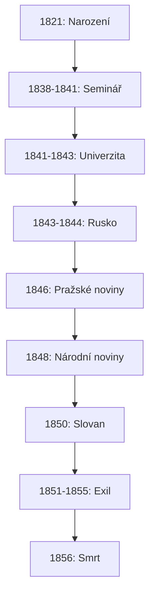
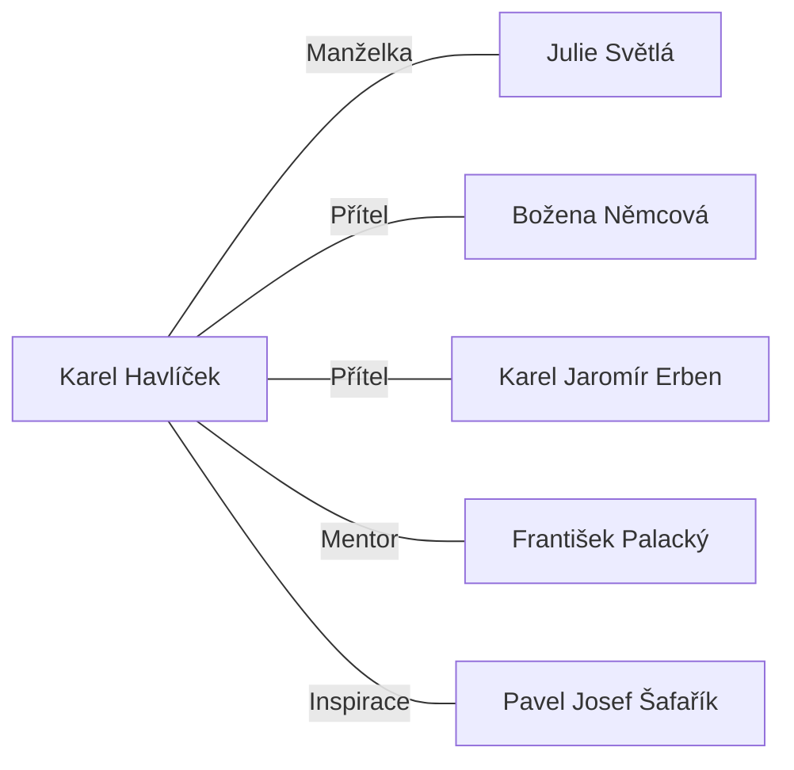
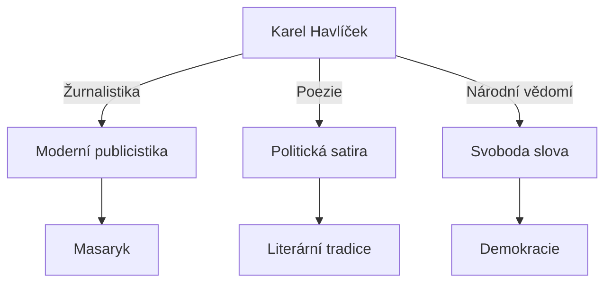

**Josef Kajetán Tyl (1808-56)**

\- dramatik, prozaik, novinář, organizátor společenského života (přezdívka miláček národa)

\- věnoval se organizaci společenských akcí – proto ho lidi měli rádi

\- smýšlením stále v národním obrození – umění má sloužit národu

→ proto proti máchovi, kvůli výchovné funkci umění

\* tak taky psal, v jeho dílech hlavně výchovné, nejde o stylistické části

\- narodil se v Kutné hoře, učil se na tamním gymnáziu kde ho učil Václav Kliment Klicpera

\- 1835-37 hrál ve Kajetánském divadle (hrál tam i mácha)

\- 1848 poslancem říšského sněmu

\- po rozpuštění sněmu mu bylo zakázáno pobývat v Praze

\- 1856 zemřel v bídě

Novinářská činnost

\- 1834 – Kwěty české

\- 1849 – Sedlské noviny

Prozaická činnost

\- povídka Rozervanec (1840)

→ povídka dvou mladých mužů

→ jeden je Karel, druhý Hynek

→ ten rozervanec se nevěnuje národu, je zahleděný pouze do sebe

→ kritika na Máchu

\- povídka Poslendí Čech (1844)

→ kritizoval to Karel Havlíček Borovský – první česká souvislá kritika

→ nízká úroveň povídky

Dramatická činnost

a\) dramatické báchorky

\- pohádkově laděný příběh, který se odehrává v tehdejší současnosti, ve vylepšené realitě

\- skončí dobře, boj dobra a zla

\- Strakonický dudák aneb Hody divých žen (1847)

→ hlavní hrdina Strakonický dudák Švanda

→ ztratil se, matku nikdy nepoznal, sirotek

→ chudý

→ zamiluje se do Dorotky

→ tatík Dorotky nechce ke sňatku svolit

→ Švanda se rozhodne vydat do světa, vydělat peníze, vrátit se a říct si o dorotku

→ vezme si s sebou dudy, to jediné co má

→ hraje v hospodách a tím vydělává

→ cestou do světa v lese potká divé ženy

→ v lese narazí na Rosavu, což je jeho matka, což zatím neví

→ usne tam, Rosava ho najde a zjistí že to je její syn

→ očarují jeho dudy že hrají tak krásně jak to jen jde

→ jde do světa a sklízí úspěch

→ dostane se k němu Vocilka, který se snaží k němu přilepit ať z něj ždímá peníze, Švanda to nevidí, tak ho přijme, Vocilka vydělává víc

→ hrají po celém světě

→ hrají pro sultána, jeho dcera se do něj zamiluje, Švanda odmítne, tak je zavřou do vězení

→ Dorotka doma smutní → svěří se Kalafunovi, který opustí doma ženu aby s Dorotkou šel hledat Švandu do světa

→ najdou Rosavu, ta je magicky dostane do turecka, dostane je z vězení, všichni jsou šťastní, Švanda zjistí že není sirotek, dostane Dorotku, Kalafunovi se odpustí, jediný nespokojený je Vocilka

→ vlastenecké prvky, čech nemůže být šťasten jinde než doma

b\) hry ze současnosti

\- většinou všechny komedie

\- dílo Fidlovačka aneb Žádný hněv a žádná rvačka (1834)

→ poprvé zazněla píseň Kde domov můj – hudba František Škroup

→ v tehdejší Praze, chudší poměry

→ Jeník a Lidunka

→ do cesty se jim staví problémy, Jeník z vlastenecké rodiny, Lidunka z rodiny co se straní tomuto

**Karel Jaromír Erben** (1811 – 70)

český básník, sběratel lidové slovesnosti, překladatel, slavista, historik, editor (=vydavatel) starší české literatury.

ZAKLADATEL MODERNÍ ČESKÉ UMĚLÉ BALADY, která svou formou vychází z lidové.

Vystudoval práva, pracoval jako sekretář Českého muzea a archivář města Prahy. Celý život trpěl zdravotními potížemi a finančními starostmi.

Byl pravým opakem nevyrovnaného Máchy – člověk řídící se spíš rozumem, disciplinovaný, praktický. Proto jej nemůžeme pokládat za typického romantického spisovatele.

SBĚRATEL LIDOVÉ SLOVESNOSTI (především pohádek, dále říkadel, písní, přísloví…) Pohádky chápal jako svědectví o povaze národa, snažil se porovnávat jednotlivé verze navzájem a rekonstruovat jejich jádro.

****Kytice z pověstí národních**** (1853) sbírka 13 balad, jediné původní dílo. Pracoval na ní 20 let. Dílo dodnes živé (o čemž svědčí nedávná filmová verze režiséra Brabce).

Má promyšlenou kompozici – protilehlé básně mají vždy něco společného (13. balada Lilie byla doplněna až při druhém vydání)

***1. a 12. (*Kytice a Věštkyně*)*** navazují na lidovou poezii, aktualizují staré pověsti, mluví se v nich o národu – vlastenecký tón.

***2. a 11. (*Poklad a Dceřina kletba*)*** porušení základního etického vztahu (matka – dítě)

Poklad: na Velký pátek se otevírají brány k pokladům skrytým v zemi. Matka vynáší skvosty a zapomene na dítě, které zůstane uvězněno v jeskyni. Po roce se opět shledají – žena už nedbá o poklad – největším pokladem je pro ni její dítě.

*„Avšak ženu vábí málo,*

*co ji tolik hoře stálo!*

*Stáloť ji, ach! slzí mnoho!*

*Leč děkujíc bohu za to,*

*touže drahé tiskne děcko.*

*Hořceť zakusila toho:*

*že-tě velmi málo zlato,*

*avšak dítě nade všecko.“*

Dceřina kletba – dívka má příliš benevolentní matku, která ji nechá chodit s chlapci. Dívka otěhotní a dítě pak zabije. Před popravou matku prokleje:

*„ ,A co necháš svojí matce,*

*dcero má?*

*A co necháš svojí matce,*

*jež tě milovala sladce*

*a draze tě chovala?´*

*,Kletbu zůstavuji tobě,*

*matko má!*

*Kletbu zůstavuji tobě,*

*bys nenašla místa v hrobě,*

*že´s mi zvůli dávala!´ “*

***3. a 10. (*Svatební košile a Vrba*)*** – proměna (milence v upíra – zombii, ženy ve vrbu)

Svatební košile – dívka se op půlnoci modlí, aby se jí vrátil milý, nebo ať ji raději stihne brzká smrt. Vtom se objevuje milý, chce ji pojmout za ženu a vleče ji neznámo kam, později se ukáže, že na hřbitov. Dívka pochopí, že ji chce roztrhat, zachrání se až kajícnou modlitbou.

Vrba – muž se ožení, žena celou noc ležívá jako mrtvá, ráno ožívá. Muž zjistí, že se v noci převtěluje do vrby – nechá strom pokácet, ale tím ji zabije. Když dají jejich dítě do kolébky upletené z proutí té vrby, přestane plakat – je v matčině náruči.

***4. a 10. (*Polednice a Vodník)**** – nadpřirozené bytosti, které zasahují do narušených mezilidských vztahů (matka – dítě)

Polednice – dítě pláče, ruší matku při vaření, zlobí, matka na něj přivolá polednici, pak lituje, snaží se dítě ubránit, ale udusí jej ve své náruči.

Vodník – matka varuje dceru, aby nechodila k jezeru, dcera neposlechne, utopí ji vodník, má s ní dítě. Po dlouhém naléhání ji pustí zpět na souš navštívit matku, matka jí brání v návratu, vodník dítě zabije.

***5. a 8. (*Zlatý kolovrat a Záhořovo lože*)*** – vina a vykoupení pokáním.

Zlatý kolovrat – mladý král se ztratí v lese, potká krásnou Doru, žádá její nevlastní matku o její ruku. Matka Doru zabije a na její místo dosadí svou vlastní dceru. Král je oklamán. Tělo Dory najde jakýsi stařeček s pacholetem, to vyšle na hrad, aby nabídl hradní paní zlatý kolovrat, kužel a přeslici za ruce, nohy a oči. Výměna se uskuteční, král se vrací, žena mu předvádí zlatý kolovrat, ten ale prozradí zločin, stařeček oživí Doru, koná se svatba, obě vražedkyně zemřou stejnou smrtí, jakou uchystaly Doře.

Záhořovo lože – kajícného poutníka v lese přepadne loupežník, ale nakonec jej nezabije, protože poutník mu slíbí, že mu z pekla přinese zprávu, jaká muka tam jsou pro něj nachystána. Když mu to později vyjeví, loupežník se zhrozí a uposlechne rady poutníkovy a začne se kát. Po mnoha letech se opět setkávají. Loupežníku Záhořovi je odpuštěno.

***6. a 7. (*Štědrý den a Holoubek*)*** motiv lásky a smrti.

Štědrý den – 2 dívky na štědrý večer vysekají díru do ledu, aby viděly, co je čeká – jedna uvidí svou svatbu, druhá pohřeb.

Holoubek – mladé ženě zemře muž, po cestě na hřbitov potká jiného mladého muže, zamiluje se, zapomene na mrtvého manžela, znovu se vdá. Na hrobě mužově sedává holoubek a smutně vrká, žena nevydrží jeho výčitky a utopí se. Je zahrabána někde u cesty – jako sebevražedkyně nemá nárok na křesťanský pohřeb. Na hrobě jí leží kámen, který ji ale tíží méně než vina, kterou spáchala na svém prvním muži.

Silná úloha osudu - FATÁLNOST.

Konflikt vzniká vždy porušením nějaké etické normy.

\- VINA – je často neúmyslně spáchaná, je TVRDĚ TRESTÁNA, až neúměrně. Základní vztah: matka – dítě (např. v baladě Vodník je dokonce dvojí konflikt: matka – dcera, dcera a její dítě. Ať zvolí jakkoli, bude to špatně.

\- NEVYHNUTELNÝ OSUD.

\- VLIV LIDOVÉ SLOVESNOSTI - veršové schéma, tématika – lidové obyčeje (Štědrý den) a pověry (Poklad), nadpřirozené bytosti (Polednice, Vodník), kouzelné předměty (Zlatý kolovrat, Vrba).

\- DĚJOVÁ ZKRATKA = typická pro lidovou baladu, nevěnuje se moc popisu přírody (x duchu romantismu)

\- ROMANTICKÁ jsou MÍSTA, kde se děj odehrává (jezero, hřbitov, les, jeskyně…).

Děj je popsán zhuštěně – využívá neslovesné věty, vynechává spojky, místo sloves používá citoslovce:

*„a u chaloupky z koně hop*

*a na dvéře klop, klop, klop…“*

to způsobuje sevřenost vyprávění, stupňuje napětí, zvyšuje spád děje…

Typické jsou také STRUČNÉ DIALOGY, dokonalá ZVUKOMALBA:

*„… a na topole podle skal,*

*zelený mužík zatleskal…“*

Hlásky p,t,k,l, evokují zvuk tleskání.

Často opakuje slova, celé verše, používá expresivní výrazy – opět vliv lidové slovesnosti.

V baladě *Záhořovo lože* – *polemika s Máchou* – trest – hlavní hrdina se provinil – trest přijímá pokorně a kaje se

(*x Máchův Vilém se bouří – romantik*), tím se může vysvobodit. Erbenův hlavní hrdina neobviňuje společnost (konflikt řeší ve prospěch společnosti, nikoli jedince, x romantismu).

Děj balad se odehrává v jakémsi BEZČASÍ (*x Máj, přesné časové určení*), nezajímá se o budoucnost (*x Mácha – úvahy Vilémovy ve vězení*):

„*Však lépe v mylné naději sníti,*

*před sebou čirou temnotu,*

*nežli budoucnost odhaliti,*

*strašlivou poznati jistotu.“*

*Sběratelská činnost:*

****Písně národní v Čechách**** (1842 – 45)

****Prostonárodní písně a říkadla**** (1862 – 64)

****Sto prostonárodních pohádek a pověstí slovanských v nářečích původních**** (1865)

\- Neusiluje o doslovnou reprodukci pohádkových textů – porovnával jednotlivé varianty pohádek a hledal jejich „jádro“, jádro příběhu.

\- Pro jeho pohádky jsou typické stručné výstižné charakteristiky hlavních postav (často používá i charakterizující přídomky (moudrý stařec, spanilý mladík), jindy mají už jména charakterizační schopnost (liška Ryška, kůň Zlatohřívák). Postavy se nemění – vstupují do děje s danými vlastnostmi.

\- Časté jsou dialogy psané hovorovým jazykem, ale ne nářečím (dodnes působí živě).

\- Stejně jako v Kytici se i zde vyskytuje nezvratný osud. Pohádky však nejsou beznadějné – hlavní hrdina bojuje proti zlu za kladné morální hodnoty a vítězí.

\- Sbíral zejm. fantastické pohádky (O ptáku Ohniváku a lišce Ryšce, Dlouhý, Široký a Bystrozraký).

### **Karel Sabina**

- **Datum narození a mládí**:

  - Narodil se 29. prosince 1813 v Praze.

  - Pocházel z chudých poměrů, vychovávala ho matka, otec nebyl znám.

  - Navštěvoval gymnázium a studoval filozofii a práva na Karlo-Ferdinandově univerzitě (studium nedokončil).

- **Literární kariéra**:

  - Spisovatel, novinář, dramatik, básník a libretista.

  - Byl jedním z prvních českých romantiků, inspirován evropskými romantickými hnutími.

  - Podílel se na českém národním obrození a šířil vlastenecké myšlenky.

- **Hlavní díla**:

  - **Básnické sbírky**: "Poezie" – vyjadřují romantické ideály lásky, svobody a individuálního vyjádření.

  - **Novela**: "Oživené hroby" – realistický obraz revolučních událostí roku 1848.

  - **Drama**: "Hraběnka Kateřina" – kritika aristokracie a nespravedlnosti ve společnosti.

  - **Libreta**: Spolupráce s Bedřichem Smetanou – napsal libreta k operám:

    - **"Prodaná nevěsta"**: komická opera zobrazující českou vesnici.

    - **"Braniboři v Čechách"**: opera, která se zabývá českým národním bojem proti cizí nadvládě.

- **Politická aktivita**:

  - Byl aktivní v revolučním roce 1848, podporoval radikální demokratické myšlenky a české národní hnutí.

  - Podílel se na revolučních novinách a vydával letáky.

  - V roce 1849 byl zatčen za účast na revoluci a odsouzen k 18 letům vězení na Špilberku (propuštěn po 5 letech díky amnestii).

- **Spolupráce s tajnou policií**:

  - Po propuštění z vězení se dostal do finančních potíží.

  - V roce 1872 bylo odhaleno, že spolupracoval s rakouskou tajnou policií a donášel na své vlastenecké přátele.

  - Kvůli tomu byl zavržen českou společností a ocitl se v izolaci.

- **Pozdní léta a smrt**:

  - Zemřel v bídě a izolaci 9. listopadu 1877 v Praze.

### **Spojitost s Karlem Hynkem Máchou**

- Karel Sabina byl blízkým přítelem **Karla Hynka Máchy**, jednoho z nejvýznamnějších českých romantických básníků.

- Sabina patřil do stejného literárního okruhu jako Mácha, oba sdíleli romantické ideály a byli ovlivněni evropským romantismem.

- Sabina psal o Máchovi, obdivoval jeho dílo, zejména **"Máj"**. Po Máchově smrti se stal jedním z jeho nejvýznamnějších propagátorů a snažil se rozšířit povědomí o jeho tvorbě mezi českou veřejností.

- Sabina se zasadil o to, aby Mácha nebyl zapomenut, a stal se jedním z jeho prvních životopisců, čímž napomohl k upevnění Máchovy pozice v české literatuře.

### **Odkaz Karla Sabiny**

- Byl významnou osobností českého národního obrození, navzdory kontroverzi, která poznamenala jeho život.

- Svou literární a hudební tvorbou přispěl k rozvoji české kultury – zejména díky libretům k Smetanovým operám.

- Jeho životní příběh je připomínkou složitého boje za národní svobodu a cenu, kterou někdy lidé za své činy platí.

### **"Prodaná nevěsta"**

- **Autor**: Libreto napsal **Karel Sabina**, hudbu složil **Bedřich Smetana**.

- **Rok premiéry**: 1866.

- **Žánr**: Komická opera (opera buffa).

- **Počet jednání**: Opera má 3 jednání.

#### **Obsah a děj opery**

"Prodaná nevěsta" je jednou z nejslavnějších českých oper, která se stala symbolem české národní kultury a hudebního dědictví. Příběh se odehrává na české vesnici a kombinuje milostnou zápletku, humor, a prvky českých lidových zvyků a tradic. Děj se točí kolem dvou hlavních postav – **Máři** a **Jeníka**, jejichž láska musí překonat překážky a intriky způsobené záměrem provdat Mařenku za bohatého ženicha.

- **První jednání**:

  - Příběh začíná na vesnici, kde se lidé připravují na slavnost. **Mařenka** a **Jeník** se milují, ale Mařenčini rodiče – **Ludmila** a **Krušina** – chtějí, aby se Mařenka provdala za **Vaška**, syna bohatého statkáře **Míchy**.

  - **Kecal**, místní dohazovač, má za úkol zajistit svatbu mezi Mařenkou a Vaškem. Nabízí Jeníkovi peníze, aby se Mařenky vzdal.

- **Druhé jednání**:

  - Jeník Kecalovi zdánlivě ustoupí a podepíše smlouvu, ve které souhlasí, že se Mařenky vzdá, ovšem s podmínkou, že si ji může vzít pouze syn Míchy. Nikdo netuší, že Jeník je ve skutečnosti Míchův syn z prvního manželství, kterého otec kvůli problémům ztratil z očí.

  - Mařenka je zprvu zděšena, protože věří, že ji Jeník prodal za peníze. Její zoufalství se ještě zvyšuje, když je nucena seznámit se s Vaškem – nesmělým a trochu pomateným mladíkem.

- **Třetí jednání**:

  - Když se pravda odhalí, ukáže se, že Jeník je také Míchův syn, což znamená, že je právoplatným dědicem a může si Mařenku vzít.

  - Vašek se zatím nechá přemluvit, aby se připojil k cirkusu, který do vesnice přijel. Nakonec vše dobře dopadne – Jeník a Mařenka jsou spolu a Kecal se ukazuje jako podvodník, který nebyl schopný své plány dotáhnout do konce.

#### **Postavy**

- **Jeník**: Hlavní hrdina, odvážný mladík, který je zamilovaný do Mařenky a je ochoten udělat vše pro to, aby byli spolu.

- **Mařenka**: Mladá a rozhodná dívka, která miluje Jeníka, ale čelí tlaku rodičů, aby si vzala někoho jiného.

- **Vašek**: Syn Míchy, nesmělý a trochu zmatený mladík, který má být Mařenčiným ženichem.

- **Kecal**: Vesnický dohazovač, který se snaží domluvit sňatek mezi Mařenkou a Vaškem za každou cenu.

- **Ludmila a Krušina**: Mařenčini rodiče, kteří chtějí, aby si Mařenka vzala bohatého ženicha.

- **Mícha**: Vaškův otec, bohatý statkář, který se podílí na plánování sňatku.

#### **Hudební charakteristika**

- "Prodaná nevěsta" obsahuje **živou, rytmickou a melodickou hudbu**, která čerpá z české lidové tradice.

- **Tance** jako **furiant** a **polka** jsou v opeře klíčovými hudebními prvky, které dotvářejí atmosféru české vesnice.

- Hudba Bedřicha Smetany v sobě nese nejen **humor a hravost**, ale také momenty **hlubokého citu** a **vlastenectví**. Smetana dokázal v této opeře vyjádřit jak vesnickou veselici, tak upřímné city zamilovaných.

#### **Význam opery**

- "Prodaná nevěsta" je považována za **národní operu** České republiky a hrála důležitou roli při formování české národní identity během období národního obrození.

- Dílo je považováno za **vrchol české komické opery** a stalo se symbolem českého hudebního dědictví.

- Díky svému chytlavému humoru, výrazným postavám a melodické hudbě se stala populární nejen v Čechách, ale také na mezinárodní scéně. Byla přeložena do mnoha jazyků a hrána na předních světových operních scénách.

### **Josef Václav Frič (1829–1890)**

#### **Profese a život**

- **Profese**: Český spisovatel, básník, novinář, politik a revolucionář.

- **Život**: Narodil se 5. září 1829 v Praze. Byl aktivním účastníkem revolučního dění v roce 1848, což ho přivedlo k několika uvězněním a později i k exilu ve Francii, Německu a Maďarsku. Po návratu do Čech v roce 1879 pokračoval v literární a politické činnosti. Zemřel 14. října 1890 v Praze.

#### **Literární tvorba a díla**

- **"Písně z bouře"** (1857):

  - Tato sbírka patří mezi nejvýznamnější Fričova díla. Reflektuje jeho zkušenosti z revoluce roku 1848, jeho naděje a zklamání. Více než jen politická deklarace, "Písně z bouře" jsou intimní výpovědí o jeho touze po svobodě a nesmíření se s tehdejším stavem. Básně se vyznačují dramatickými obrazy a silnými emocemi, které zachycují boj a naději.

- **"Zpěvy z růže a vína"** (1861):

  - Tato sbírka se liší od "Písně z bouře" svou atmosférou. Zatímco "Písně z bouře" jsou revoluční a energické, "Zpěvy z růže a vína" přinášejí intimnější a radostnější reflexi života. Víno zde funguje jako symbol radosti, uvolnění a inspirace. Tato sbírka oslavuje lásku, přátelství a krásy života, ačkoliv obsahuje také melancholické prvky, které dodávají básním hloubku.

- **Publicistika a vzpomínky**:

  - Frič byl aktivním novinářem a publicistou, psal do různých revolučních novin a časopisů. Jeho články byly často zaměřeny na politické otázky a kritiku konzervativních režimů. V exilu psal i vzpomínky na revoluci 1848 a své exilové roky. Tyto vzpomínky jsou důležitým svědectvím o tehdejší době, poskytují autentický pohled na tehdejší politické a sociální prostředí.

  - **"Paměti z mladých let"**: Vzpomínková próza, ve které Frič popisuje své zážitky z revoluce a následného pronásledování. Tento text je významný nejen jako historické svědectví, ale také jako osobní zpověď člověka, který prošel těžkými životními zkouškami.

#### **Politická angažovanost a vliv na literaturu**

- Jako výrazný představitel českého národního hnutí psal s revolučním zápalem, což se odráželo i v jeho literární tvorbě.

- Jeho poezie a publicistika výrazně ovlivnily vnímání národní identity a boje za svobodu v 19. století. Fričova díla jsou spojena s nadějemi a zklamáním revolučního období a reflektují jeho nekompromisní postoj vůči útlaku a nespravedlnosti.

#### **Význam**

- Josef Václav Frič svými díly výrazně ovlivnil národní vědomí a boj za svobodu během 19. století. Jeho básně a publicistické práce přinesly důležité svědectví o revolučním nadšení a snaze o národní emancipaci.

### **Bolemír Nebeský (1838–1876)**

#### **Profese a život**

- **Profese**: Český spisovatel, básník, novinář a dramatik.

- **Život**: Narodil se 15. října 1838 v Praze. Pocházel z intelektuálního prostředí, což mělo vliv na jeho literární tvorbu. Během českého národního obrození se angažoval v kulturním a literárním životě Prahy. Zemřel předčasně 12. června 1876, ačkoliv jeho tvorba zůstala v paměti jako významný příspěvek k české literatuře.

#### **Literární tvorba a díla**

- **"Slzy a hvězdy"** (1860):

  - Tato sbírka básní patří mezi Nebeského první vydaná díla a odráží jeho romantický pohled na svět. Básně ve sbírce jsou plné melancholie a touhy po nekonečnu, kde se slzy a hvězdy stávají symboly lidského osudu a naděje. Tato sbírka kombinuje prvky smutku a vznešených ideálů, které jsou typické pro romantickou literaturu.

- **"Osamělý hlas"** (1865):

  - Ve sbírce "Osamělý hlas" se Nebeský posunul od romantické melancholie k osobnějšímu a hlubšímu zkoumání lidských emocí a existenciálních otázek. Věnoval se tématům osamělosti, ztráty a hledání vlastní identity. Básně jsou introspektivní a často odkazují na pocity zklamání a beznaděje.

- **Drama "Bouře nad Čechem"** (1870):

  - Toto drama se zaměřuje na sociální problémy tehdejší české společnosti. Kritizuje nerovnosti mezi třídami a zaměřuje se na konflikt mezi aristokracií a obyčejnými lidmi. Drama je plné dramatických zvratů a silných emocí, které podtrhují autorův smysl pro spravedlnost a jeho angažovanost v tehdejším politickém dění.

#### **Politická angažovanost a vliv na literaturu**

- Nebeský se angažoval v kulturním a politickém životě Českého národního obrození. Jeho díla odrážjí jeho silný vztah k českému národu a jeho touhu po společenské spravedlnosti.

- Svou literární tvorbou ovlivnil další generace spisovatelů, především těch, kteří se zabývali sociálními tématy a hledali hlubší významy lidské existence.

#### **Význam**

- Bolemír Nebeský byl významnou postavou českého národního obrození a jeho díla přispěla k rozvoji české literatury. Jeho básně a dramatické tvorba reflektují jak romantické touhy, tak hluboké osobní a společenské problémy, které byly aktuální v jeho době a zůstávají inspirativní dodnes.

**SKLOŇOVÁNÍ PODSTATNÝCH JMEN PŘEJATÝCH**

Čeština si některá substantiva přejatá postupně přizpůsobuje svému systému skloňování. Jde o dlouhý proces, v jehož průběhu se postupně tvary substantiv proměňují a přizpůsobují češtině. Někdy tak existují vedle sebe různé tvary téhož slova (v různých fázích zdomácnění). Obvykle se skloňují takto:

- Maskulina dle vzoru PÁN: Puškin, -a; Fjodor, -a;

&nbsp;

- Maskulina dle vzoru MUŽ: Taras, -e; Nikolajevič, -e;

- Feminina dle vzoru ŽENA: Elektra, -y; Kuba, -y;

- Feminina dle vzoru RŮŽE: Austrálie, -e;

**Výjimky:**

**1/** Slovanská jména, která jsou původně přídavná jména, se skloňují jako česká přídavná jména:

***Tolstoj→ Tolstého; Dostojevskij→ Dostojevského***

**2/** Maskulina končící **–o** mají koncovky dle vzoru PÁN:

***Othello→ Othella; Ionesco→ Ionesca; Ševčenko→ Ševčenka***

**3/** Obecně známá maskulina končící na **–e** mívají dvojí tvary:

Dle vzoru PÁN: ***Goethe→Goetha;*** dle vzoru TEN: ***Goethe→ Goetheho***

**4/** Méně známá maskulina končící na **–e** a neslovanská jména končící na **–i** se skloňují dle vzoru TEN:

***Ševarnadze→ Ševarnadzeho; Verdi→ Verdiho***

**5/** řecká a latinská jména končící na **–os, -es, -us, -as** při skloňování odsouvají zakončení 1. pádu a dál se skloňují pravidelně dle zvoru PÁN:

***Aischylos→ Aischyla; Prométheus→ Prométhea; Dionýsos→ Dionýsa***

**6/** Některá antická jména si zachovávají prvky původního skloňování:

***Zeus→ Dia; Jupiter→ Jova*** (ale Jupitera = název planety); podobně ***Mars→ Marta** (*ale název planety = Marsu)*; **Paris→ Parida; Cicero→ Cicerona; Nero→ Nerona*** (Nera pouze mluvíme-li o jménu psa); ***Anakreon→ Anakreonta; drama→ dramatu; bronchitis→ bronchitidy***

**7/** různý tvar odlišuje významy:

Výše zmíněný Mars, Jupiter, dále ***Atlantis→ Atlantidy*** (= bájné potopené město) ***x Atlantisu*** (= raketoplán); ***cirkus→ cirku*** (= gladiátorská aréna) x ***cirkusu*** (= šapitó, v němž vystupují akrobaté); ***globus→ globu*** (= model Zeměkoule) x ***Globusu*** (= obchodní dům)

**8/** maskulina a neutra, která při vyslovení končí na dlouhou samohlásku bývají zčásti nesklonná:

***atašé, abbé*** (slovo abbé však má možnost skloňování dle vzoru TEN: ***abbého***), ***foyer→ foyer, foyeru \[foajé, foajéru\]***

Ta obvyklejší a používanější z nich však lze skloňovat dle vzoru PÁN:

***Richelieu→ Richelieu*** nebo ***Richelieua; Nehrú→ Nehrú*** nebo ***Nehrúa***

**9/** převážně francouzská jména, u kterých se v původním jazyce nečte poslední souhláska, v češtině využívají této souhlásky při skloňování :

***Dumas \[dyma\]→ Dumase \[dymase\]; Manet \[mane\]→ Maneta \[maneta\]***

***10/*** Nesklonná zůstávají:

***angažmá, negližé, relé, interview, pyré, emu, Marylin, Ráchel, Waterloo, ZOO, sárí*** a mnoho dalších slov

**11/** většina feminin se skloňuje dle vzoru ŽENA:

***Médea→ Médey; Dulcinea→ Dulciney;***

Některé z nich mají tvar sklonný i nesklonný:

***Kalypsó→ Kalypsó i Kalypsy; Sapfó→ Sapfó i Sapfy***

**12/** feminina končící na **–ea** se skloňují dle vzoru IDEA:

***Sg. 1. idea; 2. idey, ideje; 3. ideji…***

***Pl. 1. idey, ideje; 2. Idejí; 3. Ideám, idejím…***

**13/** Neutrum končící na ***–eum, -ium, -ion, -uum*** se skloňují v singuláru a nominativu plurálu dle MĚSTO, další tvary dle vzoru MOŘE:

***Koloseum, muzeum, studium, kolegium…***

# Popis

### Obecná charakteristika

Popis obsahuje sled informací, které přibližují objekt, jeho části, vlastnosti, vztahy mezi částmi nebo celkový obraz. Slouží k přesnému nebo obraznému vystižení skutečnosti, případně děje, a může být využit v různých oblastech od literatury po technické dokumenty.

## Druhy popisu

### 1. **Prostý popis**

- Srozumitelnost a jednoduchost.

- Důraz na vizuální názornost.

- Vystižení nejvýraznějších rysů objektu.

### 2. **Odborný popis**

- Přesnost, objektivita, věcnost.

- Použití odborné terminologie odpovídající danému oboru.

- Strukturovaný přístup: analýza částí, funkcí, vztahů.

- Logická posloupnost a důkazy podložené daty.

- Časté využití tabulek, grafů a schémat pro podporu přehlednosti.

- Kontextualizace v rámci historického, vědeckého nebo technického prostředí.

### 3. **Subjektivní popis (líčení)**

- Popis subjektivně zabarvený, obsahující dojmy autora.

- Využití obrazného a emotivního jazyka.

- Zaměření na vyvolání určité nálady, atmosféry nebo pocitů.

- Smyslové popisy (zrak, sluch, hmat, chuť, čich).

### 4. **Umělecký popis**

- Využití estetických a obrazných prostředků.

- Snaha vyvolat emocionální odezvu u čtenáře.

- Časté použití metafor, přirovnání nebo personifikace.

- Vytváření silné atmosféry, typické pro literární texty.

### 5. **Statický popis**

- Zaměřený na neměnné vlastnosti objektu, jako je vzhled, struktura nebo uspořádání.

- Logické uspořádání (např. od celku k detailům).

- Popis materiálů, barev, tvarů a proporcí.

### 6. **Dynamický popis (dějový)**

- Zaměřený na popis činností nebo procesů v časové posloupnosti.

- Vhodný pro technické návody, pracovní postupy nebo popis experimentů.

- Zdůraznění změn a reakcí v průběhu děje.

- Časté užití činného rodu a sloves zdůrazňujících dynamiku.

## Slovní zásoba a terminologie

- **Prostý popis**: využívá běžný, jednoduchý jazyk.

- **Odborný popis**: vyžaduje přesné definice, odborné termíny a jednoznačná vyjádření.

- **Subjektivní popis (líčení)**: užívá hodnotící a obrazný jazyk, který reflektuje autorovy dojmy.

- Výběr slov se přizpůsobuje cílové skupině a účelu textu.

## Struktura popisu

1.  **Úvod**

    - Identifikace objektu nebo děje.

    - Stručné vymezení účelu popisu.

    - Zařazení do kontextu (historického, technického, vědeckého).

2.  **Hlavní část**

    - Detailní popis částí, vlastností, vztahů nebo průběhu děje.

    - Logické uspořádání (např. od celku k detailu).

    - Použití měřitelných dat a konkrétních faktů (u odborných popisů).

3.  **Závěr**

    - Shrnutí klíčových informací.

    - Vyhodnocení významu nebo účelu popisovaného objektu.

    - Možné hodnocení, návrhy na využití.

### **Nikolaj Vasiljevič Gogol (1809–1852)**

Nikolaj Vasiljevič Gogol byl ruský spisovatel ukrajinského původu, významný představitel ruské literatury 19. století a průkopník realistické literatury, který do svých děl začleňoval i prvky satiry, grotesky a absurdity. Gogolova tvorba měla značný vliv na rozvoj ruské i světové literatury, zejména na autory jako Fjodor Michajlovič Dostojevskij, Anton Pavlovič Čechov či Franz Kafka.

Narodil se 31. března 1809 ve vesnici Velké Soročince (tehdejší Ruská říše, dnes Ukrajina) do rodiny ukrajinského statkáře. Jeho otec psal komediální hry a ovlivnil Gogolův zájem o literaturu. Již od mládí projevoval literární talent, který byl kombinován s jeho bystrým pozorováním společnosti a jemným smyslem pro humor.

#### **Život a kariéra**

Gogol studoval na Poltavském gymnáziu a později na Nežinském gymnáziu pro vyšší vzdělání, kde se začal věnovat literární činnosti. Roku 1828 se přestěhoval do Petrohradu, kde zpočátku pracoval jako úředník. Tato zkušenost měla vliv na jeho literární vnímání a poskytla mu bohatý materiál pro jeho satirická díla.

Roku 1831 se seznámil s Alexandrem Sergejevičem Puškinem, který se stal jeho mentorem a jedním z hlavních inspirátorů. Právě díky Puškinovi začal Gogol pracovat na svých nejvýznamnějších dílech, jako jsou „Revizor“ a „Mrtvé duše“.

Gogol byl známý svou osamělostí, náboženským zaujetím a konfliktním pohledem na život i své vlastní dílo. V roce 1842 vydal první díl svého vrcholného díla „Mrtvé duše“, které mělo být trilogií, ale další díly nikdy nedokončil. Během posledních let života se stáhl do ústraní, bojoval s depresemi a propadal náboženskému fanatismu. Zemřel 4. března 1852 v Moskvě za nejasných okolností.

#### **Hlavní rysy Gogolovy tvorby**

Gogolovy texty jsou charakteristické:

1.  **Satirou a groteskou** – Kritizuje společenské neduhy, byrokracii, chamtivost a lidskou hloupost.

2.  **Psychologickou hloubkou** – Postavy často zachycuje v mezních situacích, které odhalují jejich pravé já.

3.  **Symbolikou a absurdností** – Gogol často využíval surrealistické prvky a bizarní situace, aby zdůraznil absurditu lidského chování.

4.  **Kombinací realismu a fantazie** – I přes realistický základ často v jeho dílech nalezneme fantastické motivy.

### **Zajímavosti o Gogolovi**

- Gogol měl komplikovaný vztah ke svému původu. Sám sebe vnímal jako Ruska, ale jeho tvorbu výrazně ovlivnila ukrajinská kultura, jazyk a folklór.

- Trpěl hlubokými depresemi a náboženskou krizí, která vedla k tomu, že na konci života spálil rukopis druhého dílu „Mrtvých duší“.

- Byl výborným vypravěčem a miloval inscenování divadelních her. Často svá díla recitoval přátelům.

- Gogol považoval humor za „mocný prostředek poznání“ a jeho satira je často považována za nadčasovou.

- Jeho smrt je opředena tajemstvím – pravděpodobně zemřel vyhladověním, protože věřil, že hladovění má očistný účinek.

### **Detailní analýza díla „Revizor“ (1836)**

**Autor:** Nikolaj Vasiljevič Gogol  
**Žánr:** Satirická komedie  
**Forma:** Drama  
**Počet dějství:** Pět  
**Motto:** „Nevrč, brachu, na zrcadlo, když máš křivou hubu.“

### Kontext díla

- **Historické pozadí:** Gogolovo dílo vzniká v období vrcholné byrokracie a korupce Ruské říše, kdy byla administrativní struktura nejen neefektivní, ale i znešvaňovaná. Znežívání pravomocí a klientelismus byly hluboce zakořeněné, což Gogol mistrně satirizuje. Autor se tak postavil do role literárního kritika společnosti, který zároveň ironicky odhaluje univerzální lidské slabosti.

- **Inspirace:** Dílo bylo iniciováno Puškinem, který autorovi předal historku o záměně obyčejného úředníka za inspektora. Gogol tuto základní kostru rozpracoval do podoby dramatické satiry. Toto spojité propojení mezi literární a osobní inspirací dokresluje autorovu schopnost nalézat ve zdánlivě banální situaci hluboký symbolický potenciál.

### Struktura díla

- **Pět dějství:**

  - **1. dějství (expozice):** Děj začíná sdělením, že město očekává tajného revizora. Chlestakov, náhodný cestující, je omylem považován za tuto osobu. Gogol zde mistrně buduje napětí skrze groteskní reakce jednotlivých úředníků.

  - **2. dějství (kolize):** Chlestakov zjistí, že městoští úředníci jej mylně identifikovali, a situaci začne záměrně využívat. Jeho interakce s jednotlivými postavami postupně odhalují jejich charakterové slabosti.

  - **3. dějství (krize):** Chlestakov přijímá úplatky, lichotky a dokonce i nabídku sňatku. Městoští jsou ve stále větším strachu, který Gogol využívá k zesměšnění jejich pokrytectví a zbabělosti.

  - **4. dějství (peripetie):** Chlestakov se rozhodne uniknout dříve, než bude jeho podvod odhalen. Jeho odchod se stává momentem deziluze pro všechny, kteří mu uvěřili.

  - **5. dějství (katastrofa):** Po jeho odjezdu dorazí zpráva o příjezdu skutečného revizora, což vyvolá univerzální zdědění. Gogol zde závěr díla mistrně graduje do okamžiku, který zůstává věně vrytý do paměti publika.

### Aristotelovy jednoty

1.  **Jednota místa:** Všechny události se odehrávají v jednom provinčním městě, hlavně v hejtmanově domě a jeho blízkém okolí. Tento omezený prostor zdůrazňuje klaustrofobický charakter společnosti uzavřené v malém okruhu moci a významů.

2.  **Jednota času:** Děj se odehrává během jednoho až dvou dní, což podporuje dramatický spěch událostí. Tato koncentrace děje zdůrazňuje absurditu a eskalaci konfliktů.

3.  **Jednota děje:** Hra sleduje jedinou dějovou linii – příchod domnělého revizora a jeho interakci s městoštími, která je uzavřena odhalením omylu. Tato lineární struktura příběhu přispívá k jeho srozumitelnosti a efektivitě.

### Hlavní témata a motivy

1.  **Korupce:** Kritická reflexe zkorumpované byrokracie a malicherných vztahů uvnitř vládního aparátu. Korupce zde není pouze morálním nedostatkem, ale také systémovým rysem společnosti.

2.  **Strach z autority:** Satira na podlézavost a iracionální strach z neznámé autority. Gogol ukazuje, jak tento strach dokáže paralyzovat a ovlivňovat celé společenství.

3.  **Manipulace:** Zobrazení lidské důvěřivosti a schopnosti člověka manipulovat situacemi k vlastnímu prospěchu. Manipulace zde má různé podoby – od osobního vychytralého jednání Chlestakova až po kolektivní manipulaci v prostředí byrokracie.

4.  **Absurdnost maloměšťáctví:** Gogol ironizuje omezené a povrchní myšlení provinční společnosti, která si zakládá na věcech druhořadých. Tato absurdita je podtržena kontrastem mezi reálnými problémy a jejich řešením.

5.  **Satira a groteska:** Nadnesené situace slouží k zesměšnění jednotlivců i společenských struktur. Gogol se nezastavuje pouze u jednotlivých postav, ale poukazuje na strukturu celé společnosti.

### Postavy a jejich analýza

#### **1. Ivan Alexandrovič Chlestakov**

- **Role:** Antihrdina, který se náhodně dostane do role revizora.

- **Charakteristika:**

  - Vychytralý a schopný rychle reagovat na situace, které mu přinášejí prospěch.

  - Vážnost situace si plně uvědomuje a jedná impulzivně, bez hlubšího plánu.

  - Jeho egoismus je střetem individuality s kolektivní strukturou společnosti.

- **Symbolika:** Ztělesňuje lidskou vychytralost a schopnost těžit z neznalosti ostatních.

#### **2. Osip**

- **Role:** Sluha Chlestakova.

- **Charakteristika:**

  - Pragmatický a realistický, často poskytuje ironické komentáře ke chování svého pána.

  - Je si plně vědom rizika situace a snaží se minimalizovat její důsledky.

  - Představuje praktický pohled na život bez iluzí.

- **Symbolika:** Hlas zdravého rozumu kontrastující s Chlestakovovou impulzivitou.

#### **3. Anton Antonovič Skvoznik-Dmuchanovskij (hejtman)**

- **Role:** Hlavní představitel městské byrokracie.

- **Charakteristika:**

  - Zkorumpovaný, zbabělý, ale extrémně ambiciózní.

  - Jeho servilita vůči Chlestakovovi hraničí s komickou absurditou.

- **Symbolika:** Kritika zkorumpované a nekompetentní moci.

#### **4. Anna Andrejevna**

- **Role:** Hejtmanova manželka.

- **Charakteristika:**

  - Marnivá, sebestředná a povrchní, toužící po společenském uznání.

- **Symbolika:** Satira na maloměšťanský materialismus a společenskou povrchnost.

#### **5. Máša (Marie Antonovna)**

- **Role:** Dcera hejtmana.

- **Charakteristika:**

  - Naivní a ovlivnitelná, romanticky zasněná.

  - Je střetem generace snů s generací pragmatismu.

- **Symbolika:** Ztělesňuje nezkušenost a snadnou manipulovatelnost mládí.

#### **6. Dobčinskij a Bobčinskij**

- **Role:** Komické figury, nositelé fám.

- **Charakteristika:**

  - Jejich nadměrná horlivost a zbytečná aktivita podporují absurditu situace.

  - Představují archetyp malicherných členů společnosti.

- **Symbolika:** Kritika malicherných a neproduktivních jedinců.

### Jazyk a styl

- **Dialogy:** Gogol pracuje s jazykovou diverzitou, přístupně zachycuje rozdíly mezi řečí jednotlivých vrstev. Hovory mezi postavami obsahují výrazné sociolektické rozdíly.

- **Ironie a satira:** Nadnesení a zesměšnění slouží k odhalování lidských slabostí. Gogol ironicky pracuje s kontrastem mezi realistickým zobrazením a groteskou.

- **Symboly:** Revizor symbolizuje strach z moci; Chlestakov manipulaci. Jednotlivé postavy nesou symbolický význam, od povrchnosti po morální rozklad.

- **Hovorová ČJ**

### Hlavní poselství

„Revizor“ představuje nadčasovou kritiku lidské povahy, zkorumpovaného systému a iracionálního strachu z autorit. Gogol ukazuje, jak lidská hloupost a pokrytectví vedou k absurditě a destrukci. Autor skrze satiru nabízí pohled na hlubší problémy lidské společnosti, které jsou dodnes aktuální.

### Význam díla

- **Literární význam:** Klíčový text ruské dramatiky a jeden z pilířů světové literatury. Gogol vytvořil nadčasovou satiru, která inspirovala řadu dalších autorů.

- **Společenský dopad:** Dílo nastavuje zrcadlo každé společnosti, kde vládne zneužívání moci, manipulace a strach z autorit. Gogol ukazuje, že tyto fenomény nejsou pouze rysem Ruské říše 19. století, ale univerzálním atributem lidských společenství. Skrze ostrou satiru autor varuje před tím, jak snadno může moc deformovat společenské hodnoty a vést k absurditě a destrukci. Témata zkorumpovaného systému a lidské povahy, která Gogol rozpracovává, jsou stále aktuální a jejich reflexe může pomoci odhalit problémy i v současných režimech. Gogolovo dílo se zde ukazuje jako nadčasová analýza, která překračuje hranice dobového kontextu a apeluje na obecnou potřebu reflektovat, jak se mocenské struktury promítají do každodenního života. Téma revizora zde zároveň nefunguje pouze jako satirická figurka, ale jako univerzální metafora moci, jež dokáže deformovat hodnoty i osobní morálku. Autor využívá jazykových a dramatických prostředků k tomu, aby vyvolal v publiku otázky o povaze autority, podřízenosti a o schopnosti jednotlivců postavit se proti systému. Gogol tak demonstruje, že každá společnost, bez ohledu na epochu, nese riziko pádu do spirály manipulace a zneužívání.

### **Mrtvé duše (1842)**

„Mrtvé duše“ jsou považovány za jedno z vrcholných děl ruské literatury. Gogol v tomto románu přináší satirický a groteskní pohled na ruskou společnost 19. století, její byrokracii, zkorumpovanost a lidské charaktery.

#### **Obsah**

Hlavní postavou je Čičikov, šikovný a pragmatický podvodník, který cestuje po ruském venkově a skupuje „mrtvé duše“ – jména zemřelých nevolníků, kteří stále figurují v úředních seznamech jako živí. V té době byli nevolníci využíváni jako zástava při půjčkách, a tak Čičikov hodlá tyto „duše“ zapsat jako svůj majetek a použít je k získání bohatství.

Román sleduje Čičikovovy návštěvy různých statkářů, z nichž každý představuje typizovaný obraz ruské společnosti – od chamtivého Sobakjeviče přes idealistického Manilova až po hrabivou Korobočku. Gogol tím odhaluje lidské slabosti, pokrytectví a absurditu byrokratického systému.

#### **Hlavní postavy**

- **Čičikov** – Hlavní hrdina a antihrdina, jehož jednání je symbolem morální prázdnoty.

- **Manilov** – Sentimentální a nerealistický statkář, jehož sny jsou odtržené od reality.

- **Korobočka** – Lakotná vdova, která se bojí každé změny a lpí na majetku.

- **Sobakjevič** – Přízemní a vypočítavý statkář.

- **Pljuškin** – Archetyp hamižnosti, jehož statky jsou zanedbané a jeho majetek je mu k ničemu.

#### **Témata**

1.  **Morální zkaženost** – Gogol ukazuje rozklad lidských hodnot a absence etiky.

2.  **Kritika společnosti** – Román odráží absurdnost byrokratického systému a stav tehdejší společnosti.

3.  **Symbolika duší** – „Mrtvé duše“ představují nejen zemřelé nevolníky, ale i prázdné, zkorumpované lidské existence.

#### **Zajímavosti**

- Gogol plánoval vytvořit „ruskou Božskou komedii“ – první díl měl být satirický (Peklo), druhý idealistický (Očistec) a třetí duchovní (Ráj). Nicméně, druhý a třetí díl nikdy nedokončil.

- Autor spálil část druhého dílu, protože nebyl spokojen s výsledkem.

- Román je často interpretován jako obraz tehdejší ruské duše, od groteskních nedostatků po hlubší spirituální otázky.

### **Taras Bulba (1835, revidováno 1842)**

„Taras Bulba“ je historická novela, která čerpá inspiraci z ukrajinské kozácké tradice. Gogol zde kombinuje dobrodružství, romantiku a vlastenecký patos.

#### **Obsah**

Příběh se odehrává v 16. století na ukrajinském území a sleduje osudy Tarase Bulby, starého kozáka, a jeho dvou synů – Andreje a Ostapa. Taras je prototypem silného a neohroženého válečníka, jehož loajalita k kozáckému bratrstvu a víře stojí nad vším ostatním.

Děj se zaměřuje na vojenská tažení kozáků proti Polákům a na konflikty mezi otcem a syny. Největší zlom přichází, když Andrej zradí kozáky kvůli lásce k polské šlechtičně. Taras tuto zradu neodpouští a syna vlastnoručně zabíjí. Ostap zůstává věrný ideálům, ale nakonec je zajat a popraven.

#### **Hlavní postavy**

- **Taras Bulba** – Hrdý a neústupný kozák, symbol vlastenectví a věrnosti tradici.

- **Andrej** – Mladší syn, jehož vášeň a romantika vedou k tragické zradě.

- **Ostap** – Starší syn, který je věrný kozáckým ideálům a hrdinsky umírá.

#### **Témata**

1.  **Vlastenectví a tradice** – Gogol vyzdvihuje hrdinství a věrnost vlasti a kozáckému způsobu života.

2.  **Osud a tragédie** – Konflikt mezi rodinnými vztahy a povinnostmi vůči společenství.

3.  **Křesťanská víra** – Kozáci jsou zobrazeni jako obránci pravoslaví proti katolicismu.

#### **Zajímavosti**

- Gogol původní verzi přepracoval, aby byla více vlastenecká a odpovídala tehdejšímu ruskému nacionalismu.

- „Taras Bulba“ byl často kritizován za idealizaci násilí a válečných konfliktů.

- Dílo bylo adaptováno do oper, filmů a baletů.

### **Plášť (1842)**

„Plášť“ je jednou z nejznámějších povídek Gogola a často se považuje za začátek ruského realistického vyprávění. Fjodor Dostojevskij údajně prohlásil: „Všichni jsme vyšli z Gogolova Pláště.“

#### **Obsah**

Povídka sleduje osud Akakije Akakijeviče, chudého a nenápadného úředníka, který se celý život věnuje opisování dokumentů. Akakij je terčem posměchu svých kolegů, ale jeho život získává nový smysl, když si šetří na nový plášť. Po dlouhé dřině se mu podaří plášť koupit, což mu přináší radost a obdiv ostatních.

Jeho štěstí však netrvá dlouho – plášť mu ukradnou a Akakij se pokouší získat spravedlnost, avšak narazí na lhostejnost úřadů. Nakonec umírá v chudobě a zoufalství. Po jeho smrti se v Petrohradě začne šířit legenda o duchu, který lidem strhává pláště.

#### **Hlavní postavy**

- **Akakij Akakijevič** – Tragická postava, zosobnění ztraceného jedince v bezcitném světě.

- **Významná osoba** – Arrogantní úředník, který symbolizuje necitelnost byrokracie.

#### **Témata**

1.  **Společenská kritika** – Gogol ukazuje odlidštění a necitlivost byrokratického systému.

2.  **Samota a odcizení** – Akakij je outsider, jehož existence je pro společnost nevýznamná.

3.  **Materiální posedlost** – Plášť je symbolem společenského postavení a zároveň ukazuje absurditu lidského lpění na majetku.

#### **Zajímavosti**

- „Plášť“ je považován za přelomové dílo ruské literatury, které ovlivnilo tvorbu autorů jako Dostojevskij a Tolstoj.

- Povídka kombinuje realistické prvky s fantastickými, což bylo v Gogolově době velmi inovativní.

- Dílo se stalo symbolem kritiky byrokratického systému a dodnes má univerzální platnost.

### **Realismus: Přehled a Charakteristika**

Realismus je literární, umělecký a filozofický směr, který vznikl v polovině 19. století jako reakce na romantismus. Jeho cílem bylo pravdivě a objektivně zachytit skutečnost, přičemž se zaměřoval na všední život, každodenní problémy a společenské otázky. Realismus se snažil zobrazení skutečnosti oprostit od idealizace, přehánění a subjektivního vnímání, čímž kladl důraz na věrnost, detail a objektivitu.

### **Hlavní znaky realismu**

1.  **Pravdivé zobrazení reality:**

    - Realistická literatura se snaží zachytit život takový, jaký je, bez idealizace nebo přikrášlování.

    - Důraz je kladen na konkrétní detaily, sociální podmínky a prostředí.

2.  **Typizace postav:**

    - Postavy jsou typickými zástupci své společenské třídy, povolání nebo sociální skupiny.

    - Charakterové rysy postav vycházejí z jejich prostředí, výchovy a společenského postavení.

3.  **Důraz na společenské problémy:**

    - Realismus reflektuje otázky, jako jsou chudoba, sociální nerovnost, korupce, vliv společnosti na jednotlivce či rozpory mezi společenskými třídami.

    - Ukazuje, jak společenské podmínky ovlivňují lidský osud.

4.  **Kritika společnosti:**

    - Autoři realistických děl často kritizovali nedostatky tehdejší společnosti, jako jsou pokrytectví, byrokracie, zkaženost vyšších vrstev nebo nešvary měšťanstva.

5.  **Psychologická hloubka postav:**

    - Realismus klade důraz na vnitřní život postav, jejich psychologii, motivace a pocity.

    - Popisuje jejich vnitřní konflikty a vztahy ke společnosti.

6.  **Každodenní život jako námět:**

    - Děj realistických děl se odehrává ve známém prostředí, často ve městech, na venkově nebo v domácnostech.

    - Hlavními tématy jsou běžné situace, jako jsou rodinné vztahy, manželství, práce, politické dění či mezilidské konflikty.

7.  **Styl a jazyk:**

    - Jazyk je jednoduchý, věcný, přesný a bez zdobnosti.

    - Autoři používají přímou řeč a dialekty, aby věrně zachytili jazyk své doby a postav.

8.  **Objektivní přístup:**

    - Vypravěč stojí „nad příběhem“ a hodnotí ho z odstupu.

    - Realistická literatura se vyhýbá subjektivnímu vnímání světa (oproti romantismu) a klade důraz na objektivní popis.

9.  **Kombinace dokumentárního a uměleckého přístupu:**

    - Realismus často čerpá inspiraci z reálných událostí, prostředí nebo lidí.

    - Fikce a skutečnost se prolínají, aby vytvořily věrohodný obraz života.

10. **Historické a sociální pozadí:**

    - Realistická díla jsou pevně ukotvena v době, ve které vznikla.

    - Autoři zachycují konkrétní společenské prostředí a jeho vliv na jedince.

### **Vývoj realismu**

1.  **Vznik:**

    - Realismus se poprvé objevil ve Francii v 30. letech 19. století jako reakce na romantismus, který byl považován za příliš subjektivní a idealizující.

    - Prvním výrazným představitelem byl **Honoré de Balzac** a jeho cyklus „Lidská komedie“.

2.  **Rozvoj:**

    - Realismus se postupně rozšířil do dalších zemí, zejména do Anglie (Charles Dickens), Ruska (Lev Tolstoj, Fjodor Dostojevskij) a Německa.

3.  **Vliv na další směry:**

    - Realismus položil základy pro naturalismus, který byl ještě detailnější a analytičtější.

    - Byl také důležitým předchůdcem modernistických směrů, jako byl psychologický realismus.

### **Významné rysy realismu ve světové literatuře**

- **Francie:**

  - Honoré de Balzac – „Otec realismu“, jeho cyklus „Lidská komedie“ zahrnuje desítky románů, které komplexně zobrazují francouzskou společnost.

  - Gustave Flaubert – „Paní Bovaryová“ je realistické mistrovské dílo, které zobrazuje tragický osud ženy, jež hledá únik ze všedního života.

- **Anglie:**

  - Charles Dickens – Věnoval se otázkám chudoby a sociální nespravedlnosti ve viktoriánské Anglii („Oliver Twist“, „David Copperfield“).

  - George Eliot (pseudonym Mary Ann Evans) – Zaměřila se na psychologii postav a morální otázky („Middlemarch“).

- **Rusko:**

  - Lev Tolstoj – Autor velkých epických románů, jako je „Vojna a mír“, které zobrazují společenské i psychologické aspekty života.

  - Fjodor Dostojevskij – Hloubka psychologického realismu ve spisech, jako je „Zločin a trest“ či „Bratři Karamazovi“.

- **České země:**

  - Karel Havlíček Borovský – Realistická publicistika, která kritizovala politické poměry.

  - Božena Němcová – „Babička“ je považována za významný realistický román s idealistickými prvky.

### **Srovnání s romantismem**

1.  **Tematika:**

    - Romantismus: Hrdinské, nadčasové a ideální příběhy.

    - Realismus: Každodenní problémy, obyčejní lidé.

2.  **Postavy:**

    - Romantismus: Jedineční hrdinové bojující proti společnosti.

    - Realismus: Typizované postavy, ovlivněné prostředím a společenskými podmínkami.

3.  **Styl:**

    - Romantismus: Emotivní, expresivní a zdobný jazyk.

    - Realismus: Jednoduchý, věcný a objektivní popis.

### **Fjodor Michailovič Dostojevskij**

#### **1. Životopis**

- **Narození a rodina**

  - **Datum narození:** 11. listopadu 1821

  - **Místo narození:** Moskva, Ruská říše

  - **Rodinné zázemí:** Syn německého inženýra Michaila Dostojevského a Marii Andrejevny. Jeho otec zemřel, když Fjodorovi bylo 16 let, což mělo značný dopad na jeho dětství a pozdější život.

- **Vzdělání**

  - **Gymnázium:** Dokončil gymnázium v Sankt-Petergoradu.

  - **Vojenská akademie:** V roce 1837 vstoupil na Vojenskou akademii inženýrství v Sankt-Petergoradu, kterou úspěšně absolvoval v roce 1843 s titulem inženýra.

- **Kariéra a spisovatelská činnost**

  - **Úřednická kariéra:** Po ukončení akademie pracoval jako inženýr pro Ruskou telekomunikační společnost v Sankt-Petergoradu.

  - **Spisovatelský debut:** Jeho první významné dílo, „Bídníci“ (často nazývané „Chudáci“), bylo publikováno v roce 1846.

- **Vězněný pobyt a vyhnanství**

  - **Vězňové tábory:** V roce 1849 byl zatčen za účast v revoluční skupině Petrashevského, odsouzen k trestu smrti, který byl v poslední chvíli změněn na čtyřletní nucené práce v Sibiři.

  - **Následky:** Tento zážitek hluboce ovlivnil jeho další díla a filozofii.

- **Pozdější život a smrt**

  - **Návrat a rodina:** Po návratu z vyhnanství se oženil a měl několik dětí. Jeho pozdější roky byly poznamenány finančními problémy a zdravotními potížemi.

  - **Datum úmrtí:** 9. února 1881

  - **Místo úmrtí:** Petrohrad, Ruská říše

#### **2. Literární Dílo**

- **Hlavní díla**

  - **„Zločin a trest“ (1866):** Psychologický román o morálních dilematech hlavního hrdiny Raskolnikova, který spáchá vraždu.

  - **„Idioti“ (1869):** Příběh knížete Myškin, který představuje ideál čistoty a dobra v korupčním světě.

  - **„Běsi“ (1872):** Politický román kritizující radikální nacionalismus a nihilismus.

  - **„Bratři Karamazovi“ (1880):** Poslední a považované za mistrovské dílo, které zkoumá otázky víry, morálky a rodinných vztahů.

- **Další významná díla**

  - **„Bídníci“ (1846):** První román, který popisuje život chudých v Petrohradě.

  - **„Dvojník“ (1846):** Příběh muže, který se setká se svou dvojníkem a ztratí kontrolu nad vlastním životem.

  - **„Nepřátelé“ (1849):** Satirický román, který kritizuje intelektuální snahy o revoluci.

#### **3. Styl a Způsoby Psání**

- **Psychologický realismus**

  - Dostojevskij je známý svým hlubokým ponorem do psychiky postav, zkoumá jejich vnitřní konflikty, motivace a morální dilemata.

- **Dialektika a dialog**

  - Jeho díla často obsahují intenzivní dialogy, které reflektují filozofické a etické otázky. Používá dialektiku k představení různých pohledů na téma.

- **Symbolismus a metafora**

  - Používá bohaté symbolické prvky a metafory k vyjádření komplexních myšlenek a emocí.

- **Pluralita perspektiv**

  - Často využívá více narátorů nebo střídání perspektiv, což umožňuje komplexní pohled na události a postavy.

- **Tematická hloubka**

  - Zkoumá hluboká témata jako existenciální krize, víra, svoboda vůle, morálka, společenské nerovnosti a smysl života.

#### **4. Filozofické a Společenské Vlivy**

- **Existencialismus**

  - Jeho díla jsou považována za předchůdce existencialistické filozofie, zkoumají otázky existence, svobody a individuality.

- **Náboženské motivy**

  - Dostojevskij byl silně ovlivněn pravoslavnou vírou, což se odráží v jeho dílech skrze témata víry, hříchu a spásy.

- **Sociální kritika**

  - Kritizuje sociální nerovnosti, chudobu a útlak v ruské společnosti 19. století.

- **Psychologie**

  - Jeho analýza lidské psychiky byla revoluční a předběhla dobu, přispěla k rozvoji literární psychologie.

#### **5. Ovlivnění a Dědictví**

- **Světová literatura**

  - Dostojevskij je považován za jednoho z největších světových spisovatelů. Jeho díla ovlivnila mnoho autorů a filozofů, včetně Franze Kafky, Alberta Camuse a Fjodora Šilovského.

- **Psychologie a psychiatrie**

  - Jeho hluboký vhled do lidské psychiky ovlivnil i oblasti psychologie a psychiatrie, zejména teorie osobnosti a motivace.

- **Filmové a divadelní adaptace**

  - Mnoho jeho děl bylo adaptováno do filmů, divadelních her a televizních seriálů, což svědčí o jejich trvalé aktuálnosti a univerzálnosti.

- **Filozofické diskuse**

  - Jeho díla jsou předmětem mnoha filozofických a literárních studií, diskutuje se v nich otázky morálky, etiky a existence.

- ***Mikropsychologická analýza***

#### **6. Osobní Život a Vlastnosti**

- **Zdravotní problémy**

  - Trpěl epilepsií, která ovlivnila jeho život a tvorbu. Epileptické záchvaty byly často inspirací pro některé jeho postavy a scény.

- **Finanční potíže**

  - Neustálé finanční problémy kvůli vysokým nákladům na život a literární činnost.

- **Rodinný život**

  - Byl ženatý s Marií Dmitrievnou Isaeva, s níž měl syna Alekseje a dvě dcery, Polu a Alonu.

- **Vztahy s ostatními spisovateli**

  - Udržoval přátelské i profesní vztahy s dalšími ruskými spisovateli, jako byl Lev Tolstoj, a měl vliv na jejich tvorbu.

#### **7. Jazyk a Styl v Původních Dílech**

- **Ruský jazyk**

  - Používal bohatý a expresivní ruský jazyk, plný idiomů a folklórních prvků, což dodává jeho dílům autentičnost a hloubku.

- **Vnitřní monology**

  - Často využíval techniku vnitřních monologů, které umožňují čtenáři proniknout do myšlenek a pocitů postav.

- **Ironie a sarkasmus**

  - Používal ironii a sarkasmus k zdůraznění společenských kritik a charakterizaci postav.

- **Symbolická struktura**

  - Jeho romány často obsahují symbolické struktury a opakující se motivy, které propojují různé části příběhu a zdůrazňují hlavní témata.

#### **8. Klíčová Témata v Dílech Dostojevského**

- **Dobro vs. zlo**

  - Zkoumá dualitu lidské povahy a boj mezi dobrem a zlem uvnitř jednotlivce.

- **Svoboda a determinismus**

  - Diskutuje, do jaké míry jsou lidé svobodní v rozhodování a jaké jsou limity této svobody.

- **Vědomí a sebeuvědomění**

  - Postavy často procházejí hlubokým sebeuvědoměním a introspekcí, což vede k osobnímu růstu nebo krizi.

- **Víra a ateismus**

  - Konfrontace mezi vírou a racionalismem, často zobrazující vnitřní konflikty postav mezi náboženskými přesvědčeními a skeptickým pohledem na svět.

- **Izolace a společnost**

  - Zkoumá, jak izolace ovlivňuje jednotlivce a jak jsou postavy ovlivněny společenskými strukturami a očekáváními.

#### **9. Adaptace a Interpretace**

- **Literární adaptace**

  - Dostojevského díla byla interpretována a analyzována v různých literárních teoriích, včetně psychoanalýzy a marxismu.

- **Kinematografie**

  - Filmy jako „Zločin a trest“ nebo „Bratři Karamazovi“ přinášejí jeho příběhy do vizuální podoby, často zdůrazňující psychologickou hloubku postav.

- **Divadlo**

  - Mnohé jeho příběhy byly adaptovány do divadelních her, které zachycují dramatické konflikty a morální dilemata.

#### **10. Význam v České Literatuře a Kultuře**

- **Překlady a vliv**

  - Jeho díla byla přeložena do češtiny již v 19. století a měla významný vliv na české spisovatele a intelektuály.

- **Studium v školách**

  - Dostojevskij je často součástí literárních kurzů na středních školách, kde se studuje jeho styl, témata a filozofické otázky.

- **Kulturní odkazy**

  - Jeho postavy a motivy se objevují v české literatuře, filmu a dalších uměleckých formách jako symboly komplexní lidské psychiky a morálních dilemat.

#### **11. Kritika a Kontroverze**

- **Filozofické debaty**

  - Jeho díla vyvolala debaty o morálce, náboženství a filozofii, často rozdělující čtenáře a kritiky.

- **Reakce na jeho osobní život**

  - Některé aspekty jeho osobního života, včetně jeho finančních problémů a rodinných vztahů, byly předmětem literárních a biografických debat.

- **Politické postoje**

  - Kritika revolučních ideálů a radikálních myšlenek v jeho dílech reflektovala jeho vlastní konzervativní a náboženské názory, což vyvolalo různé reakce mezi čtenáři.

#### **12. Dopad a Trvalý Odkaz**

- **Inspirace pro budoucí generace**

  - Dostojevskij inspiroval nejen literaturu, ale i filozofii, psychologii a další umělecké disciplíny.

- **Kanon světové literatury**

  - Jeho díla jsou považována za kanonické a nadčasové, studovaná a analyzovaná po celém světě.

- **Osobní hloubka a univerzálnost témat**

  - Díky své schopnosti zachytit komplexní lidské emoce a univerzální otázky o smyslu života zůstává jeho práce relevantní i v moderní době.

### **Zločin a trest**

#### **1. Úvod do Díla**

- **Autor:** Fjodor Michajlovič Dostojevskij

- **Název originálu:** Преступление и наказание

- **Rok vydání:** 1866

- **Žánr:** Psychologický román, realistická literatura

- **Historický kontext:** Dílo vzniklo v době sociálních a politických změn v Rusku, kdy se diskutovaly otázky morálky, spravedlnosti a lidské psychiky.

#### **2. Stručný Přehled Příběhu**

**Zločin a trest** je příběh mladého studenta Raskolnikova, který žije v Petrohradě v chudobě. Přesvědčený o své nadřazenosti a teoriích o "výjimečných" lidech, Raskolnikov plánuje a spáchá vraždu staré lichvářky Alony Ivanovy a její sestry Lizavety, aby získal peníze a dokázal svou teorii o nadčlověku. Po zločinu prožívá intenzivní psychickou tísň a vnitřní konflikt. Postupně se dostává do kontaktu s různými postavami, které ho vedou k přiznání viny a duchovní obnově.

#### **3. Detailní Rozbor Děje**

##### **3.1. Úvodní Stav Raskolnikova**

- **Postava Raskolnikova:** Mladý student práva, který je chudý, osamělý a izolovaný. Jeho finanční tíseň a intelektuální pýcha ho vedou k myšlence, že některé lidi lze považovat za nadčlověky, kteří mají právo překročit morální zákony.

##### **3.2. Plánování a Spáchání Zločinu**

- **Motivace:** Raskolnikov věří, že vražda lichvářky mu umožní nejen získat peníze, ale také přispět k lepšímu světu tím, že odstraní "neužitečného" člověka.

- **Průběh zločinu:** Raskolnikov zavede lichvářku do opuštěné místnosti, kde ji nejprve chce okrást, ale nakonec ji zavraždí sekerou. Při vraždě neúmyslně zabije i její sestru, která náhodou dorazí.

##### **3.3. Následky Zločinu**

- **Psychologický dopad:** Po zločinu Raskolnikov prožívá silný pocit viny, paranoiu a fyzickou nemoc. Jeho duševní stav se zhoršuje a stává se izolovanějším.

- **Vztahy s ostatními postavami:**

  - **Sonja Marmeladova:** Prostitutka (není špatným člověkem, dělá to kvůli rodině a financím, pro své blízké) s hlubokou vírou, která se stává Raskolnikovovou důvěrnicí a inspiruje ho k přiznání viny.

  - **Porfiry Petrovich:** Detektiv vyšetřující vraždu, který psychologicky ovlivňuje Raskolnikova a postupně ho přibližuje k odhalení.

  - **Dostojenský Razumichin:** Raskolnikovův přítel, který mu poskytuje podporu a představuje protiklad jeho temným myšlenkám.

  - **Dmitrij Razumichin:** Raskolnikovův přítel, který je optimistický a praktický, slouží jako kontrast k Raskolnikovovým introspektivním úvahám.

##### **3.4. Přiznání a Pokání**

- **Rozhodnutí přiznat:** Po sérii vnitřních bojů a vlivu Sonji Raskolnikov přizná svou vinu.

- **Trestní stíhání:** Bude odsouzen k trestu odnětí svobody v Sibiři.

- **Duchovní obnova:** Věřící Sonja ho podporuje na cestě k duchovnímu očištění a morální obnově.

#### **4. Charakteristika Hlavních Postav**

- **Rodion Raskolnikov:** Protagonista, komplexní postava se silnými vnitřními konflikty, jehož morální dilemata tvoří jádro příběhu.

- **Sonja Marmeladova:** Symbol víry a obětavosti, reprezentuje duchovní cestu a naději.

- **Porfiry Petrovich:** Inteligentní detektiv, který používá psychologické taktiky k odhalení Raskolnikova.

- **Dmitrij Razumichin:** Raskolnikovův přítel, který zosobňuje praktickou moudrost a lidskost.

- **Alena Ivanovna (Lichvářka):** Antagonistka, jejíž vražda je ústředním činem románu.

- **Lizaveta Ivanovna:** Sestra Aleny, neúmyslně zabitá Raskolnikovem, představuje nevinnost a nevědomost.

#### **5. Hlavní Témata Díla**

- **Moralita a etika:** Konflikt mezi osobními cíli a společenskými morálními normami.

- **Vina a trest:** Psychologické důsledky zločinu a cesta k odpuštění.

- **Existenciální krize:** Hlavní postava prochází hlubokými úvahami o smyslu života a své vlastní existence.

- **Nadčlověk a filozofie:** Raskolnikovova teorie o "výjimečných" lidech a jejich právu překračovat morální zákony.

- **Víra a spásení:** Sonja reprezentuje víru jako prostředek k duchovnímu uzdravení.

- **Sociální kritika:** Kritika sociálních nerovností, chudoby a morálního úpadku společnosti.

#### **6. Umělecké a Literární Prostředky**

- **Psychologický realismus:** Dostojevskij detailně zobrazuje vnitřní psychiku postav, jejich myšlenky a emoce.

- **Symbolismus:** Použití symbolů, jako je kříž Sonji, který reprezentuje víru a naději.

- **Vnitřní monology:** Intenzivní introspekce Raskolnikova, které umožňují čtenáři nahlédnout do jeho mysli.

- **Dialogy a dialektika:** Intenzivní a filozofické dialogy, zejména mezi Raskolnikovem a Porfiry Petrovichem, které zkoumají morální a etické otázky.

- **Tempo a struktura:** Kombinace rychlých a pomalých scén, které odrážejí Raskolnikova psychického stavu.

- **Ironie a sarkasmus:** Použití ironie k vyjádření společenské kritiky a charakterizaci postav.

- **Kontrast a opakování:** Protiklady mezi postavami a opakující se motivy zdůrazňují hlavní témata románu.

#### **7. Jazyk a Styl**

- **Ruský jazyk:** Bohatý a expresivní jazyk, plný idiomů a regionálních prvků, které dodávají autenticitu prostředí.

- **Deskriptivní pasáže:** Detailní popisy prostředí a postav, které vytvářejí živý obraz Petrohradu a sociálních podmínek.

- **Psychologická hloubka:** Jazyk odráží Raskolnikova vnitřní rozpory a emocionální turbulenci.

- **Symbolické názvy:** Některé postavy a místa mají symbolický význam, například Marmeladov představuje rozpadnou rodinu a společnost.

#### **8. Filozofické a Společenské Vlivy**

- **Existencialismus:** Román předznamenává existencialistické myšlenky o individuální svobodě, odpovědnosti a hledání smyslu.

- **Marxismus:** Kritika sociálních nerovností a vykořisťování chudých v ruské společnosti.

- **Pravoslavná víra:** Téma spásy a odpuštění je silně ovlivněno pravoslavnou teologií.

- **Psychologie:** Analýza lidské psychiky a motivací přispěla k rozvoji literární psychologie.

#### **9. Přijetí a Dopad Díla**

- **Kritické ohlasy:** Román byl široce oceňován za svou psychologickou hloubku a filozofickou komplexnost, stal se klasikou světové literatury.

- **Vliv na literaturu:** Inspiroval mnoho autorů a filozofů, včetně Franze Kafky, Alberta Camuse a dalších.

- **Adaptace:** Bylo adaptováno do filmů, divadelních her a televizních seriálů, což svědčí o jeho trvalé aktuálnosti.

- **Vzdělávací význam:** Často se studuje na literárních kurzech a univerzitách jako klíčové dílo ruské a světové literatury.

#### **10. Relevance a Dědictví**

- **Moderní interpretace:** Téma morálky, svobody a viny jsou stále aktuální a rezonují s dnešními čtenáři.

- **Psychologický vhled:** Dílo nabízí hluboký vhled do lidské psychiky, což je relevantní pro moderní psychologii a psychiatrické studie.

- **Společenská kritika:** Kritika sociálních struktur a nerovností je stále relevantní v současných diskusích o spravedlnosti a rovnosti.

- **Filozofický význam:** Představuje důležité filozofické otázky o nadčlověku, etice a smyslu života, které jsou stále předmětem debat.

### **Ídiot – Podrobný Zápis**

#### **1. Úvod do Díla**

- **Autor:** Fjodor Michajlovič Dostojevskij

- **Název originálu:** Идиот (Idiot)

- **Rok vydání:** 1869

- **Žánr:** Psychologický román, realistická literatura

- **Historický kontext:** Dílo bylo napsáno v době sociálních a politických změn v Rusku, kdy Dostojevskij reflektoval své názory na morálku, společnost a lidskou povahu.

#### **2. Stručný Přehled Příběhu**

**Ídiot** vypráví příběh knížete Myškina, mladého muže s epilepsií a čistou, upřímnou povahou, který se vrací do Ruska po léčbě ve Švýcarsku. Myškin je označován jako "idiot" kvůli své nevinností a nedostatku sofistikovaného světa. Během svého pobytu v Petrohradě se setkává s různými postavami, včetně Nasty Filipovny, Aglaie Epanchinové a Rogozina, a zapojuje se do složitých milostných a společenských vztahů, které vedou k tragickým následkům.

#### **3. Detailní Rozbor Děje**

##### **3.1. Úvodní Stav Myškina**

- **Postava knížete Myškina:** Mladý muž z lékařské rodiny, který trpí epilepsií. Jeho návrat do Ruska je motivován touhou po rodině a setkání s různými lidmi.

- **Osobnost:** Myškin je charakterizován svou nevinností, upřímností, soucitem a touhou po pravdě a spravedlnosti, což mu přináší jak obdiv, tak i nepochopení ostatních.

##### **3.2. Setkání s Nasty Filipovnou**

- **Nasty Filipovna:** Manipulativní společenská dáma, která hraje klíčovou roli v komplikování vztahů kolem Myškina.

- **Vztah s Myškinem:** Nasty Filipovna se snaží využít Myškina k dosažení svých cílů, což vede k napětí a konfliktům s ostatními postavami.

##### **3.3. Vztah s Aglaie Epanchinovou**

- **Aglaia Epanchinová:** Mladá a krásná dívka z urozené rodiny, která je jednou z hlavních romantických zájmů Myškina.

- **Dynamika vztahu:** Aglaia je zpočátku fascinována Myškinovou upřímností a čistotou, ale její city jsou komplikovány dalšími postavami a okolnostmi.

##### **3.4. Vztah s Rogozinem**

- **Parfyon Rogozin:** Bohatý a vášnivý muž, který je také zamilován do Aglaie Epanchinové.

- **Konflikt mezi Rogozinem a Myškinem:** Rivalita mezi nimi eskaluje, když Rogozin se stává posedlým Aglaií a snaží se ji získat, což vede k psychologickému a emocionálnímu střetu.

##### **3.5. Zvraty a Konflikty**

- **Manipulace Nasty Filipovny:** Její pokusy o kontrolu a manipulaci s Myškinem a Aglaií vedou k řadě nedorozumění a emocionálních zranění.

- **Epileptické záchvaty Myškina:** Tyto záchvaty symbolizují jeho vnitřní konflikty a nejistotu, zároveň ovlivňují jeho interakce s ostatními postavami.

- **Tragické události:** Série nedorozumění a manipulací vyvrcholí tragédií, která má za následek devastaci všech zúčastněných.

##### **3.6. Konec a Závěr**

- **Rozuzlení vztahů:** Vztahy mezi postavami se rozpadnou, což vede k izolaci a duchovní krizi Myškina.

- **Duchovní a morální poučení:** Myškin, navzdory svým ideálům a upřímnosti, není schopen plně změnit svět kolem sebe, což odráží Dostojevského pesimistický pohled na lidskou přirozenost a společnost.

#### **4. Charakteristika Hlavních Postav**

- **Kníže Lev Nikolajevič Myškin:** Protagonista, jehož nevinnost a upřímnost kontrastují s morálními a etickými rozpory ostatních postav.

- **Parfyon Semyonovič Rogozin:** Bohatý a vášnivý muž, posedlý Aglaií, představuje destruktivní lásku a posedlost.

- **Aglaja Ivanovna Epanchinová:** Mladá a krásná dívka, jejíž romantické vztahy s Myškinem a Rogozinem tvoří jádro konfliktů.

- **Nastasia Filippovna Barashkova:** Manipulativní společenská dáma, která hraje klíčovou roli v dějových zvratech a komplikacích vztahů.

- **Gavril Ardalionovič Ivolgin (Ganja):** Přítel Myškina, který je také zapojen do komplikovaných vztahů a intrik.

- **General Ivan Pavlovič Epanchin:** Otec Aglaie, autoritativní postava, která reprezentuje tradiční hodnoty a společenské normy.

- **Lizaveta Prokofyevna Epanchinová:** Matka Aglaie, jemná a laskavá, představuje morální stabilitu a rodinné hodnoty.

- **Varvara Ardalionovna Ivolgin (Varya):** Sestra Gany, která se stará o rodinu a představuje praktickou a rozumnou stránku ruské společnosti.

- **Adelaida Ilinichna Yepanchinová (Darya Pavlovna):** Matka Aglaie, komplexní postava s vlastními ambicemi a vnitřními konflikty.

#### **5. Hlavní Témata Díla**

- **Nevinnost vs. společenská korupce:** Myškinova čistota a nevinnost kontrastují s morálními kompromisy a manipulacemi ostatních postav.

- **Láska a posedlost:** Romantické vztahy jsou komplikovány vášní, žárlivostí a destruktivními emocemi.

- **Svoboda a determinismus:** Postavy bojují s otázkami svobodné vůle a předurčenosti v jejich rozhodnutích a osudech.

- **Psychologická hloubka:** Dostojevskij zkoumá vnitřní konflikty a motivace postav, odhaluje jejich nejhlubší touhy a strachy.

- **Společenská kritika:** Kritika ruské společnosti, její morální úpadek a sociální nerovnosti.

- **Náboženství a morálka:** Myškinova víra a morální ideály jsou střetávány s materialismem a cynismem ostatních postav.

- **Identita a sebepoznání:** Postavy se snaží pochopit sami sebe a své místo ve světě, což často vede k vnitřnímu konfliktu a krizi.

#### **6. Umělecké a Literární Prostředky**

- **Psychologický realismus:** Dostojevskij detailně zobrazuje vnitřní psychiku postav, jejich myšlenky a emoce.

- **Symbolismus:** Použití symbolů, jako je Myškinovo epileptické záchvaty, které symbolizují jeho vnitřní rozpory a osud.

- **Vnitřní monology:** Intenzivní introspekce Myškina, které umožňují čtenáři nahlédnout do jeho mysli a motivací.

- **Dialogy a dialektika:** Filozofické a emocionální dialogy, které zkoumají morální a etické otázky a odhalují charakter postav.

- **Tempo a struktura:** Kombinace rychlých a pomalých scén, které odrážejí psychického stavu postav a dynamiku děje.

- **Ironie a sarkasmus:** Použití ironie k vyjádření společenské kritiky a charakterizaci postav.

- **Kontrast a opakování:** Protiklady mezi postavami a opakující se motivy zdůrazňují hlavní témata románu.

#### **7. Jazyk a Styl**

- **Deskriptivní pasáže:** Detailní popisy prostředí, postav a jejich vnitřních stavů, které vytvářejí živý obraz Petrohradu a společenských vrstev.

- **Psychologická hloubka:** Jazyk odráží postaviny vnitřní rozpory, emocionální turbulenci a morální dilemata.

- **Symbolické názvy:** Některé postavy a místa mají symbolický význam, například kníže Myškin jako symbol nevinnosti a čistoty v korupčním světě.

#### **8. Filozofické a Společenské Vlivy**

- **Existencialismus:** Román předznamenává existencialistické myšlenky o individuální svobodě, odpovědnosti a hledání smyslu.

- **Marxismus:** Kritika sociálních nerovností a vykořisťování chudých v ruské společnosti.

- **Pravoslavná víra:** Téma spásy a odpuštění je silně ovlivněno pravoslavnou teologií.

- **Psychologie:** Analýza lidské psychiky a motivací přispěla k rozvoji literární psychologie.

#### **9. Přijetí a Dopad Díla**

- **Kritické ohlasy:** Román byl široce oceňován za svou psychologickou hloubku a filozofickou komplexnost, stal se klasikou světové literatury.

- **Vliv na literaturu:** Inspiroval mnoho autorů a filozofů, včetně Franze Kafky, Alberta Camuse a dalších.

- **Adaptace:** Bylo adaptováno do filmů, divadelních her a televizních seriálů, což svědčí o jeho trvalé aktuálnosti.

- **Vzdělávací význam:** Často se studuje na literárních kurzech a univerzitách jako klíčové dílo ruské a světové literatury.

#### **10. Relevance a Dědictví**

- **Moderní interpretace:** Téma morálky, svobody a identity jsou stále aktuální a rezonují s dnešními čtenáři.

- **Psychologický vhled:** Dílo nabízí hluboký vhled do lidské psychiky, což je relevantní pro moderní psychologii a psychiatrické studie.

- **Společenská kritika:** Kritika sociálních struktur a nerovností je stále relevantní v současných diskusích o spravedlnosti a rovnosti.

- **Filozofický význam:** Představuje důležité filozofické otázky o nevinnosti, morálce a smyslu života, které jsou stále předmětem debat.

#### **11. Závěr**

**Ídiot** je jedno z vrcholných děl Fjodora Dostojevského, které nabízí hluboký psychologický portrét hlavní postavy a zkoumá komplexní morální a filozofické otázky. Dílo poskytuje kritický pohled na ruskou společnost, její morální úpadek a sociální nerovnosti. Díky své univerzální tématice a literární brilanci zůstává **Ídiot** relevantním a inspirativním pro čtenáře a studující po celém světě, a nadále ovlivňuje literaturu, filozofii a psychologii.

### **Dodatečné Poznámky**

- **Inspirace a vliv:** Dílo ovlivnilo mnoho literárních a filozofických směrů, včetně existencialismu a psychoanalýzy.

- **Symbolika:** Myškinova postava a jeho vztahy s ostatními postavami symbolizují boj mezi nevinností a korupcí, idealismem a cynismem.

- **Struktura románu:** Román je strukturován do čtyř častí, které postupně odhalují komplikace ve vztazích postav a jejich vnitřní konflikty.

- **Dostojevského technika:** Autor využívá techniku volného proudu vědomí a detailní vnitřní monology k zobrazení postaviny psychologické hloubky.

### **Doporučená Literatura a Studium**

- **Kritické studie:** Existuje mnoho literárních kritik a studií zaměřených na hlubokou analýzu postav, témat a stylistických prostředků v **Ídiotu**.

- **Překlady:** Vybrat kvalitní překlad, který zachovává nuance původního ruského jazyka a Dostojevského stylu.

- **Porovnání s jinými díly:** Studium **Ídiotu** v kontextu ostatních Dostojevského románů, jako jsou **Zločin a trest** a **Bratři Karamazovi**, poskytuje širší pohled na autorovu tvorbu a filozofii.

### **Význam pro Českou Literatuře a Kulturu**

- **Překlady a adaptace:** **Ídiot** byl přeložen do češtiny a stal se součástí literárních kurzů na středních školách a univerzitách.

- **Kulturní odkazy:** Postavy a motivy z románu se objevují v české literatuře, filmu a dalších uměleckých formách jako symboly komplexní lidské psychiky a morálních dilemat.

- **Vliv na české spisovatele:** Dílo inspirovalo české autory k tvorbě vlastních psychologických a morálních příběhů, které reflektují podobné témata a konflikty.

### **Bratři Karamazovi**

## **1. Úvod do Díla**

- **Autor:** Fjodor Michajlovič Dostojevskij

- **Název originálu:** Братья Карамазовы (Brat'ya Karamazovy)

- **Rok vydání:** 1880

- **Žánr:** Psychologický román, filozofický román, realistická literatura

- **Historický kontext:**

  - Poslední velké dílo Dostojevského, psáno v době výrazných sociálních a politických proměn v Rusku.

  - Dostojevskij zde zúročil všechny své zásadní ideje (náboženské, filozofické, morální) a zkušenosti z předchozích děl.

Román **Bratři Karamazovi** představuje vrcholnou syntézu Dostojevského umělecké a myšlenkové tvorby. Zabývá se rodinnými vztahy, otázkou dobra a zla, víry a ateismu, svobodné vůle, viny a trestu. V centru děje stojí rodina Karamazovových, jejíž komplikované vztahy vyúsťují ve vraždu otce Fjodora Pavloviče a následný soudní proces.

## **2. Stručný Přehled Děje**

1.  **Rodina Karamazovových**

    - Hlavou rodiny je **Fjodor Pavlovič Karamazov**, bohatý, prostopášný a chamtivý muž.

    - Má tři oficiální syny (z různých manželství): **Dmitrije (Míťu), Ivana** a **Alyošu**.

    - V jeho domě se objevuje ještě **Smerďakov**, který je pravděpodobně jeho nemanželským synem.

2.  **Ústřední konflikty**

    - Spor o peníze a dědictví mezi nejstarším synem Dmitrijem a otcem Fjodorem.

    - Milostné trojúhelníky:

      - Dmitrij i otec Fjodor jsou zamilovaní do **Grushenky (Agrafeny)**.

      - Dmitrij je formálně zasnouben s **Katerinou Ivanovnou**, ale jeho srdce tíhne k volnomyšlenkářské Grushence.

    - Ivan Karamazov prožívá vnitřní filozofickou krizi (otázky o Bohu, zlu ve světě, smyslu lidského utrpení).

    - Alyoša Karamazov, duchovně zaměřený mladík, se snaží působit jako zprostředkovatel a představuje morální pilíř příběhu.

3.  **Vražda Fjodora Pavloviče a soud**

    - Fjodor Pavlovič je zavražděn za nejasných okolností.

    - Hlavním podezřelým se stává Dmitrij, který měl prokazatelný motiv i s otcem prudké spory.

    - V průběhu vyšetřování a soudu se ukazuje role Smerďakova i vliv Ivanových myšlenek.

    - Soudní proces vrcholí Dimitrijovým odsouzením. (Otázka skutečného pachatele však v románu zůstává i tak zkoumána z různých úhlů.)

4.  **Závěrečná reflexe**

    - Román končí otevřenými otázkami o vině a odpovědnosti, o smyslu utrpení a víry.

    - Alyoša představuje naději na mravní vzestup a odpuštění, i když rodina Karamazovů prošla hlubokou tragédií.

## **3. Postavy – Velmi Detailní Popis a Vztahy**

### **3.1. Fjodor Pavlovič Karamazov**

- **Rodinný status:**

  - Hlava rodiny Karamazovů, otec Dmitrije, Ivana a Alyoši.

  - Má velmi špatný vztah se všemi syny, zejména s Dmitrijem, s nímž soupeří i v lásce.

- **Povaha a charakter:**

  - Bohatý statkář, proslulý svou chamtivostí, prostopášností a nedostatkem morálních zábran.

  - Vede neurvalý způsob života, oddává se pití, hýření a cynickému užívání peněz.

  - Emocionálně je nestálý, jednou se chová podlézavě, jindy agresivně.

- **Vztahy k ostatním:**

  - **Dmitrij:** Neustálé spory o peníze a o Grushenku, na povrch vyplouvá rivalita a nenávist.

  - **Ivan:** Má z Ivana respekt kvůli jeho intelektu, ale citovou blízkost neprojevuje.

  - **Alyoša:** Nezajímá se o něj, považuje ho za nepraktického a "příliš zbožného".

  - **Smerďakov:** Zřejmě jeho nemanželský syn, kterého zaměstnává jako sluhu a kuchaře; chová se k němu s pohrdáním.

  - **Grushenka:** Je do ní zamilovaný stejně jako Dmitrij, a tím se konflikt ještě přiostřuje.

Fjodor Pavlovič představuje v románu symbol mravního úpadku a zhýralosti. Jeho zavraždění se stává tragickým vyústěním konfliktů, které sám často podněcuje.

### **3.2. Dmitrij Fjodorovič Karamazov (Míťa)**

- **Rodinný status:**

  - Nejstarší syn Fjodora Pavloviče z prvního manželství.

  - Má prudkou a vášnivou povahu, nevyrovnaný vztah k otci.

- **Povaha a charakter:**

  - Explozivní, impulzivní, silný smysl pro čest smíšený s divokými emocemi.

  - Mívá střídavě světlé a temné momenty: dokáže být galantní, štědrý, ale i agresivní a násilnický.

  - Je hédonista, který se rád oddává radovánkám, pije a utrácí.

- **Vztahy k ostatním:**

  - **Fjodor Pavlovič:** Nenávidí ho kvůli špatnému dětství a nevyjasněnému dědictví. Rivalita v lásce ke Grushence.

  - **Ivan:** Jeho mladší bratr, s nímž sdílí vzájemný respekt, ale i nevyjasněné napětí (Ivan je jeho intelektuální protipól).

  - **Alyoša:** K Alyošovi cítí bratrskou lásku a úctu, protože si uvědomuje Alyošovu čistotu a duchovní sílu.

  - **Grushenka:** Dmitrij je vášnivě zamilován do Grushenky, navzdory původnímu zasnoubení s Katerinou. Je ochoten pro ni obětovat i svou čest.

  - **Katerina Ivanovna:** Jeho snoubenka, ale city k ní se míchají se smyslem pro povinnost, výčitkami svědomí a zároveň touhou po Grushence.

- **Úloha v ději:**

  - Centrální postava v konfliktu ohledně dědictví a milostného trojúhelníku.

  - Obviněn z vraždy otce, což vyústí v dramatický soudní proces, kde se ukazují i hlubší otázky morálky a spravedlnosti.

Dmitrijův charakter ztělesňuje „karamazovskou vášeň“ – prudkost a nezkrotnost. Jeho osud je tragický, neboť je odsouzen za vraždu, ačkoli vinu nelze posoudit jednoznačně.

### **3.3. Ivan Fjodorovič Karamazov**

- **Rodinný status:**

  - Prostřední syn Fjodora Pavloviče (z druhého manželství).

  - Vzdělaný, racionálně založený mladý muž.

- **Povaha a charakter:**

  - Velmi inteligentní, cynický, ateisticky a filozoficky orientovaný.

  - Trpí vnitřními rozpory: intelektuálně odmítá Boha a církev, ale zároveň ho sžírají otázky o spravedlnosti a lidském utrpení.

  - Jeho slavný „vnitřní monolog“ a epizoda s „Legendem o Velkém inkvizitorovi“ ukazují jeho osobní krizi a nedůvěru v řád světa.

- **Vztahy k ostatním:**

  - **Fjodor Pavlovič:** Necítí k otci lásku, spíš odstup a opovržení, přesto mu otec vyplácí podporu a je pyšný na jeho vzdělání.

  - **Dmitrij:** Složité bratrské pouto – Ivan Dmitrije navenek soudí, ale zároveň ho do jisté míry chápe a v hloubi duše mu chce pomoci.

  - **Alyoša:** Ivanova idea „logiky bez Boha“ se střetává s Alyošovou vírou. Přesto k sobě chovají upřímnou bratrskou lásku a respekt.

  - **Katerina Ivanovna:** Je jí okouzlen, ale není schopen normálního citového vztahu. Je v něm konflikt mezi rozumem a citem.

  - **Smerďakov:** Sluha (a možný polorodý bratr). Ivan ovlivní Smerďakova svým ateistickým myšlením, což má důsledky pro vraždu otce.

- **Úloha v ději:**

  - Filozofický pól románu, zosobňuje otázky ateismu, existence zla a „pokud Bůh neexistuje, vše je dovoleno“.

  - Jeho vnitřní rozpolcenost a pocit nepřímé odpovědnosti za otcovu vraždu vedou k psychickému zhroucení.

Ivan reprezentuje racionální a filozofický přístup k životu, ovšem prožívá hlubokou krizi kvůli neřešitelným otázkám dobra a zla, Boha a lidské svobody.

### **3.4. Alexej (Alyoša) Fjodorovič Karamazov**

- **Rodinný status:**

  - Nejmladší syn Fjodora Pavloviče (z druhého manželství).

  - Vychováván převážně v klášteře, kde si ho vzal pod ochranu starec Zosima.

- **Povaha a charakter:**

  - Upřímně věřící, nesmírně dobrosrdečný, tichý, ale zároveň silně morálně zakotvený.

  - Jeho povaha je klidná, vyrovnaná, působí jako „svědomí“ rodiny a snaží se usmiřovat konflikty.

- **Vztahy k ostatním:**

  - **Fjodor Pavlovič:** Nemá k němu blízký vztah, ale nepociťuje ani nenávist. Spíše ho lituje a vidí v něm lidskou slabost.

  - **Dmitrij:** Snaží se Míťu podporovat a chápat jeho vášnivou povahu; vyvolává v něm pocit studu a zároveň naděje.

  - **Ivan:** Má ho upřímně rád, i když Ivanovy ateistické názory jsou mu cizí. Zůstává mu morální oporou.

  - **Smerďakov:** Alyoša se k němu chová laskavě, avšak Smerďakov v něm vidí jen dalšího „svatouška“, se kterým si neví rady.

  - **Katerina Ivanovna a Grushenka:** K oběma ženám je Alyoša vstřícný a snaží se jim pomoci urovnat vztahy s Dmitrijem.

  - **Starec Zosima:** Alyošův duchovní učitel, který symbolizuje lásku a soucit. Jeho smrt a zdánlivé „znesvěcení“ těla (pach tlení) je pro Alyošu zásadní duchovní zkouškou.

- **Úloha v ději:**

  - Představuje protiklad k Ivanovu skepticismu a Dmitrijově divokosti.

  - Je nositelem naděje a morálních principů, ačkoli sám musí projít zkouškami víry a charakteru.

Alyoša zosobňuje křesťanskou lásku, odpuštění a pokoru. Navzdory všemu, co se v rodině a okolí děje, si udržuje vnitřní stabilitu a stává se světlem v temném příběhu.

### **3.5. Pavel Smerďakov**

- **Rodinný status:**

  - Neoficiální (a zřejmě nemanželský) syn Fjodora Pavloviče, vychovaný jako sluha v Karamazovově domě.

  - Matkou byla pomatená žebračka Lizaveta Smerďačka (odtud jméno Smerďakov).

- **Povaha a charakter:**

  - Uzavřený, zákeřný, cynický. Jeho jednání je často chladné a bezcitné.

  - Trpí epilepsií (stejně jako Dostojevskij sám), což v románu slouží i jako metafora pro jeho „chorou“ psychiku.

  - Je posedlý myšlenkou, že je „něco víc“, zejména poté, co se seznámí s Ivanovými filozofickými úvahami o neexistenci Boha.

- **Vztahy k ostatním:**

  - **Fjodor Pavlovič:** Je k němu servilní, ale v nitru ho nenávidí. Pravděpodobně v něm vidí otce, který ho nikdy veřejně neuznal.

  - **Dmitrij:** Považuje ho za neurvalého a primitivního, chová k němu strach i opovržení.

  - **Ivan:** Obdivuje Ivanovu inteligenci, zároveň využívá Ivanovy ateistické teorie k ospravedlnění svého jednání.

  - **Alyoša:** Necítí k němu důvěru, vnímá ho jako „mnišského světce“, který mu nerozumí.

- **Úloha v ději:**

  - Je stěžejní figurou vraždy Fjodora Pavloviče.

  - Využívá Ivanovy filozofie, aby se „osvobodil od morálních zábran“.

  - Jeho činy i sebevražda (po vraždě) prohlubují téma viny, zodpovědnosti a manipulace.

Smerďakov symbolizuje temný, potlačený aspekt rodiny Karamazovů. Jeho postava odhaluje, jak teorie „všechno je dovoleno“ může vést k tragickým činům.

### **3.6. Agrafena Alexandrovna Svetlova (Grushenka)**

- **Rodinný status:**

  - Pochází z chudší rodiny, později se stává společensky vlivnou (peníze získá od svého bývalého polského milence).

  - Je objektem touhy Fjodora Pavloviče i Dmitrije.

- **Povaha a charakter:**

  - Sebevědomá, často koketní, avšak v jádru citlivá a zranitelná.

  - Umí manipulačně využívat své krásy i finanční nezávislosti.

  - Prochází proměnou od cynické svůdnice k ženě, která touží po opravdové lásce a odpuštění.

- **Vztahy k ostatním:**

  - **Fjodor Pavlovič:** Má k němu odpor i jistou dávku pobavení. Otec Karamazov ji nepřitahuje, spíš jí imponuje jeho majetek.

  - **Dmitrij:** Je s ním spojená vášnivým vztahem, který zpočátku bere jako hru, později se skutečně zamiluje.

  - **Katerina Ivanovna:** Rivalka, která Grushenku považuje za „zkaženou ženu“. Vzájemně k sobě cítí opovržení, ale nakonec mezi nimi vznikne i lidské porozumění, když se ukáže Grushenčina lepší stránka.

  - **Alyoša:** Grushenka je vůči němu zpočátku ironická, ale jeho dobrota ji zasáhne. Nakonec v něm nachází oporu při své vnitřní proměně.

- **Úloha v ději:**

  - Spouštěč konfliktu mezi Fjodorem a Dmitrijem, který prohlubuje rodinné i milostné spory.

  - Její citová proměna ukazuje, že i zdánlivě „zkažená“ duše může nalézt cestu k vykoupení.

Grushenka zosobňuje motiv milenky „padlé a znovuzrozené“. Jejím příběhem Dostojevskij zkoumá milostnou vášeň, odpuštění a možnost nápravy.

### **3.7. Katerina Ivanovna**

- **Rodinný status:**

  - Ušlechtilá dívka z vážené rodiny, zasnoubená s Dmitrijem.

  - Její otec ztratil peníze a Dmitrij mu pomohl, což vedlo k jejich zasnoubení z vděčnosti.

- **Povaha a charakter:**

  - Hrdá, morálně založená, ale také tvrdohlavá a panovačná.

  - Její city k Dmitrijovi se mísí s pocitem dluhu a noblesní povinností.

  - Často jedná z principu, ale může sklouznout k přehnanému vzletnému sebeobětování.

- **Vztahy k ostatním:**

  - **Dmitrij:** Cítí k němu vděk a povinnost, což si někdy plete s láskou. Zraňuje ji jeho vztah k Grushence.

  - **Ivan:** Ivan ji obdivuje a ona jeho rovněž. Vzniká mezi nimi složitá přitažlivost – jak intelektuální, tak citová.

  - **Alyoša:** Respektuje ho jakožto zástupce čistých hodnot, obrací se na něj o radu.

  - **Grushenka:** Považuje ji za sokyni, nenávidí její „nemravnost“, později však prožijí i okamžik vzájemného pochopení.

- **Úloha v ději:**

  - Katerina představuje druhý pól ženského elementu (oproti Grushence) – je „vzorná“ a společensky „přijatelná“.

  - Její vznešený smysl pro čest a důstojnost je v rozporu s Dmitrijovou nevyzpytatelností a vášnivostí.

Katerina je klíčová v psychologické linii románu, zejména ve vztahu k Dmitrijovi a Ivanovi. Bojuje mezi rozumem a citem, mezi hrdostí a odpuštěním.

### **3.8. Vedlejší, ale Významné Postavy**

- **Starec Zosima**

  - Alyošův duchovní učitel v klášteře.

  - Symbolizuje živou a láskyplnou víru, zdůrazňuje pochopení a soucit.

  - Jeho smrt a následné „zklamání“ věřících, když jeho tělo po smrti vykazuje znaky rychlého rozkladu (neplní se zázrak „svatosti“), zkouší Alyošovu víru.

- **Iljuša a skupina chlapců**

  - Příběh chlapce Iljušy a jeho kamarádů, který se odehrává paralelně ke hlavnímu ději.

  - Alyoša jim pomáhá v jejich sporech a Iljušovi je oporou při smrtelné nemoci.

  - Tento vedlejší děj zdůrazňuje téma soucitu, nevinnosti dětství a vykoupení.

- **Porotci, prokurátor, advokát Fetiukovič**

  - Významní při soudním procesu.

  - Soudní síň se stává „pódiem“ pro mravní a filozofické debaty, souvisí s tématy pravdy a spravedlnosti.

## **4. Hlavní Témata a Jejich Projevy v Románu**

1.  **Víra a Ateismus**

    - **Alyoša** vs. **Ivan** jako protichůdné pozice: duchovní důvěra v Boha a křesťanskou lásku vs. skeptická, racionální kritika náboženství.

    - Otázky o původu zla a nespravedlnosti ve světě (Ivanova báseň „Velký inkvizitor“).

2.  **Dobro a Zlo v Lidské Povaze**

    - „Karamazovský“ temperament (vášeň, pudovost, zároveň schopnost pokání).

    - **Smerďakov** jako temný odraz rodiny, který dovádí zlo k činu.

    - Postavy však nejsou jednorozměrné – ve všech se mísí dobří i zlí andělé.

3.  **Rodinné Vztahy a Morálka**

    - Konflikt otce se syny, sourozenecké napětí, rivalita v lásce.

    - Dysfunkční rodina symbolizuje širší rozpad tradičních hodnot.

4.  **Svoboda Vůle a Odpovědnost**

    - „Pokud Bůh neexistuje, je vše dovoleno“ (Ivanova myšlenka) – kam až může vést absence morální autority?

    - **Dmitrij** i **Smerďakov** čelí následkům svých rozhodnutí, ať už motivovaných vášní, nenávistí či nihilismem.

5.  **Vina, Trest a Odpuštění**

    - Kdo je skutečným vrahem Fjodora Pavloviče? Jak definovat vinu, je-li spousta faktorů nepřímých?

    - Soud a představy spravedlnosti x milost, láska, odpuštění (Alyoša).

6.  **Láska a Vášně**

    - Romantické vazby (Dmitrij–Grushenka–Katerina) a jejich destruktivní i proměňující síla.

    - Zaslepenost touhou po moci, penězích, fyzické přitažlivosti.

## **5. Jazyk, Styl a Struktura**

- **Psychologický Realismus:**  
  Dostojevskij podrobně vykresluje vnitřní stavy postav skrze dialogy i vnitřní monology.

- **Polyfonie (mnohohlasnost):**  
  Každá postava má vlastní hlas, názory a způsoby vyjadřování, které spolu „diskutují“.

- **Symbolika a Motivy:**

  - Opakující se motivy: peníze, dědictví, pomsta, odpuštění.

  - Epilepsie (Smerďakov) jako symbol temné, možná „démonické“ stránky.

- **Kompozice:**

  - Děleno do knih a kapitol, příběh se odvíjí chronologicky, prokládán reflexemi, soudní fází, vedlejšími epizodami.

- **Filozofické vs. Emocionální Linie:**

  - Dlouhé dialogy a monology (Ivan a Alyoša) se prolínají s emocionálními výbuchy Dmitrije, tragickými setkáními a soudním dramatem.

## **6. Přijetí, Vliv a Dědictví**

- **Kritické Ohlasy:**

  - Od počátku považováno za jedno z vrcholných děl ruské i světové literatury.

  - Oceněno za hloubku psychologické a filozofické analýzy.

- **Vliv na Další Autory a Filozofy:**

  - Odkazy u Franze Kafky, Friedricha Nietzscheho, Alberta Camuse a dalších.

  - Mnohé teze o vině, svobodě vůle a Bohu byly předmětem filozofických diskusí 20. století.

- **Adaptace:**

  - Román byl často adaptován (divadlo, film, televize, opera).

- **Vzdělávací Význam:**

  - Zařazen do kánonu světové literatury.

  - Studuje se jako klíčový text při zkoumání psychologického realismu a filozofického myšlení 19. století.

## **7. Závěrečná Reflexe**

**Bratři Karamazovi** jsou syntézou Dostojevského celoživotních témat: rozpor mezi vírou a ateismem, mezi dobrem a zlem v lidském nitru, mezi láskou a vášní, rodinnou soudržností a rozpadem. Detailní vykreslení každé z postav ukazuje, jak se v člověku prolínají protiklady: touha po dobru a sklony k destrukci, potřeba lásky a agresivní vášeň, filozofický rozum i spirituální víra.

- **Vliv rodiny Karamazovů na vývoj postav:**  
  Rozvrácená rodina a chybějící opravdová otcovská láska formuje každého ze synů jinak: Dmitrij hořkne, Ivan pochybovačně hledá „pravdu“ a Alyoša se obrací k víře.

- **Existenciální Otázky:**  
  Román zkoumá, do jaké míry si každý z bratří zachová (či ztratí) morální kompas v chaosu světa.

- **Naděje v Alyošovi:**  
  Přestože příběh končí tragicky (vražda, soud, rozpad rodiny), Dostojevskij naznačuje v Alyošovi směr k lásce a soucitu.

**Božena Němcová**

## Základní informace

- **Rodné jméno:** Barbora Panklová (často nesprávně uváděna jako Barbora Novotná)

- **Datum narození:** 4. února 1820

- **Místo narození:** Vídeň (nepotvrzeno, pravděpodobněji Ratibořice)

- **Datum úmrtí:** 21. ledna 1862

- **Místo úmrtí:** Praha

- **Povolání:** Spisovatelka, básnířka, sběratelka lidových pověstí a pohádek

- **Význam:**

  - Jedna z **nejvýznamnějších českých spisovateleك 19. století**

  - Klíčová představitelka **českého národního obrození**

  - Její díla, zejména *"Babička"*, jsou považována za vrchol české literatury a jsou součástí školního kánonu

## Rodinné zázemí

### Rodiče

- **Matka:** Terezie Novotná (1799–1867)

  - Povolání: Služka v rodině kněžny Zaháňské

- **Otec:** Jan Pankl (1790–1839)

  - Povolání: Kočí v službách kněžny Zaháňské

  - Poznámka: Pravděpodobně biologický otec, ale není to jednoznačně prokázáno

### Sourozenci

- Božena měla **12 sourozenců**

- Byla **nejstarší** z dětí

### Manželství

- **Manžel:** Josef Němec (1812–1876)

  - Povolání: Finanční úředník

  - Seznámení: Rok 1837

  - Svatba: Rok 1837 v České Skalici  
    -Vztah: Bouřlivý, plný stěhování a finančních potíží (Josef byl často překládán na různá místa)

### Děti

1.  **Hynek Němec** (1838–1854) – Syn, zemřel mladý na tuberkulózu

2.  **Dora Němcová** (1840–1862) – Dcera

3.  **Karel Němec** (1842–1863) – Syn

4.  **Theodora Němcová** (1844–1862) – Dcera

- Poznámka: Všechny děti zemřely mladé, většinou na tuberkulózu, což Boženu hluboce zasáhlo

## Dětství a mládí

### Dětství

- **Místo:** Ratibořice

- **Výchova:**

  - Vyrůstala u své babičky **Magdaleny Novotné** (1779–1849)

  - Babička ji ovlivnila vyprávěním lidových příběhů a moudrostí

  - **Magdalena Novotná** se stala **předobrazem postavy babičky** v díle *"Babička"*

### Vzdělání

- **Základní škola:** Česká Skalice

- **Další vzdělání:**

  - Učila se **francouzštině** a **němčině**

  - V roce 1832 poslána do Chvalkovic u Jaroměře k tetě Kateřině Panklové, kde se učila hospodařit

## Literární kariéra

### Začátky

- **První dílo:** Báseň *"Ženám českým"* (1842)

  - Publikována pod pseudonymem **B. Němcová**

- **První povídka:** *"Karla"* (1845)

  - Vyšla v časopise *Květy*

### Styl tvorby

- **Charakteristika:**

  - **Realismus** s prvky **romantismu**

  - Důraz na **lidovou kulturu**, tradice a **vlastenectví**

  - Živý, obrazný jazyk, často s použitím **nářečí**

- **Témata:**

  - Realistické zobrazení venkovského života

  - Lidová moudrost a pohádky

### Nejvýznamnější díla

1.  **"Babička" (1855)**

    - Román zachycující život na venkově

    - Hlavní inspirací byla babička **Magdalena Novotná**

    - Považován za **vrchol české prózy 19. století**

2.  **"Divá Bára" (1856)**

    - Povídka o dívce s nadpřirozenými schopnostmi

    - Kritika pověrčivosti a nesnášenlivosti

3.  **"Pohorská vesnice" (1855)**

    - Sbírka povídek z venkovského prostředí

4.  **"Slovenské pohádky a pověsti" (1857–1858)**

    - Sbírka lidových pohádek a pověstí nasbíraných během cest po Slovensku

### Další tvorba

- Psala povídky, romány, cestopisy a sbírky pohádek

- Její díla odrážejí hlubokou lásku k českému národu a jeho tradicím

## Osobní život

### Manželství a finanční situace

- **Problémy:**

  - Časté stěhování kvůli manželově práci

  - Finanční potíže po celý život

- **Krize:**

  - Smrt syna Hynka (1854)

  - Odchod manžela do Uher (1857) – Božena zůstala sama s dětmi

### Zdraví

- Trpěla **tuberkulózou**

- Nemoc ji oslabila a vedla k její předčasné smrti v roce 1862

## Význam a odkaz

### Přínos národnímu obrození

- Aktivní účast v **českém národním obrození**

- Členka literárních spolků

- Přátelství s osobnostmi jako **František Palacký**, **Karel Jaromír Erben** a další

### Inspirace

- Její díla inspirovala:

  - Divadelní hry

  - Filmy

  - Televizní seriály

### Památka

- **Muzeum:** Ratibořice – věnováno jejímu životu a dílu

- **Rodný dům:** Česká Skalice – památník

## Zajímavosti a mýty

- **Původ:**

  - Přetrvává mýtus, že byla nemanželskou dcerou kněžny Zaháňské

  - Historicky nepotvrzeno

- **Smrt:**

  - Zemřela v **chudobě a zapomenutí**

  - Její dílo bylo oceněno až posmrtně

## Závěr

- Božena Němcová je **ikonou české literatury**

- Její život plný osobních tragédií (smrt dětí, chudoba, nemoc) dodal její tvorbě autenticitu

- Díky dílům jako *"Babička"* zůstává dodnes oblíbenou a ctěnou autorkou

- Klíčovou roli v jejím životě sehrála babička **Magdalena Novotná**, která ji inspirovala nejen v dětství, ale i v literární tvorbě

# *Babička* od Boženy Němcové

Božena Němcová (*1820–1862*) je jednou z nejvýznamnějších osobností české literatury a její román *Babička* (v originále *Babička - Obrazy z venkovského života*), vydaný poprvé v roce 1855, patří mezi klíčová díla české literární klasiky. Tento podrobný zápis shrnuje děj, postavy, témata, historický kontext, literární styl a význam díla, aby poskytl komplexní pohled na tento milovaný román.

## Děj

Děj románu *Babička* se odehrává v malebné vesnici v českém kraji, pravděpodobně inspirované Ratibořicemi, kde Němcová prožila část svého dětství. Příběh je zasazen do 19. století a sleduje život jedné venkovské rodiny, do níž přichází babička, aby zde strávila zbytek svého života. Román nemá přísně lineární dějovou linii, ale je spíše epizodický – skládá se z řady obrazů a příběhů, které dohromady tvoří mozaiku venkovského života.

### Hlavní události:

1.  **Příchod babičky**: Babička, laskavá a moudrá žena, se stěhuje k rodině své dcery, která žije s manželem mlynářem a čtyřmi dětmi – Barunkou, Janem, Vilémem a Adelkou. Její přítomnost přináší do domácnosti klid a tradici.

2.  **Každodenní život na vesnici**: Román zachycuje venkovské zvyky, jako jsou sezónní slavnosti (např. dožínky), pohádky a pověsti, které babička vypráví dětem, a práci na poli či v mlýně.

3.  **Vztahy s vesničany**: Babička se setkává s různými postavami – chudými, podivíny i šlechtici – a vždy prokazuje shovívavost a moudrost. Například pomáhá šílené Kristle nebo mladé pastýřce Máničce.

4.  **Velká povodeň**: Jednou z dramatických událostí je povodeň, která ohrožuje vesnici. Babička zachovává chladnou hlavu a pomáhá rodině i sousedům překonat tuto krizi.

5.  **Babiččina smrt**: Příběh končí klidným úmrtím babičky, která zemře obklopena svou rodinou. Její odchod je zobrazen jako přirozený a harmonický, v souladu s jejím životem.

## Postavy

Postavy v *Babičce* jsou živě vykreslené a představují různé aspekty venkovského života i lidské povahy.

- **Babička**: Ústřední postava románu, symbol tradičních českých hodnot – laskavosti, pracovitosti, víry a lásky k přírodě. Je idealizovanou postavou inspirovanou Němcovou vlastní babičkou, Magdalenou Novotnou. Babička je morálním kompasem pro rodinu i vesnici.

- **Barunka**: Nejstarší dcera v rodině, citlivá a vnímavá dívka, která je částečně autobiografickou postavou odrážející samotnou autorku. Příběh je často vyprávěn z jejího pohledu.

- **Mlynář a jeho žena**: Barunčini rodiče představují typickou venkovskou střední třídu. Mlynář je praktický a přísný, zatímco jeho žena je citově založená a pečující.

- **Děti (Jan, Vilém, Adelka)**: Barunčini sourozenci jsou hraví a zvědaví. Učí se od babičky o životě, přírodě a morálce.

- **Vesničané**: Pestrobarevná skupina postav, například:

  - **Kristla**: Pomatená žena, ke které babička chová soucit.

  - **Mánička**: Mladá pastýřka, symbol nevinnosti a prostoty.

  - **Vít**: Mlynářův tovaryš, zamilovaný do Máničky.

  - **Hraběnka**: Místní šlechtična, která je benevolentní, ale vzdálená prostému lidu.

## Témata

*Babička* zkoumá několik hlubokých témat, která odrážejí jak specifika českého venkova 19. století, tak univerzální lidské zkušenosti:

- **Idealizovaný venkovský život**: Román nabízí nostalgický obraz vesnice plné harmonie, kde lidé žijí v souladu s přírodou a tradicemi. Tento pohled je reakcí na industrializaci a úpadek venkova v době Němcové.

- **Morálka a duchovní hodnoty**: Babička ztělesňuje křesťanské ctnosti – milosrdenství, pokoru a odpuštění. Její učení zdůrazňuje význam morálního života a úcty k druhým.

- **Rodina a společenství**: Román oslavuje sílu rodinných pout a komunity, které babička posiluje svou přítomností.

- **Folklor a tradice**: Němcová včleňuje české pohádky, písně a zvyky, čímž zachovává kulturní dědictví.

- **Plynoucí čas**: Příběh reflektuje pomíjivost života a změny, které přináší čas, zejména skrze babiččiny vzpomínky a její smrt.

## Struktura a styl

Román je napsán lyrickou a popisnou prózou, která oživuje krásy české přírody a venkovského života. Struktura je epizodická – jednotlivé kapitoly fungují jako samostatné příběhy, které dohromady tvoří celistvý obraz.

### Klíčové stylistické prvky:

- **Nářečí**: Němcová používá regionální dialekty a hovorovou řeč, což dodává postavám autenticitu.

- **Pohádky a písně**: Babiččino vyprávění pohádek je ústředním prvkem, který předává morální nauky a kulturní kontext.

- **Symbolika**: Příroda (řeka, les, roční období) slouží jako symbol emocí a plynoucího času.

- **Vypravěčský pohled**: Příběh je často líčen z pohledu Barunky, což dodává textu dětskou nevinnost a údiv.

## Historický a kulturní kontext

*Babička* vznikla během českého národního obrození, kdy se Češi snažili oživit svůj jazyk, kulturu a identitu v rámci rakousko-uherské nadvlády. Němcová, jako významná postava tohoto hnutí, chtěla svým dílem zachovat české lidové tradice a posílit národní hrdost. Idealizace venkova kontrastuje s tehdejšími společenskými změnami, jako byla industrializace a úbytek tradičního způsobu života.

Postava babičky také odráží dobový ideál ženy – pečující, zbožné a morálně silné. Nicméně Němcové osobní život, plný finančních obtíží a tragédií, dodává románu hořkosladkou notu.

## Význam a odkaz

*Babička* je považována za jedno z největších děl české literatury a má trvalý vliv na českou kulturu:

- **Kulturní paměť**: Román je pokladem českých tradic, jazyka a hodnot.

- **Literární inspirace**: Ovlivnil další české spisovatele, například Karla Čapka nebo Jaroslava Haška.

- **Národní identita**: Stal se symbolem českého venkova a národního ducha.

- **Adaptace**: Dílo bylo mnohokrát zfilmováno, uvedeno na divadle či zpracováno do televizních seriálů.

I přes svou idealizaci zůstává *Babička* oblíbeným dílem pro svou vřelost, morální jasnost a krásné vykreslení dávné éry.

## Závěr

*Babička* od Boženy Němcové je nadčasové dílo, které zachycuje podstatu českého venkovského života 19. století. Skrze živé postavy, lyrickou prózu a hluboký morální vhled nabízí nostalgickou, ale zároveň hlubokou reflexi rodiny, společenství a plynoucího času. Babička jako ztělesnění tradičních hodnot zůstává ikonou české literatury a román nadále oslovuje čtenáře svými univerzálními tématy lásky, ztráty a síly lidského spojení.

# **Divá Bára**

## **1. Úvodní informace o díle**

- **Autor:** Božena Němcová

- **Žánr:** Novela

- **Literární směr:** Romantismus s prvky realismu

- **Doba vzniku:** 1856

- **Místo děje:** Česká vesnice

- **Téma:** Osud statečné dívky Báry, která se vzpírá předsudkům venkovské společnosti

- **Hlavní myšlenka:**

  - Kritika předsudků a maloměšťácké společnosti

  - Oslava nezávislosti, odvahy a spravedlnosti

  - Důležitost svobodného rozhodování

  - Kontrast mezi přírodním a civilizovaným životem

## **2. Obsah díla**

Příběh se odehrává v malé vesnici, kde vyrůstá **Bára**, dcera pastýře **Jakuba**. Po smrti matky tráví Bára většinu času v přírodě, kde získává sílu, odvahu a odolnost. Lidé ji kvůli jejímu nezvyklému vzhledu (vysoká postava, tmavé vlasy, snědá pleť) a neobvyklému chování považují za čarodějnici.

Bářina nejlepší přítelkyně **Eliška**, dcera rychtáře, má být provdána za starého muže, kterého si nevybrala. Bára jí pomůže uprchnout k jejímu milému tím, že za ni přespí v márnici. Když se to vesnice dozví, rozhodnou se Báru potrestat a zavřou ji do márnice, kde má strávit noc s mrtvolou.

Bára však strach neprojevuje, trest přetrpí a nakonec získává lásku mladého **myslivce**, který jí nabízí svobodu mimo vesnici.

## **3. Charakteristika hlavních postav**

### **Bára**

- Hlavní hrdinka, odvážná a silná, fyzicky i psychicky

- Miluje přírodu a svobodu, odmítá nespravedlnost

- Proti vůli vesničanů jedná podle vlastního přesvědčení

- Nenechá se zlomit předsudky ani krutostí

- Přestože je společností zavrhována, zůstává dobrosrdečná

### **Eliška**

- Bářina nejlepší přítelkyně, něžná a citlivá

- Přestože pochází z vyšší vrstvy, nepohrdá Bárou

- Touží po opravdové lásce, odmítá dohodnutý sňatek

- Neumí se postavit rodičům, proto se spoléhá na Báru

### **Jakub**

- Bářin otec, laskavý a moudrý muž

- Přestože je pastýřem, má hlubokou životní zkušenost

- Bezvýhradně miluje svou dceru a podporuje její svobodu

### **Rychtář (Eliščin otec)**

- Představitel vesnické autority

- Přísný, konzervativní, lpí na společenských normách

- Důležitější než štěstí jeho dcery je pro něj čest rodiny

### **Myslivec**

- Pohledný, rozumný mladý muž, který Báru miluje

- Na rozdíl od ostatních si jí váží pro její odvahu

- Nabízí jí možnost opustit vesnici a žít podle vlastních pravidel

### **Farář**

- Sympatizuje s vesničany, podporuje pověrčivost

- Jeho postava ukazuje sílu církevní autority v tehdejší společnosti

### **Vesničané**

- Maloměšťáčtí, plní předsudků a pověr

- Mají strach z neznámého, Báru považují za hrozbu

## **4. Romantické prvky v díle**

- **Výjimečná hrdinka** – Bára se liší od ostatních, je odvážná, silná, nezávislá.

- **Konflikt jedince a společnosti** – Společnost ji odmítá kvůli jejímu vzhledu a povaze.

- **Důraz na emoce** – Láska, přátelství, strach a nespravedlnost jsou hlavní témata.

- **Příroda jako útočiště** – Příroda je pro Báru zdrojem síly a svobody.

- **Šťastný konec** – Bára překonává překážky a nachází své místo ve světě.

## **5. Realistické prvky v díle**

- **Kritika venkovské společnosti** – Autorčina zkušenost s vesnickým prostředím je zobrazena autenticky.

- **Psychologie postav** – Postavy nejsou černobílé, mají své klady i zápory.

- **Věrohodnost děje** – Konflikty a zvyky odpovídají době vzniku díla.

- **Sociální problematika** – Postavení žen ve společnosti, nucené sňatky, pověrčivost.

## **6. Jazykové a stylistické prostředky**

- **Er-forma** – Vyprávění ve 3. osobě, ale s vnitřním vhledem do postav.

- **Lidový jazyk** – Vesničané mluví prostým jazykem s nářečními prvky.

- **Přímá řeč** – Dává důraz na autenticitu postav a jejich vyjadřování.

- **Obrazná vyjádření**:

  - **Personifikace** („les šuměl tajemně“)

  - **Metafory** („její duše byla jako volný pták“)

  - **Přirovnání** („byla silná jako muž“)

## **7. Mluvnické a literární prostředky**

- **Eufemismy** – Například místo slova „smrt“ se užívají jemnější výrazy.

- **Ironie** – Němcová místy využívá ironický pohled na vesnické předsudky.

- **Kontrast** – Protiklad mezi vesnickým životem a svobodnou přírodou.

- **Symbolika**:

  - **Márnice** – místo strachu a pověr

  - **Býk** – zkouška odvahy Báry

  - **Příroda** – symbol svobody

## **8. Hlavní myšlenky díla**

- **Odmítání předsudků**

- **Oslava odvahy a svobody**

- **Kritika venkovského maloměšťáctví**

- **Důležitost opravdové lásky**

## **9. Možné maturitní otázky**

1.  Jaké jsou romantické a realistické prvky v Divé Báře?

2.  Jak Božena Němcová kritizuje venkovskou společnost?

3.  Jaký je význam přírody v životě Báry?

4.  Porovnej postavy Báry a Elišky.

5.  Jak se vyvíjí vztah vesničanů k Báře?

6.  Jak se projevuje postavení žen v tomto díle?

7.  Jaké jazykové prostředky používá Božena Němcová?

## **10. Shrnutí**

Divá Bára je významná novela, která kombinuje prvky romantismu a realismu. Ukazuje boj jedince proti předsudkům společnosti, oslavuje odvahu a svobodu a nabízí hlubokou psychologii postav. Němcová zde mistrovsky spojuje poetický jazyk s realistickou kritikou tehdejší doby.

1.  **Jak se projevuje postavení žen v tomto díle?**

2.  **Jaké podobnosti a rozdíly najdeme mezi Divou Bárou a Babičkou?**

#### **9. Shrnutí**

Divá Bára je příběh o silné dívce, která se vzpírá společenským normám a předsudkům. Božena Němcová v díle spojuje prvky romantismu (výjimečná hrdinka, důraz na přírodu, citový konflikt) s realismem (kritika společnosti, realistické popisy vesnice, psychologie postav). Dílo je významné svou emancipací hlavní postavy, kritikou konzervativních názorů a oslavou odvahy a nezávislosti.

# Karel Havlíček Borovský

## 1. Životopis v bodech
- **Narození**: 31. října 1821, Borová (dnes Havlíčkova Borová), chudá rodina obchodníka.
- **Vzdělání**:
  - Gymnázium v Německém Brodě (dnes Havlíčkův Brod), výborné výsledky.
  - Kněžský seminář v Praze (1838–1841), vyloučen pro skeptické názory na církev.
  - Filozofická fakulta Karlovy univerzity (1841–1843), setkání s Františkem Palackým a Pavlem Josefem Šafaříkem.
- **Pobyt v Rusku**:
  - 1843–1844: vychovatel u generála Muravjova v Moskvě.
  - Obdiv k slovanské kultuře, později kritika ruského absolutismu.
- **Revoluce 1848**:
  - Redaktor *Pražských novin* (1846–1848).
  - Zakladatel *Národních novin* (1848), první český politický deník.
  - Kritika Habsburků a obhajoba českých práv.
- **Exil a perzekuce**:
  - 1851: zatčen, internován v Brixenu (Tyrolsko) v rámci Bachova absolutismu.
  - Tvrdé podmínky, izolace, zhoršení zdraví.
- **Osobní život**:
  - 1847: sňatek s Julií Světlou, dcera Marie (*Máryška*).
  - Přátelství s Boženou Němcovou, Karlem Jaromírem Erbenem.
- **Smrt**: 29. července 1856, Praha, tuberkulóza, pouhých 34 let.

## 2. Charakter a osobnost
- **Povaha**: 
  - Nezdolný, sarkastický, odvážný.
  - Hluboký smysl pro spravedlnost a svobodu.
- **Vztah k národu**: 
  - Oddaný český vlastenec, ale skeptický k naivnímu panslavismu.
- **Konflikty**: 
  - Nepřátelství s rakouskou cenzurou a konzervativními Čechy.

## 3. Literární a novinářská tvorba

### 3.1 Publicistika
- **Národní noviny (1848–1850)**:
  - Denník, kritika vlády, podpora demokracie.
  - Zakázány po dvou letech kvůli cenzuře.
- **Slovan (1850–1851)**:
  - Pokračování po zákazu *Národních novin*.
  - Ostré útoky na Bacha a režim.

### 3.2 Satirická poezie
- **Tyrolské elegie (1852)**:
  - Psáno v exilu, 13 elegií v jambickém verši.
  - Témata: osobní zoufalství, kritika absolutismu.
  - Klíčový citát: „Já sedím v Brixenu a myslím na Čechy, kde pravda leží a lháři mají peří.“
- **Král Lávra (1854)**:
  - Alegorie o králi s oslíma ušima.
  - Kritika moci, pokrytectví, stupidní elity.
  - Inspirace irskou pověstí, převedena do českého kontextu.

### 3.3 Próza a cestopisy
- **Obrazy z Rus (1844–1846)**:
  - Popis ruské společnosti, krajiny, kultury.
  - Vývoj od obdivu k realismu a kritice carismu.
  - Styl: živý, přístupný, vtipný.

### 3.4 Epigramy
- **Příklady**:
  - „V Čechách pravda vítězí, ale jen na papíře.“
  - „Kdo mlčí, ten s pravdou spí.“
- **Charakteristika**: 
  - Krátké, trefné, satirické.
  - Kritika společnosti i jednotlivců.

## 4. Styl a techniky
- **Jazyk**: 
  - Hovorový, srozumitelný, blízký lidu.
  - Bohatý na ironii a nadsázku.
- **Metody**: 
  - Satira: odhalování absurdit.
  - Argumentace: logická, osvícenecká.
- **Inspirace**: 
  - Český folklór, evropská satira (Voltaire).

## 5. Významné vztahy a inspirace
- **František Palacký**: 
  - Mentor, podpora národního obrození.
- **Pavel Josef Šafařík**: 
  - Spolupráce na slovanských studiích, ovlivnil Havlíčkův pobyt v Rusku.
- **Božena Němcová**: 
  - Přátelství, vzájemná podpora v literatuře.
- **Karel Jaromír Erben**: 
  - Společná láska k české tradici.

## 6. Historický a kulturní význam
- **Žurnalistika**: 
  - Zakladatel moderní české politické žurnalistiky.
- **Literatura**: 
  - Průkopník politické satiry v české poezii.
- **Národní vědomí**: 
  - Boj za svobodu slova a českou identitu.
- **Odkaz**: 
  - Inspirace pro demokrakty (Masaryk), symbol odvahy.

## 7. Kritická reflexe
- **Pozitiva**: 
  - Realismus, odvaha, humor.
- **Negativa**: 
  - Tvrdohlavost, odmítání kompromisů.
  - Skepticismus k panslavismu někdy považován za příliš radikální.

## 8. Závěr
Karel Havlíček Borovský byl vizionářem, jehož život a dílo zůstávají pilířem české kultury. Od novinářské odvahy přes básnickou satiru až po osobní oběť – jeho odkaz je nadčasový a aktuální i v roce 2025.

# Karel Havlíček Borovský: Život a dílo v harmonické analýze

---

## 1. Chronologie života: Od kořenů k odkazu

### 1.1 Počátky a vzdělání
- **Narození**: 31. října 1821, Borová – venkov formuje národní cítění.
- **Studia**:
  - **Gymnázium**: Německý Brod – intelektuální základ.
  - **Seminář**: Praha, 1838–1841 – vyloučen pro skepticismus.
  - **Univerzita**: 1841–1843 – inspirace od Palackého a Šafaříka.

### 1.2 Cesta do Ruska a ideový posun
- **1843–1844**: Vychovatel v Moskvě u Muravjova.
  - Obdiv ke Slovansku (Šafaříkův vliv).
  - Kritika carismu → realistický pohled.

### 1.3 Revoluce a žurnalistika
- **1846**: Redaktor *Pražských novin* – start publicistiky.
- **1848**: 
  - *Národní noviny* – obhajoba českých práv.
  - Střety s cenzurou.
- **1850**: *Slovan* – boj pokračuje.

### 1.4 Exil a zánik
- **1851–1855**: Brixen (Tyrolsko) – Bachův režim.
  - Inspirace pro *Tyrolské elegie*.
- **1855**: Návrat – zdraví podlomené.
- **Smrt**: 29. července 1856, Praha – tuberkulóza, 34 let.

---

## 2. Osobní život a vztahy
- **Rodina**: 
  - **1847**: Sňatek s Julií Světlou – dcera Máryška.
- **Přátelství**:
  - **Božena Němcová**: Literární podpora.
  - **Karel Jaromír Erben**: Folklorní spojení.
- **Charakter**: Sarkasmus, nezdolnost, vlastenectví.

---

## 3. Tvorba: Od novin k satirám

### 3.1 Publicistika – Hlas národa
- **Národní noviny (1848–1850)**: 
  - Politický deník, demokracie, kritika.
- **Slovan (1850–1851)**: 
  - Útoky na Bacha, cenzura.

### 3.2 Satirická poezie – Zrcadlo doby
- **Tyrolské elegie (1852)**:
  - 13 básní, citát: „Já sedím v Brixenu a myslím na Čechy.“
- **Král Lávra (1854)**:
  - Alegorie, kritika elit.

### 3.3 Próza – Obrazy z Rus (1844–1846)
- Ruská kultura, od obdivu k realismu.

### 3.4 Epigramy
- Příklad: „Pravda vítězí, ale jen na papíře.“

---

## 4. Styl a inspirace
- **Jazyk**: Přístupný, ironický.
- **Techniky**: Satira, argumentace.
- **Inspirace**: Folklór, Voltaire, Šafařík.

---

## 5. Význam a odkaz
- **Žurnalistika**: Základ moderní publicistiky.
- **Literatura**: Politická satira.
- **Národ**: Svoboda slova.
- **Kritika**: Tvrdohlavost vs. vizionářství.

---

# Tyrolské elegie

## Autor
- **Karel Havlíček Borovský** (1821–1856)
  - Český novinář, spisovatel, kritik a politik
  - Klíčová postava českého národního obrození
  - Známý svým satirickým stylem a odporem vůči absolutismu

## Žánr
- **Satirická elegie**
  - Kombinace elegického tónu (smutek, nostalgie) s ostrou satirou a ironií
  - Unikátní spojení osobní výpovědi a politické kritiky

## Historický kontext
- **Doba vzniku**: 1852
  - Havlíček byl v letech 1851–1855 násilně internován v Brixenu (Tyrolsko) rakouskými úřady
  - Důvod: Kritika vlády v jeho novinách *Národní noviny* a *Slovan*
- **Politická situace**:
  - Po potlačení revoluce 1848–1849 nastolil František Josef I. absolutistický režim
  - Cenzura, represe a omezování svobody slova
- **Osobní kontext**:
  - Havlíček byl odloučen od rodiny a domova, což ovlivnilo melancholický tón díla

## Téma
- **Hlavní motivy**:
  1. **Vyhnanství**: Osobní zkušenost odloučení od vlasti a rodiny
  2. **Politický útlak**: Kritika absolutismu, cenzury a policejního státu
  3. **Ironie a humor**: Prostředek k vyjádření odporu a zachování duševní integrity
- **Kontrast**: Smutek z vyhnanství vs. sarkastický pohled na rakouskou byrokracii

## Struktura a forma
- **Forma**: Veršovaný text
  - Psáno v jambickém metru, typickém pro elegie
  - Verše jsou pravidelné, ale obsah je živý díky ironii
- **Rozdělení**:
  1. **První elegie**: Líčení cesty do vyhnanství a počátečního šoku
  2. **Druhá elegie**: Reflexe nad životem v Brixenu a kritikou poměrů
  3. **Třetí elegie**: Nostalgické vzpomínky na domov a závěrečná výzva
- **Jazyk**:
  - Bohatý, obrazný, s častým použitím nadsázky a lidových prvků
  - Satirické pasáže střídají lyrické momenty

## Obsahový rozbor
1. **Cesta do Tyrolska**:
   - Popis cesty z Čech do Brixenu pod dozorem policie
   - Ironické komentáře k rakouským úředníkům a jejich stupiditě
2. **Život ve vyhnanství**:
   - Havlíček líčí nudu, izolaci a absurditu situace
   - Příklad: Satirický popis místního života a „hlídacího“ režimu
3. **Vzpoura duchem**:
   - I přes fyzické omezení si Havlíček zachovává vnitřní svobodu
   - Humor a satira jako zbraň proti bezmoci
4. **Nostalgie a vlastenectví**:
   - Vzpomínky na Čechy, rodinu a svobodu
   - Kritika Rakouska jako nepřirozeného útisku českého národa

## Hlavní postavy a symboly
- **Autor sám**: Hlavní hrdina, vypravěč a oběť režimu
- **Rakouští úředníci**: Karikovaní jako tupí a bezduší vykonavatelé moci
- **Tyrolsko**: Symbol odloučení, ale i absurdity rakouského systému
- **Čechy**: Idealizovaný domov, ztělesnění svobody a identity

## Styl a jazykové prostředky
- **Ironie**: Např. oslavování „pohodlí“ vyhnanství
- **Hyperbola**: Zveličování absurdity rakouské správy
- **Kontrast**: Smutek vs. humor, osobní vs. politické
- **Lidový tón**: Přibližuje dílo širšímu publiku

## Význam
- **Literární**:
  - Klasika české literatury 19. století
  - Příklad spojení osobního a národního v literatuře
- **Politický**:
  - Odkaz boje proti cenzuře a nesvobodě
  - Inspirace pro pozdější generace vlastenců
- **Kulturní**:
  - Ukázka Havlíčkova génia v používání satiry jako zbraně

## Citát
> „Já sedím v Brixenu a myslím na Čechy,  
> a Rakousko mi zjevně dává na vybranou:  
> buď mlčet, nebo sedět v této díře slepé.“

*(Volně parafrázováno pro ilustraci, přesný citát by vyžadoval originál.)*

## Zajímavosti
- Dílo bylo vydáno až po Havlíčkově smrti (1861), protože za jeho života bylo zakázáno.
- Inspirací pro elegie byly i dopisy, které Havlíček psal rodině.

# Král Lávra

## Autor
- **Karel Havlíček Borovský** (1821–1856)
  - Český spisovatel, novinář a satirik
  - Klíčová osobnost českého národního obrození
  - Proslulý kritikou absolutismu a společenských poměrů

## Žánr
- **Satirická báseň / pohádka**
  - Kombinuje prvky lidové pohádky s politickou satirou
  - Alegorická forma slouží k nepřímé kritice moci

## Historický kontext
- **Doba vzniku**: 1854
  - Psáno během Havlíčkova vyhnanství v Brixenu (Tyrolsko)
  - Období po revoluci 1848–1849, kdy v Rakouském císařství vládla absolutistická monarchie pod Františkem Josefem I.
- **Cenzura**:
  - Dílo nemohlo být za Havlíčkova života publikováno kvůli přísné cenzuře
  - Vydáno posmrtně v roce 1870

## Téma
- **Hlavní motivy**:
  1. **Kritika moci a absolutismu**: Alegorie hloupého krále jako symbolu neschopné vlády
  2. **Pomíjivost slávy**: Moc je založena na iluzi, nikoli na skutečných zásluhách
  3. **Společenská satira**: Odsuzuje podlézavost, strach a absurditu dvorského života
- **Alegorie**: Král s oslíma ušima představuje panovníka, jehož autorita je směšná a neopodstatněná

## Struktura a forma
- **Forma**: Veršovaná pohádka
  - Psána v pravidelném jambickém metru
  - Členěna do kratších oddílů (scén) s dialogy a vyprávěním
- **Jazyk**:
  - Jednoduchý, lidový styl s humornými a ironickými prvky
  - Časté použití nadsázky a grotesky
- **Délka**: Středně dlouhá báseň, přístupná širšímu publiku

## Obsahový rozbor
1. **Úvod**:
   - Představení krále Lávry, irského panovníka s oslíma ušima
   - Tajemství jeho uší je střeženo pod trestem smrti
2. **Holič**:
   - Král si nechává pravidelně stříhat vlasy, ale každý holič je po odhalení tajemství popraven
   - Jeden holič (Kuba) je ušetřen, ale musí slíbit mlčenlivost
3. **Prozrazení tajemství**:
   - Kuba tajemství nevydrží a prozradí ho přírodě (šeptá do rákosí)
   - Z rákosí jsou vyrobeny píšťaly, které při hře prozradí: „Král Lávra má oslí uši!“
4. **Závěr**:
   - Královo tajemství je odhaleno před lidem
   - Satirický konec: Lávra je zesměšněn, ale jeho moc paradoxně přetrvává

## Hlavní postavy a symboly
- **Král Lávra**:
  - Alegorie absolutistického panovníka (např. Františka Josefa I.)
  - Jeho oslí uši symbolizují hloupost a nekompetentnost
- **Holič Kuba**:
  - Prostý člověk, který odhaluje pravdu
  - Představuje lid, jenž trpí pod nesmyslnou vládou
- **Rákosí a píšťaly**:
  - Symbol pravdy, která se nakonec vždy projeví
- **Irsko**:
  - Fiktivní prostředí, aby Havlíček zamaskoval kritiku Rakouska

## Styl a jazykové prostředky
- **Satira**: Zesmiešňování krále a jeho dvora
- **Ironie**: Např. oslí uši jako „královská ozdoba“
- **Hyperbola**: Absurdita trestu smrti za stříhání vlasů
- **Lidový tón**: Příběh je podán jako pohádka, aby oslovil široké publikum
- **Alegorie**: Skrytý význam odkazuje na reálné politické poměry

## Význam
- **Literární**:
  - Vrchol Havlíčkovy satirické tvorby
  - Inspirace lidovou slovesností (pohádky o hloupých králích)
- **Politický**:
  - Kritika rakouské monarchie a její rigidity
  - Výzva k odhalení pravdy o moci
- **Filozofický**:
  - Zkoumání pomíjivosti autority založené na lži
  - Humor jako prostředek odporu proti tyranii

## Citát
> „Král Lávra má oslí uši,  
> toť pravda, jež ho zjevně suší.  
> Ač holiče trest smrti zje,  
> píšťala pravdu zjeví všem.“

## Zajímavosti
- Báseň vychází z keltské legendy o králi Midasovi, kterou Havlíček přepracoval do satirické podoby.
- Za Havlíčkova života kolovala jen v rukopisech mezi jeho přáteli.
- Dílo je dodnes populární pro svůj vtip a nadčasovou kritiku moci.

**Název díla:** Balada romance
 **Literární druh:** lyricko-epická poezie
 **Literární žánr:** balada, romance
 **Forma:** poezie, sbírka

**Obsah:**
 Sbírka „Balada romance“ obsahuje výběr balad a romancí od různých autorů, jak českých, tak zahraničních. Texty často čerpají z lidové slovesnosti, mýtů, historických událostí nebo tragických příběhů. Hlavními tématy jsou láska, smrt, vina a trest, tragický osud či touha po spravedlnosti. Romance bývají jemnější, často se šťastným nebo dojemným koncem, zatímco balady jsou temnější a osudovější.

**Ukázkoví autoři a básně:**

- Karel Jaromír Erben – *Svatební košile*
- François Villon – *Balady a písně*
- Jiří Wolker – *Romance o kráse*
- František Hrubín – *Romance pro křídlovku*
- Johann Wolfgang Goethe – *Erlkönig* (Král duchů)

**Jazyk a styl:**
 Jazyk je často archaičtější, básnický, bohatý na metafory, symboliku a rytmus. Používá se rým a pravidelný verš, ale u některých autorů se objevuje i volný verš. Styl je působivý, dramatický nebo lyrický – podle charakteru básně.

## **Jan Neruda (1834–1891)**

### **Život**

- Narodil se 9. července 1834 v Praze na Malé Straně v chudé rodině (otec byl trafikant).
- Vystudoval gymnázium, poté krátce studoval práva a filozofii.
- Byl novinářem, publicistou, fejetonistou, básníkem a prozaikem.
- Významná osobnost **generace májovců** – usilovali o uměleckou svobodu, aktuální témata, návaznost na evropské umění (zejména francouzské a německé).
- Zemřel 22. srpna 1891 v Praze. Pohřben na Vyšehradě.

------

### **Tvorba**

Nerudova tvorba je velmi široká – zahrnuje poezii, prózu i publicistiku. Měl silný smysl pro detail, kritické vidění společnosti a hluboký psychologický vhled.

------

## **POEZIE**

### **Hřbitovní kvítí (1858)**

- **Debutová sbírka**, ovlivněná pesimismem, skepsí a tématy smrti, zmaru a nepochopení.
- V době vydání nepochopena, kritizována za beznaděj.
- **Motivy:** samota, zklamání, smrt, neúspěšná láska.
- Jazyk je hutný, symbolický, emocionálně silný.

> *Příklad tématu:* básník jako vyděděnec, který nepatří do společnosti.

------

### **Knihy veršů (1867)**

- Tři části:
  - **Kniha veršů výpravných** – motivy historické, národní minulost.
  - **Kniha veršů lyrických a smíšených** – osobní lyrika, melancholie.
  - **Kniha veršů časových a příležitostných** – aktuální dění, společenská kritika.
- Neruda zde hledá smysl lidské existence, klade si filozofické otázky.

------

### **Písně kosmické (1878)**

- Vrchol jeho básnické tvorby, **optimističtější tón**.
- Oslava **vědy, pokroku, lidstva**, vesmírná symbolika.
- Básník vyjadřuje úctu k lidské snaze poznávat a tvořit.
- Ironie i humor – člověk je malý, ale důležitý.

> *Citát:* „Vzhůru již hlavu, národe můj – tvé pole planou jasem hvězd!“

------

### **Balady a romance (1883)**

- Oživení folklorních a lidových motivů, **baladický tón**, spojení tragiky a všednosti.
- Lidské osudy, viníci i nevinní, často s nečekanou pointou.
- Silné **sociální cítění**.

------

### **Prosté motivy (1883)**

- Intimní lyrika, všední okamžiky života, **motiv domova, stáří, klidu, přírody**.
- Filosofická hloubka, smíření se životem, hledání krásy v obyčejnosti.
- Básně cyklické – navazují na roční období.

------

## **PRÓZA**

### **Arabesky (1864)**

- Sbírka povídek s pestrými lidskými osudy.
- Zachycuje **pražské typy a charaktery**, psychologická kresba postav.
- Experimentální styl – arabeska = ornamentální kresba, což odpovídá fragmentární stavbě povídek.

------

### **Povídky malostranské (1877)**

- **Nejznámější próza**, vrchol české povídkové literatury 19. století.
- 13 povídek ze života Malé Strany – Nerudovo rodné prostředí.
- **Ironický a satirický pohled** na maloměšťáky, pokrytectví, lidské slabosti.
- Neruda je **empatický i kritický**, jeho postavy jsou živé a autentické.

**Příklady povídek:**

- **Doktor Kazisvět** – ironický pohled na měšťanské pomluvy, předsudky.
- **Hastrman** – tragikomický příběh muže, kterého společnost odstrčí.
- **Přivedla žebráka na mizinu** – groteskní kritika byrokracie.
- **Jak si pan Vorel nakouřil pěnovku** – příběh o osamělosti a předsudcích.

------

## **PUBLICISTIKA**

- Psal mnoho **fejetonů** (žánr mezi publicistikou a literaturou), např. do **Národních listů**.
- Sbírky: **Obrazy z ciziny**, **Studie krátké a kratší**, **Menší cesty**, **Žerty a ernsty**.
- Cestoval po Evropě (Itálie, Francie, Německo), jeho postřehy jsou přesné, vtipné, osobní.

------

## **Jazyk a styl**

- **Realistický popis**, silný smysl pro detail.
- Často používá **ironie, sarkasmus**, ale i **empatii**.
- Výborný **vypravěč a pozorovatel**, který dokáže v několika větách vystihnout charakter.
- Hojně pracuje s **kontrastem**, např. mezi vnějším klidem a vnitřním dramatem.

------

## **Význam a odkaz**

- Zakladatel **moderní české prózy a žurnalistiky**.
- Jeden z největších českých realistů.
- Ovlivnil další autory: **Sv. Čech, J. Arbes, K. V. Rais**.
- Jeho dílo je **nadčasové**, stále čtené a ceněné.
- Po něm si zvolil pseudonym např. **Pablo Neruda** – chilský básník.

# Vítězslav Hálek (1835-74)

- spíš pozitivní

## Večerní písně (1859)

- sbírka básní které odráží co zrovna prožíval
- šťastná láska
- harmonie
- vše skvělý výborný nádherný
- myšlenka o všemocnosti lásky - problémy neexistují
- harmonizace všeho
- velké množství básní zhudebněno
- prakticky písňové texty

## V přírodě (1872)

- soustředěno na přírodní lyriku
- vše dokonalé
- uspořádané
- všem je skvěle alles gutte

## Muzikantská Liduška (1861)

- próza
- povídka
- dívka se zamiluje do chudého hudebního
- rodiče donutí ke sňatku z rozumu 
- ona z toho zešílí
- vesničtí usmrkaní fakani po ní pořvávají muzikantská liduška

# Adolf Heyduk (1835-1923)

- dožil se největší věku ze všech májovců
- hodně se inspiroval lidovou slovesností
- cestoval po celé monarchii -> byl i na slovensku

## Cimbál a husle (1876)

- motivy útlaku slováků
- inspirace ze slovenska
- hudební motivy

## Kniha Vzpomínky literární (1911)

- vzpomínky na celou druhou polovinu 19. stol.

# Rudolf Mayer (1837-65)

## V poledne (1862)

- první sociální balada
- hlavní hrdina mladý topič
- v poledne se opře o lopatu a přemýšlí nad svou prací a napadne ho že tu nespravdlnost by mohl vyřešit radikálním činem
- pak si říká že to je způsob chování lůzy a že by stejnak odstranil jen jednoho tyrana, takže by jeho gesto nemělo smysl

# Karolina Světlá (1830-99)

- není její jméno, vlastním jménem Johanna Rottová - velmi bohatá pražská rodina
- doma se u nich mluvilo německy
- byla velice vzdělaná, uměla vše, dáma z vyšší společnosti
- v mládí se zamilovala do učitele hudby, toho si vzala (Petr Mužák)
- po nějaké době se zjistilo že manželství nebylo dobrým nápadem
- narodila se jim dcera, která zemřela po narození
- vydala se na zotavení do Světlé v Podještědí
- potkala tam holčičku jménem Karolina
- manželství se nepovedlo už zachránit, seznámila se s Janem Nerudou
- posílali si milostné dopisy
- Mužák upozorněn, s holí vyšel za Nerudou a vysvětlil si to s ním
- Světlá mu nabídla rozvod, on odmítl
- všechny knihy rozhodnutí pro hlavní hrdinku zda jít za svým srdcem či osobním štěstím nebo pro to co je "morálně správně", nakonec obětuje své osobní štěstí
- !MESIANISMUS
- píše ze dvou prostředí, Ještědské prózy a Pražské prózy
- je tam zjednodušená psychologie - každá postava jednu vlastnost/typický rys
- prvky romantismu, hlavní hrdina výjimka, dramatické osudy, osudové náhody
- popis vztahu lidí mezi společenskými vrstvami

## Ještědské prózy

- patří sem 5 románů

### Kříž u potoka (1868)

- román, hlavní hrdinka Eva je sirotek
- dostane se jí velikéoh štěstí, že se jí ujmou na vesnici tamní mlynáři
- vychovají ji a až vyspěje tak si řekne že když byla tak dobře vychována a co pro ni udělali ti mlynáři, tak si řekne že udělá také nějaké dobro
- rodina Potocká, žádné manželství není šťastné, skončí vždy strašnou katastrofou
- říká se že pouze čistá láska zlomí tu kletbu, jsou tam dva synové, Ambrož a Štěpán
- zamiluje se do Štěpána
- po nějaké době se spolu ožení a seznamuje se s Ambrožem, snaží se s ním spřátelit
- komplikace když se jim narodí dcera, Štěpán závidí té dceři a začne ji bít, pít
- Eva se začne sbližovat s Ambrožem, má dvě možnosti, buďto jít dle svého plánu že zbaví rodinu Potockých kletby, nebo uteče s Ambrožem spolu s dcerou někam pryč
- Ambrož nabídne Evě útěk, ona odmítne
- nakonec divná scénka, kde Eva zajde do domu kde je manžel s jeho přítelkyní, začne prosit na kolenou ať ho pustí zpět za rodinou, nakonec se Štěpán uvědomí, opraví se, vše začne být v pořádku, přestane pít a začne být důležitým členem společnosti
- poté jakmile má šanci se stát starostou tak někteří obyvatelé nesouhlasí, přichází Ambrož aby to zachránil a umírá při bitce

### Frantina (1870)

- vážená ve vesnici, možnost se stát starostkou
- povede se jí to
- první věc kterou má rozhodnout, je že má potrestat muže kterého miluje, jelikož se zjistí že je loupežník
- nakonec volí možnost že ho sama zabije

## Pražské prózy

### Černý petříček (1871)

- něco jako Romeo a Julie
- technicky vzato naprosto stejný příběh, až na to že v Praze

### povídka Hubička

- dvojice mladých Lukáš a Vendulka
- Lukáš donucen si vzít jinou
- zakrátko jeho manželka umírá, v tu dobu již dostatečně svobodný aby si vybral dle sebe
- vybírá si Vendulku a ona přijímá, ale ona mu chce dát hubičku až po svatbě
- jemu se to nelíbí, tak se jde poradit do hospody
- v hospodě sežene dav lidí s muzikou
- dojde k domu kde se před ním začne se všemi líbat aby ukázal jak na hubičce nezáleží
- ona se urazí a uteče, on ji doběhne, smíří se a vše se zlepší a je poté výborné
- zhudebnil Bedřich Smetana

# Jakub Arbes (1840-1914)

- májovec
- zakladatel žánru romaneto
  - krátký žánry něco jako novela, kratší než román, název vymyslel Jan Neruda
  - prozaický příběh kde na začátku je zdánlivá záhada, něco co vypadá často nadpřirozeně, fantastický prvek
  - v průběhu děje se to racionálně vysvětlí, dle např. checmických důkazů atd.
  - blízko literárnímu hororu
  - blízko gotickému románu
  - blízko dílum která psal Poe
  - záminkou na vědecké důkazy
  - často si to vymýšlí, míchají skutečnost s blbostí

## Svatý Xaverius

- hlavní hrdina mladík Xaverius
- všimne si že někde v práglu obraz svatého Xaveria
- začne ho to zajímat že je to stejné jméno
- namaloval to autor stejného jména
- pak někde zjistí že v tom je nějaká šifra a jde tam zjistit kde je v praze nějaký poklad
- poté záblesk světla, zjeví se svatý xaverius
- zděsí se a uteče i z prahy
- po několika letech ho potkává autor ve vězení, protože byl obviněn z nějakých krádeží v kostele 
- jakmile se rozhodne svědčit, jelikož autor ví že to nemohl udělat, jelikož kopal ten poklad, tak je již pozdě a již je popraven

## Newtonův mozek

- cirkusovvý umělec, ukazuje stroj, chce ukázat že zvládne jít proti proudu času
- autor se rozhodne cestovat, jak cestuje proudem času, tak zjišťuje že historie jsou jen války a konflikt

## Zázračná madona

- hlavní hrdinka Ismena, miluje mladíka
- oba jsou velmi chudí a mladík je velmi věřící
- dívka hodlá udělat cokoliv pro jeho lásku, nakonec obětuje svůj život a on pochopí jak moc o něj stála

# Ruchovci a lumírovci

1868 - položení základního kamene Nár. divadla

- vyšel almanach Ruch

## ruchovci

- národní křídlo
- vrací se k národním tradicím, české minulosti
- navazují na lidovou slovesnost
- často píší o českém asi baseballe
- patří sem Sv. Čech, El. Krásnohorská

## lumírovci

- kosmopolitní křídlo
- inspirují se hodně v zahraničí uměleckými směry tam
- hodně překládali
- snažili se povzednout českou literaturu na světovou úroveň
- patří se J. V. Sládek, Jar. Vrchlický, J. Zeyer

## společné znaky

- patetický styl
- mnohomluvnost
- rétoričnost
- emotivnost
- zájem o historii
- velké zaměření na poezii

1881 - ND -> 1883

- vzniká celá řada nakladatelství
  - nejznámější nakladatelství jana oty
- hodně všelijakých spolků
- organizace táborů lidu - setkání pod širým nebem

1890 - akademie věd

# Lumírovci

## Josef Václav Sládek (1845-1912)

- básník a překladatel
- zakladatel poezie pro děti
- naplňoval program ruchovců, ale silně říkal že je lumírovec
- narodil se u Zbiroh u Brna
- odjel na 4 roky do USA
  - původně aby se tam stal učitelem
  - vystřídal spoustu zaměstnání
  - poznal americkou společnost ve všech žebříčcích
  - viděl ten hnus tam:
    - útlak černochů
    - indiánů
    - připomínalo útlak čechů
  - téma které bude zpracovávat
- po návratu jako překladatel z angličtiny, učitel angličtiny a spisovatel
- v mladém věku mu zemřela manželka i s dítětem
  - velká osobní krize -> sbírky deprese
- poté co se znovu oženil a měl novou dceru -> myšlenka poezie pro děti
- básně často založené na hříčkách
- nejznámější asi Lesní studánka

### sbírka Jiskry na moři (1880)

- často píše o motivech které nabral na cestě do USA
- jedna báseň:

#### Na hrobech indiánských

### sbírky Zlatý máj (1887) a Skřivánčí písně (1888)

## Jaroslav Vrchlický (1853-19?2)

- noc na karlštejně
- napsal mnoho sbírek
- překladatel
- trpěl nadprodukcí 

### sbírka Poutí k Eldorádu (1882)

- město, které má být celé ze zlata

### sbírka Okna v bouři (1884)

- psal i dramata

### Noc na Karlštejně (1884)

## Julius Zeyer (1841-1901)

- exotický pták české poezie
- NOVOROMANTISMUS
- měl velkou fantazii v dílech
- dílo: Román o věrném přátelství Amise a Amila (1877) - ve středověké francii

- dílo: Radúz a Mahulena (1898) - drama

# Ruchovci

## Svatopluk Čech (1846-1908)

- typický spisovatel
- usedlý pán který píše nezábavné knihy
- jeho otec byl hospodářský správce
- v mládí s tatínkem pocestoval hodně český venkov → tolik o tom psal
- jeho velké téma je **husitství**
- v lyrice psal vlasteneckou lyriku - jedna z nejvíc citovaných básní "Dosti nás"

### Pravý výlet pana Broučka do Měsíce (1888)

- tento člověk nechce problémy
- pronajímá byty a odpočívá
- nějak omylem se dostane na měsíc 
- měsíčňané jsou umělci moc

### Nový epochální výlet pana Broučka, tentokráte do XV. stol.

- zavítal do hospody
- posilněn pivy byl jako poslední z hospody vypuděn pryč
- chodbou upadne, dlouho padá padá dokud nedopadne do temné místnost, kde najde zlatý poklad
- vyjde z místnosti ven a ocitne se v temné ulici
- bloudí a poté co se ho ujme někdo, tak zjistí že je v roce 1420 v Praze
- obléhání prahy
- snaží se z toho vyvléknout
- mnohokrát se dostane do prekérních situací, ze kterých se vylže
- opakovaně mu hrozí smrt
- nakonec se dostane k žižkovi → ten ho nechá zavřít do sudu na to aby byl zabit
- v sudu se probudí a zjistí že to celé byl sen
- próza, román/povídka
- střídavě 19. stol. a 1420 v husitské praze
- vtipná jsou nedorozumění, Brouček mluví češtinou, lid tam staročeštinou
- historismy, archaická čeština
- oceňované jako lehká a rozberná kritika dnešních čechů → opuštěné ideály
- k maturitě? pokud baví historie (znáte rozdíl mezi pražanem a Pražanem), tak asi ano, pokud nebaví tak bude v pohodě když to přežijeme bez tohoto díla

## Eliška Krásnohorská (1847-1926)

- celý život vážně nemocná - protože se neoženila
- založila první dívčí gymnázium
- spisovatelka
- nejvíc živá jsou její libreta
- libreto - podklad pro operu
- díla Čertova stěna, Hubička, Tajemství
- všechna tato díla zhudebnil Smetana

# Rukopisné boje

- nejvíc v době Ruchovců a Lumírovců
- nejvíc do toho vryli TGM, Antonín Vašek (otec Petra Bezruče), Jan Gebauer, Jaroslav Goll
- časopis Atheneum

# Charakteristika - Povahopis

- zachycuje vlastnosti osoby výčtem jejich morálních vlastností (povahových), mentálních schopností, temperamentu, vztahu k sobě i okolí, pomocí typického jednání a gest

## Druhy:

a) přímá

- říká přímo tu vlastnost ("usměvavý, lakomý, přemýšlivý")

b) nepřímá

- používá činy člověka popisem chová k vyjádření vlastnosti ("když petr našel peněženku, odevzdal ji hned na policii" → obětavý, čestný,...)

c) vnější

- to co je z venku vidět
- vzhled, způsob oblékání

d) vnitřní

- vlastnosti

## Jazykové prostředky

- přídavná jména (přívlastek)
- **vyhnout se být a mít**, nahradit dynamickým slovesem
- používat synonyma, nespokojit se s jedným významem (je čestný a spravedlivý)
- používat přirovnání
- ti kteří jsou zdatnější tak i metafora, rčení a podobně

## Charakteristika - Pracovní list: láska přes internet

### Jana Kolarova

- introvert - do společnosti moc nechodí
- má ráda zvířata
- chytrá - studuje druhým rokem na ekonomické škole v **Praze**
- vybíravá - má přesně dáno jaký typ kluků chce
- osamocená - "kdo mě osvobodí"
- atletická - chodí často sportovat, s kamarádkami, apod.
- blondýna
- naivní - okamžitě uvěří že dostane fotku za svou fotku
- zranitelná - po opuštění, i přes to, že si spolu psali pouze po 46 zpráv, tak je již zainvestovaná mentálně do druhého a okamžitě vydává více osobních informací

### Anderka

- lhář - vše vypadá jako lež, jen pro zneužití Jany
- manipulativní - donucuje Janu aby se angažovalo v konverzaci pro více informací, které vydává ve stylu, jak kdyby za to měla Jana platit
- pedofil - po zjištění že je jí 16 tak ihned připouští "něco víc", snaží se získat fotku a dostat se k ní fyzicky

#### v případě že vše co řekl není lež:

- chytrý - studuje právo
- sportovec - hraje mnoho sportů
- pracovitý - pracuje do noci

# 28. 4. suplování Skopalíková

## Charakterizujte literární postavy:

### pan Brouček

**Dílo:** *Výlety pana Broučka* (Svatopluk Čech)

**Století:** Žije v 19. století (současnost autora, druhá polovina 19. století).

**Prostředí:** Praha, měšťanská společnost.

**Povolání:** Měšťan – pravděpodobně nájemce nebo majitel domu v Praze, živí se pronajímáním bytů.

**Společenská vrstva:** Střední měšťanstvo (nižší vyšší vrstva společnosti, bez šlechty a bohatých průmyslníků).

**Vzhled:** Obyčejný, silnější muž středního věku, dobře živený, nenápadný.

**Povaha:** Pohodlný, sebestředný, zbabělý, malomyslný, konzervativní, nevzdělaný, domýšlivý.

**Chování:** Vyhýbá se odpovědnosti, nechce se obětovat, zajímá se pouze o jídlo, pití a vlastní pohodlí. Na cestách do minulosti i budoucnosti se chová zbaběle a sobecky.

**Vývoj:** Během děje se nevyvíjí, zůstává stále stejný.

**Význam:** Brouček je karikaturou maloměšťáka – zosobňuje nedostatek ideálů, malost a pohodlnost tehdejší společnosti.

**Důležité poznámky:** Ve *Výletu do XV. století* se ocitá v husitské Praze (1420), kde se ukáže jeho zbabělost a neochota bojovat za vyšší hodnoty.

### Jan Domšík

**Dílo:** *Výlet pana Broučka do XV. století* (část *Výletů pana Broučka*)

**Století:** Žije v 15. století (husitská doba, konkrétně kolem roku 1420).

**Prostředí:** Praha v době husitských válek.

**Povolání:** Měšťan – vážený pražský občan, pravděpodobně řemeslník nebo obchodník, zároveň významný člen městské rady a obránce města.

**Společenská vrstva:** Bohaté a vážené měšťanstvo (vyšší střední třída ve středověké společnosti).

**Vzhled:** Vážný, rozhodný muž, působící důstojně a pevným dojmem.

**Povaha:** Statečný, zásadový, vlastenecký, obětavý, hluboce věřící, odhodlaný bránit pravdu i za cenu života.

**Chování:** Aktivně organizuje obranu Prahy, povzbuzuje ostatní k boji, jedná čestně a odhodlaně.

**Vývoj:** Jeho charakter zůstává pevný až do smrti, kterou potvrzuje své ideály.

**Význam:** Jan Domšík je vzorem ideálního vlastence a obránce víry, představuje mravní sílu husitské doby.

**Důležité poznámky:** V příběhu padne v boji, čímž se stává symbolem odvahy a věrnosti vyšším ideálům.

## Charakteristika záporné literární/filmové postavy

**Amon Göth**

Sadistický, krutý, bezcitný, fanatický, arogantní, násilnický, nemilosrdný, nadřazený, surový.